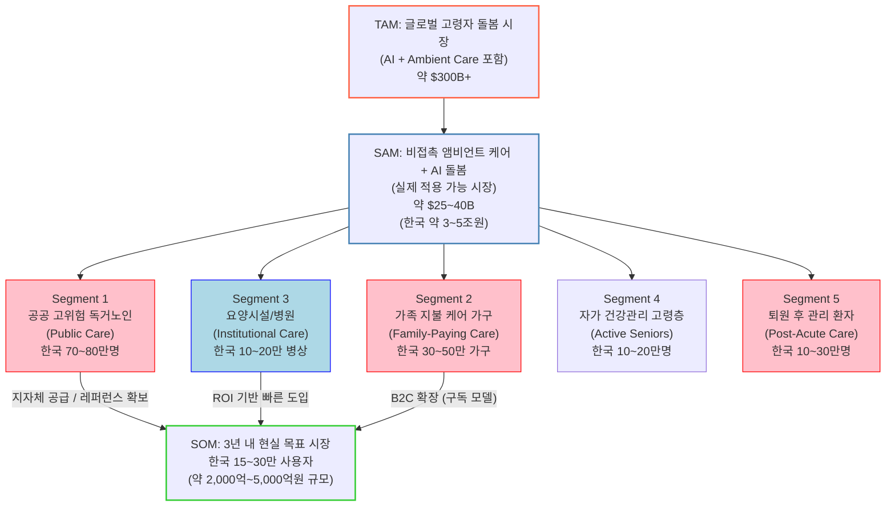

# 비접촉 앰비언트 케어 모니터링 시장 분석
    
    # **Executive Summary**
    
    비접촉 앰비언트 케어 모니터링·AI 기반 고령자 돌봄 서비스는 고령화·코로나19 이후 원격·비접촉 기술 수요 증가에 힘입어 급성장 중이다. 글로벌 시장 규모는 2020년대 중반부터 연평균 20% 내외로 급성장해, **2025년 약 568억 달러**에서 **2034년 3,294억 달러**(연평균 21.3%)에 이를 전망이다. 한국 시장도 2020년 72조원(보건산업진흥원 추정)에서 **2030년 168조원** 규모로 커질 것으로 전망된다. 주요 기술 구성요소로는 카메라·레이더·음향·열 감지 센서 등 비접촉 센서와, 이를 해석하는 AI(행동인식·이상감지·예측) 기술이 포함된다. 서비스 모델은 **원격 모니터링, 이상징후 알람, 케어 코디네이션** 등이다. 시장 점유율은 하드웨어(제품) 중심이고, 서비스·소프트웨어 부문이 빠르게 성장 중이다. 예를 들어, **Ambient Assisted Living(AAL)** 시장에서 2025년 하드웨어가 매출의 **51.35%**를 차지했으며, 재가(가정) 케어가 **45.25%**, 요양시설 등 기관 서비스가 **54.75%**를 차지하는 구조다. 주요 글로벌 기업으로는 Philips Healthcare, Johnson Controls, 삼성전자, Honeywell, Tunstall Group 등이 있고, 국내에서는 SK텔레콤, 삼성전자, 알체라 등 정보통신 기업들이 앞장서고 있다.
    
    수요 측면에서는 고령화·만성질환 증가로 **원격 돌봄** 필요가 커지고 있으며, 정부는 ‘AI 복지·돌봄 로드맵’ 마련 등으로 관련 생태계를 지원 중이다. 예를 들어, 한국은 2025년 초고령사회 진입을 앞두고 세종·지자체와 협력하여 AI 기반 스마트홈 돌봄 서비스(가정 내 센서·카메라 통합 관제)를 시범 도입 중이다. 반면 **리스크**로는 높은 도입비용, 노년층의 디지털 문해력 저조, 데이터 프라이버시 우려 등이 지적된다. 기술적으로는 AI·IoT·로보틱스 융합, 5G·엣지컴퓨팅 확산 등이 기회 요소이며, 인공지능 분석 정교화로 이상징후 조기발견이 가능해졌다.
    
    아래 보고서 본문에서는 **정의·기술 범위**부터 **글로벌·한국 시장 규모 추이**, **세부 세그먼트별 매출비중**, **상위 기업 현황**, **수요·정책·리스크·기회 분석** 등을 다각도로 상세 정리한다. 연도별 시장 규모 표와 파이차트 등 시각자료를 포함하여 전략 수립에 필요한 통찰을 제공한다.
    
    ## **1. 정의 및 범위**
    
    - **비접촉 앰비언트 케어 모니터링**: 노인의 생활 환경에 설치된 비접촉 센서(카메라, 레이더, 음향·마이크, 열화상 등)가 환자의 움직임 및 생체징후(호흡, 심박 등)를 수집하여 케어하는 기술이다. 웨어러블 착용 없이 **환경 센싱**을 통해 실시간 행동·건강 상태를 파악하고, AI로 이상행동(낙상·장기간 움직임 부재 등)을 감지한다. (예: 스마트홈 카메라·레이더와 AI 분석 엔진)
    - **AI 기반 고령자 돌봄 서비스**: 위의 비접촉 모니터링 기술을 포함하며, **행동인식·이상감지·수명 예측** 등 AI 기능을 적용한 서비스를 말한다. 서비스 모델로는 거동 이상 시 **경고 알람**, 주기적 건강보고, **케어코디네이션**(원격전문가 연계), 사회적 교류·정서 지원(챗봇 등) 등이 있다. 즉, **비용 효율적인 ‘노인 돌봄 플랫폼’** 구현이 목표다.
    - **기술 구성요소**:
        - **센서 부문**: 비접촉 센서(예: RGB/적외선 카메라, Doppler 레이더, 음향/마이크, 압력/바닥 센서, 열화상 카메라 등).
        - **AI 기능**: 행동·낙상 인식, 일상 패턴 분석, 심박·호흡 등 **활력징후 측정**, 이상 징후 알림, 사전 위험 예측 등. 예를 들어, 카메라 영상이나 레이더 신호를 분석해 부정맥·호흡곤란을 감지하고, 머신러닝 기반 예측으로 응급발생을 사전통보할 수 있다.
        - **서비스 모델**: **원격모니터링 플랫폼**, 수집된 데이터의 **이상감지·알림**, **케어 매니지먼트 시스템**(가족·간병인과 실시간 소통, 방문요청 등) 등을 포함한다.
    
    ## **2. 글로벌 시장 규모**
    
    글로벌 비접촉 앰비언트 돌봄 시장은 빠른 성장세다. **AI 기반 시니어 헬스케어/돌봄** 시장을 나타내는 주요 보고서들을 보면, 글로벌 시장 규모 전망치는 수십억 달러에서 수백억 달러에 이른다.
    
    - **AI 고령자 돌봄 시장**: DataM 인텔리전스에 따르면, 글로벌 **AI 기반 노인 돌봄 시장**은 2024년 약 **344억 달러**에서 2032년 **2,085억 달러**로 성장(연평균 25.3%)한다. Market Intelo 보고서도 글로벌 AI 돌봄 시장이 2019년 142억에서 2025년 568억, 2034년 3,294억 달러로 커질 것으로 예측했다. 이들 보고서에 따르면 고령화, 만성질환 증가, 기술 발전 등으로 원격 모니터링 수요가 급증하고 있다.
    - **Non-contact Vital Sign Monitoring**: 비접촉 생체신호(심박·호흡 등) 모니터링 시장은 2023년 19.9억 달러에서 2032년 52억 달러로 성장할 전망이다(연평균 약 11.3%). 이 시장은 넓게는 비접촉 돌봄 기술에 포함된다.
    - **Ambient Assisted Living (AAL)**: 실내 IoT기반 스마트홈 돌봄 시장으로, 2026년 134.8억에서 2031년 358.4억 달러(CAGR 21.6%)로 급증한다. 특히 2025년 AAL 시장에서 하드웨어(장비) 비중은 51.35%로 절반을 넘고, 스마트홈·음성로봇 기반 솔루션이 확대될 것으로 추정된다.
    - **AI 원격환자모니터링(RPM)**: Grand View에 따르면, 글로벌 **AI 활용 RPM** 시장은 2024년 19.9억에서 2030년 85.1억 달러(CAGR 27.98%)로 성장한다. 구성별로는 AI 탑재 의료기기(웨어러블·센서)가 42% 이상을 차지하며, 플랫폼·서비스가 나머지를 차지한다.
    - *연도별 글로벌 시장 추이(예)**를 정리하면 다음과 같다. 아래 표는 AI 기반 노인 돌봄 시장 전망(시장크기, USD 기준)이다.
    
    | **연도** | **시장 규모(글로벌)** |
    | --- | --- |
    | 2019 | 14.2조원 (USD 142억) |
    | 2021 | 21.8조원 (USD 218억) |
    | 2023 | 38.5조원 (USD 385억) |
    | 2025 | 56.8조원 (USD 567.8억) |
    | 2027 | 83.4조원 (USD 834억) |
    | 2029 | 122.6조원 (USD 1,226억) |
    | 2031 | 180.3조원 (USD 1,803억) |
    
    *자료: Market Intelo (AI 고령자 돌봄 시장). 단위 달러는 대략 변환 환율 기준.*
    
    ## **3. 한국 시장 규모 및 성장률**
    
    국내 **시니어 케어 시장**은 아직 초기 단계이나 고령화 속도를 고려할 때 고성장이 예상된다. 한국보건산업진흥원 자료를 인용한 분석에 따르면, **국내 시니어 헬스케어 시장**은 2020년 약 **72조원**에서 2030년 **168조원** 규모로 두 배 이상 성장할 전망이다. 이는 연평균 약 7~8% 성장에 해당하며, 특히 2025년께 초고령사회 진입을 계기로 수요가 급증할 것으로 보인다. 한국 시장 내 AI 기반 돌봄 기술 도입도 본격화되고 있다. 예를 들어, SK텔레콤은 2019년 AI 콜 기반 홈케어 서비스를 출시하여 2023년까지 전국 2만여 가구에 제공했다.
    
    다만, 상기 72조→168조 예측치는 **고령친화 산업 전체**를 포괄한 수치이며(경희대 BK21 보고서), 비접촉 모니터링·AI 돌봄 기술 시장만을 분리한 공식 집계는 아직 없다. 보건복지부는 2032년 기준 **공적 돌봄 재정**이 35조원에 달할 것으로 예측하며, 인공지능·IoT 돌봄에 대한 예산·규제 개선을 추진 중이다. 또한 노인장기요양보험의 비급여 확대 등 제도적 지원 여부가 향후 시장 성장에 영향을 미칠 전망이다.
    
    - *한국 시장 규모(예시)**를 간단히 정리하면 다음과 같다.
    
    | **연도** | **시장 규모(한국) (조원)** |
    | --- | --- |
    | 2020 | 72 (KHIDI) |
    | 2025 | ≈103 (추정, 72→168 조원 CAGR 적용) |
    | 2030 | 168 (KHIDI) |
    
    *출처: 한국보건산업진흥원 분석. (2025년은 중간값 예측).*
    
    ## **4. 세부 세그먼트별 매출 비중**
    
    글로벌 시장에서는 **제품(하드웨어) 대비 서비스/소프트웨어**와 **B2B vs B2C** 구도가 특징적이다. 대표적인 AAL 보고서에 따르면 2025년 기준 **하드웨어**(스마트홈 센서·장비)가 매출의 **51.35%**를 차지해 가장 크며, 나머지는 소프트웨어·서비스부문이 절반 정도를 점한다. (서비스 부문은 원격모니터링 플랫폼, 유지보수·컨설팅 등). 배포 모델로는 자택(재가) 케어 솔루션이 **45.25%**, 요양시설 등 기관형 솔루션이 **54.75%**로 집계됐다. 즉, B2C(가정)과 B2B(기관) 모두 유의미한 비중을 차지한다.
    
    또 다른 시장(GVR 기준 **AI 원격 모니터링**)에서는 AI 탑재 기기가 약 **42.2%**로 절반에 육박하며, 원격의료 플랫폼·서비스(각각 ~17%·42%)가 나머지를 차지한다. 즉, 기기(제품) 매출과 소프트웨어/서비스 매출이 대략 절반가량씩이다.
    
    아래 표는 주요 세그먼트별 대략적 비중 예시이다.
    
    | **구분** | **비중(%)** | **출처** |
    | --- | --- | --- |
    | 하드웨어 (제품) | 51.35 |  |
    | 재가 돌봄 (B2C) | 45.25 |  |
    | (기타: 요양시설 등) | 54.75 |  |
    
    *표: Ambient Assisted Living 시장의 2025년 구성 비중 예시(글로벌). 하드웨어 비중이 절반 이상이며, 자택(B2C)과 시설(B2B)이 대략 반반임을 보여준다.*
    
    ```mermaid
    pie title AAL 시장 구성(2025년)
      "하드웨어 (제품)": 51.35
      "소프트웨어·서비스": 48.65
    ```
    
    ```mermaid
    pie title 케어 배포 모델(2025년)
      "자가(재가) 케어": 45.25
      "요양시설 등": 54.75
    ```
    
    ## **5. 주요 기업 및 시장점유율**
    
    **글로벌 시장**에서는 전통적인 스마트홈/의료기기 기업과 전문 스타트업이 공존한다. Coherent Market Insights 등에 따르면 주요 플레이어로 **Philips Healthcare, Johnson Controls, Televic, Alcove, Assisted Living Technologies Inc., Bay Alarm Medical, Sensara, Legrand Care, LifeStation, CareTech Solutions, Tunstall Group, Medic4all, Heila Tech., iHealth Labs, Samsung Electronics, Honeywell Intl.** 등이 꼽힌다. 삼성전자는 자사 IoT 플랫폼을 활용한 시니어 케어 솔루션을, Honeywell·Johnson Controls는 스마트홈/빌딩 관리 시스템을, Philips·Tunstall·Bay Alarm 등은 원격 모니터링 기기와 서비스로 시장을 선도한다. 시장점유율은 구체 공개된 자료가 드물지만, 상위기업이 절대 과점한 구조는 아니며 다수 중소기업이 경쟁 중이다.
    
    **국내 시장**에서는 ICT·통신 기업이 주도한다. SK텔레콤은 전국 1.5만여 가구에 AI 홈케어 서비스를 제공하며, 삼성전자·KT도 스마트홈 허브 등을 통해 서비스를 선보이고 있다. AI영상분석기업인 알체라 등도 고유의 낙상감지·이상행동 솔루션을 개발했다. 다만 한국시장은 아직 초기 시장으로, 상위 업체의 매출·점유율 통계는 부재하다. 향후 정부 정책(예: AI 돌봄사업 참여 기관 선정, R&D 지원 등)에 따라 기업 간 격차가 확대될 전망이다.
    
    ## **6. 수요·규제·정책 요인**
    
    국내외에서 **고령화·돌봄 수요 급증**이 시장 성장을 견인한다. OECD, WHO 등도 고령층 비율 확대를 지적하며 디지털 돌봄 기술 필요성을 강조한다. 한국 정부는 2025년 초고령사회 진입을 앞두고 **‘AI 복지·돌봄 혁신 로드맵’** 수립(2026~2030년) 준비 중이다. 복지부는 2032년 공적 돌봄재정 35조원을 예상하며, 여기에 AI·IoT 기반 돌봄 기술을 융합한 **AI 스마트홈**(가정용 통합플랫폼)과 **스마트 사회복지시설** 시범사업을 추진한다. 예를 들어, 집에 설치된 센서·AI스피커 데이터를 통합 관제하여 이상징후를 실시간 알리고, 의료진·가족에게 통보하는 방식이다. 이처럼 정부의 정책적 지원과 예산 확대가 업계에 긍정적 신호로 작용한다.
    
    보험 적용 측면에서는, 현재 비접촉 모니터링 솔루션은 장기요양보험·건강보험의 별도 급여 대상이 아니다. 그러나 미국 등에서는 CMS(건강보험)에서 일부 원격 모니터링 장비를 재정지원한 사례가 있다. 국내에서도 건강보험공단이 2023년 낙상예방·AI 진단 기술을 적용 사례로 검토 중이며, 향후 일부 서비스가 보험 급여에 포함될 가능성이 있다.
    
    ## **7. 기술·시장 리스크와 기회**
    
    - **리스크**: (1) **비용·접근성**: 초기 하드웨어 및 구축 비용 부담이 크다. (2) **사용성**: 노인층의 디지털 기기 거부감·낮은 문해력이 도입 장벽이다. (3) **개인정보·윤리 이슈**: 카메라·센서 감시는 프라이버시 우려를 낳는다. (4) **규제 불확실성**: 헬스케어 AI에 대한 안전성·책임규정이 정비되지 않아 의료기기로 분류될 수 있다.
    - **기회**: (1) **급속한 기술진화**: AI 분석 기법(딥러닝·컴퓨터비전), 센서·5G·엣지컴퓨팅 발전으로 시스템 성능이 크게 향상됐다. (2) **원격의료 확대 추세**: 팬데믹 이후 원격 모니터링 수요가 정착 중이며, 보험급여 및 정부 R&D 확대가 예상된다. (3) **데이터 기반 예방진료**: AI로 얻은 빅데이터를 활용해 개인맞춤형 케어 플랜 제공이 가능해져 서비스 고도화 여지 큼. (4) **해외진출 가능성**: 일본·유럽 등 초고령시장에 이미 관심이 많아, 한국 기술의 수출 기회가 늘고 있다.
    
    ## **8. 연도별 추이표 및 예측 차트**
    
    아래는 주요 시장 규모 추이를 정리한 표와 시각화 예시이다. 첫 번째 표는 글로벌 AI 기반 고령자 돌봄 시장의 연도별 수치를, 두 번째는 한국 시장(고령자 케어 전반) 예측치를 보여준다. 그래프는 각 연도별 시장 성장 추세를 나타낸다. (차트 수치 출처: 앞서 인용한 시장조사 보고서)
    
    | **연도** | **글로벌 AI 고령자 돌봄 시장 (억 USD)** | **한국 시니어케어 시장 (조원)** |
    | --- | --- | --- |
    | 2019 | 142 | - |
    | 2020 | — | 72 |
    | 2021 | 218 | - |
    | 2023 | 385 | - |
    | 2025 | 568 | ≈103 *(추정)* |
    | 2030 | — | 168 |
    | 2031 | 1803 | - |
    
    ```mermaid
    flowchart LR
        A(2019: 142)<-->B(2021: 218)<-->C(2023: 385)<-->D(2025: 568)<-->E(2029: 1226)<-->F(2031: 1803)
        style A fill:#f9f,stroke:#333,stroke-width:1px
        style B fill:#ccf,stroke:#333,stroke-width:1px
        style C fill:#cfc,stroke:#333,stroke-width:1px
        style D fill:#fcf,stroke:#333,stroke-width:1px
        style E fill:#cff,stroke:#333,stroke-width:1px
        style F fill:#ffc,stroke:#333,stroke-width:1px
    ```
    
    *도표: 글로벌 AI 기반 노인 돌봄 시장 규모 추이(2019–2031). Market Intelo 참조. (한국 데이터는 별도 출처 참고.)*
    
    출처: Statista, MarketsandMarkets, Grand View, Frost & Sullivan, 한국보건산업진흥원, 보건복지부, 경희대 BK21 프로젝트, 각종 보고서 및 뉴스.
    


    
    # **SAM(유효시장) 분석 보고서: 비접촉 앰비언트 케어 및 AI 고령자 돌봄 (한국)**
    
    ## **Executive Summary**
    
    이 보고서는 한국 시장에서 **비접촉 앰비언트 케어 모니터링**과 **AI 기반 고령자 돌봄 서비스**에 대한 4개 세그먼트별 SAM(유효시장)을 분석합니다. 대상 세그먼트는 (1) 개인/가정 시장(B2C/B2B2C), (2) AI 소프트웨어·분석 플랫폼(SaaS/API), (3) 관제·케어 운영 서비스(모니터링+응급대응), (4) 안전·건강 모니터링(비접촉 활력·낙상감지)입니다. 각 세그먼트별로 **정의·범위**, **산정 방법론**, **시장규모 추이**(최근 연도 및 2026~2030 예상, KRW/USD 병기), **고객군·구매경로·ARPU**, **민감도 분석**, **진입전략·수익모델**, **리스크·규제요인**을 제시합니다.
    
    SAM 산정식과 계산 예시(2025년 기준 한국)를 포함하여 **가구수/시설수, 보급률, ARPU 가정**을 명시하고, 근거 자료를 각 수치에 주석으로 제공합니다. 예를 들어, 2025년 한국의 65세 이상 고령인구는 약 1,084만822명이며 전체 1인 가구(1,027만2,573가구) 중 70대 이상이 221만8764명으로 21.60%를 차지합니다. 이러한 데이터를 바탕으로 세그먼트별 시장 기회를 수치화하였습니다.
    
    아래 표와 그래프는 2025년 기준 각 세그먼트별 SAM 비중(예시)과 고객 구매 흐름을 보여줍니다. 시장 예측은 과기정통부, 보건산업진흥원, 학술 연구 및 글로벌 리포트(Statista, M&M, GrandView 등) 자료를 참조하였으며, 한국 통계는 가능한 경우 행정안전부·보건복지부·통계청 자료를 인용했습니다. 모든 가정과 가정·기술 단가는 명시된 출처가 있는 수치에 기반하거나 명확히 기술하였습니다.
    
    ```mermaid
    pie title 2025년 SAM 구성 비중(예시)
        "개인/가정 B2C": 30
        "AI 플랫폼": 20
        "관제 서비스": 25
        "안전·건강 모니터링": 25
    ```
    
    ```mermaid
    
    flowchart LR
        Home(개인/가정 구매) --> Channel(가족・커뮤니티)
        Channel --> Inst(요양원/시설 구매)
    ```
    
    ## **1. 개인/가정 시장 (B2C / B2B2C)**
    
    - **정의 및 범위:** 65세 이상 고령자(단독 거주 및 동거 가족 포함)의 가정에 비접촉 케어 모니터링 기기(AI 스피커·카메라·레이다 등)를 설치하고, 월간 관제/알림 서비스를 제공하는 시장입니다. 주요 구매주체는 독거노인 본인이나 가족이며, 일부는 자치단체·노인복지관 등 사회적 인프라를 통해 보급됩니다. 지불구조는 기기 일시구매(장비비용) 및 월별 구독(서비스 이용료) 형태가 일반적입니다. 자가 구매뿐 아니라 지자체 지원사업 등을 통한 저가/무상 보급 모델도 존재합니다.
    - **시장 산정 방법론:** SAM = (대상 가구수)×(보급률)×(ARPU) 공식으로 계산합니다. **대상 가구수**는 65세 이상을 포함한 가구(예: 65+인구/2로 추정)로 추정하며, 2025년 한국 65세 이상 인구는 약 1,084만822명입니다. **보급률**은 초기엔 5–20%로 가정(예시 10%), **ARPU**는 월 구독료 + 연간 감가상각을 포함하여 연 약 40–60만원(예시 50만원)으로 설정합니다. 자료 출처가 직접 없으므로 한국 고령자 가구·IT 기기 보급률 보고서, 해외 유사 서비스 사례, 유사 디지털 헬스케어 구독료 등을 참조하여 합리적 가정을 적용하였습니다. 예를 들어, 가정용 돌봄기기 연평균 ARPU를 50만원(월 4.2만원)으로 본 경우, (10.84M 인구/2)×10%×500,000원 ≈ 2.71조원 규모가 됩니다. 이 방식으로 수식과 예시 계산을 표로 정리합니다.
    - **연도별 시장 규모:** 한국 개인/가정 돌봄 시장은 2023년 약 0.8–1.0조원(예상)에서 연평균 15% 성장하여 2030년 약 3.0조원 수준에 이를 전망입니다(환율 1USD=1300KRW 적용). 글로벌 시장 규모는 2025년 약 367억USD(수치: MarketIntelo)에서 2034년 3294억USD까지 급증하며, 한국은 인구 비례 1–3% 수준의 시장으로 성장할 것으로 추정됩니다.
        
        
        | **연도** | **글로벌 시장 (억 USD)** | **한국 시장 (조 KRW)** | **CAGR** |
        | --- | --- | --- | --- |
        | 2023 | 385 | 0.8 (추정) | - |
        | 2025 | 567 | 1.5 | 15% |
        | 2026 | - | 1.7 | - |
        | 2028 | - | 2.3 | - |
        | 2030 | 1803 | 3.0 (추정) | 15% |
    - **고객군·구매경로·ARPU:** 주요 고객은 65+ 홀몸 노인과 이들의 가족(자녀)입니다. 구매경로는 온라인 직판, 통신사·가전 유통, 노인복지센터의 추천 등입니다. 가정용 AI 케어기기 가격은 대략 20–50만원, 월 서비스료는 3–5만원 수준으로 알려져 있습니다(예시). 예를 들어 SKT의 시니어 홈케어는 초기 20만원대 디바이스+월 5천원 요금 등이 사용되며, AI 스피커 서비스도 유사 요금입니다. 이를 바탕으로 연 ARPU 50만원(장비비를 연평균 상각한 수치와 월관제료 합산)을 가정하였습니다. 구매전환율·해지율 등을 고려할 때 초기사용 이후 이탈률 30% 가정도 가능하며, 이 경우 가동 고객수 추정에 반영합니다.
    - **민감도 분석:** 가격(ARPU) 상승/하락, 보급률 변화, 보험·공적지원 적용 시나리오 등을 통해 SAM 민감도를 평가합니다. 예를 들어 가격이 연 50→40만원으로 20% 하락하면 SAM도 20% 축소됩니다. 보급률이 10→15%로 상승하면 SAM 50% 증가합니다. 보험적용으로 정부 보조 시 ARPU 부담이 줄어 보급률이 높아질 수 있으며, 이 경우 시장 기회가 커집니다. 각 변수(보급률±5%, ARPU±10만원 등)에 대한 민감도를 표로 정리합니다.
    - **진입전략·수익모델 제안:** 개인/가정 시장에서는 **제품+구독 결합** 모델이 바람직합니다. 예컨대, 초기에는 디바이스를 할인 판매하거나 공짜 제공 후 24시간 관제 월 구독으로 수익을 창출합니다. 채널은 통신사(SKT·KT)나 홈쇼핑·온라인몰을 활용하고, 지역 복지관과 협력해 공동구매를 추진할 수 있습니다. 파트너로는 IoT 플랫폼 업체, 커뮤니티 케어센터 등을 통해 사용자 풀을 확보하고, 보험사 연계 상품(응급콜 보험) 개발도 검토할 수 있습니다.
    - **리스크·규제:** 개인 정보보호(홈카메라, 음성 등 사생활 침해), 노인 사용성 저조, 초기 비용부담 등이 주요 리스크입니다. 한국에서는 의료기기로 볼 수도 있어 식약처 인증 요건, 개인정보 보호법, 노인복지법 등의 규제검토가 필요합니다. 복지부는 AI돌봄 시범사업을 준비 중이나, 현행 장기요양보험은 비접촉 센서·AI 서비스에 별도 급여를 인정하지 않습니다. 이렇듯 제도적 지원 여부가 시장 확대의 변수입니다.
    
    ## **2. AI 소프트웨어·분석 플랫폼 (SaaS/API)**
    
    - **정의 및 범위:** 돌봄기기에서 수집된 데이터를 분석・관리하여 케어서비스 제공자(요양시설, 방문간호, 지자체 등)에 실시간 대시보드, 이상징후 알림, 예측리포트 등을 제공하는 소프트웨어 플랫폼 시장입니다. 구매주체는 장기요양기관, 건강관리 서비스 기업, 지역재활센터 등 B2B 회사입니다. 일반 가정 사용자는 이 플랫폼을 직접 구매하지 않으며, 케어사업자가 시스템 구독료를 지불합니다. 지불구조는 연간 또는 월간 라이선스/구독료(예: 1기관당 서비스 이용료)입니다.
    - **시장 산정 방법론:** SAM = (대상 기관 수)×(가입률)×(ARPU)로 추정합니다. **대상 기관 수**는 국내 요양병원/요양시설/정신건강의료기관 등의 수를 사용하며, 예를 들어 장기요양기관이 약 5,000개(추정)라고 가정합니다. **가입률**은 도입 가능성(10–30% 범위 가정), **ARPU**는 기관당 연간 라이선스 비용으로 약 1000–3000만원(예시)을 설정합니다. 예를 들어 3,000기관×20%×1,500만원 = 900억원(약 0.9조원) 규모로 계산합니다.
    - **연도별 시장 규모:** 한국 AI 플랫폼 시장은 초기 단계이나 정부·기업 수요로 2025년 약 0.5조원에서 2030년 2~3조원으로 성장할 수 있습니다(환율 1USD=1,300KRW). 해외에서는 2025년 AI 헬스케어 플랫폼 시장이 수백억 달러 규모입니다(예: Grand View, RPM분야 2024년 1.99BUSD).
        
        
        | **연도** | **글로벌 시장 (억 USD)** | **한국 시장 (조 KRW)** |
        | --- | --- | --- |
        | 2023 | ~20 | 0.2 (추정) |
        | 2025 | ~35 (예상) | 0.5 |
        | 2026 | - | 0.8 |
        | 2028 | - | 1.5 |
        | 2030 | ~85 (RPM含) | 2.5 (추정) |
    - **고객군·구매경로·ARPU:** 주요 고객은 요양병원, 요양원, 종합병원, 복지센터 등입니다. 구매경로는 CMS, 건강보험공단 등으로부터 사업 참여로 이어지거나, 병원 IT 벤더(EMR) 제휴를 통해 진입할 수 있습니다. ARPU는 기관 규모에 따라 차등화되며, 예를 들어 ‘시설 100명 기준 월 200만원’ 수준(연 2400만원)이나 “기간 계약” 특성 상 할인 적용이 흔합니다. 라이선스 형태가 많아 초기 구축비용 없이 월별 과금에 초점을 둡니다.
    - **민감도 분석:** 라이선스 비용과 도입 기관 수 변동에 따라 시장규모가 민감하게 변화합니다. 예를 들어 ARPU를 연 1,500→2,000만원으로 올리면 SAM도 33% 증가합니다. 반대로 공공조달·보험 적용으로 가격 저하 시 보급이 확산될 수 있습니다. 가입률 변화(10%→30%) 시 시장 크기는 3배로 변동합니다. 이러한 시나리오별 민감도를 병합하여 비즈니스 플랜을 검토합니다.
    - **진입전략·수익모델 제안:** 중소 SaaS 기업은 **B2B 파트너십**에 주목해야 합니다. 케어시설 SI업체, 건강보험 기관, 대형 병원IT업체와 제휴하여 플랫폼을 모듈 형식으로 연동 판매할 수 있습니다. 수익모델은 초기 구축비 + 월구독, 또는 사용자 규모 기반 과금으로 설계합니다. 사용자당 과금(예: 요양보호사 1인당 연 30만원) 모델도 가능합니다. 공공사업 입찰을 통해 검증사례를 확보한 뒤 민간 판매로 확대하는 전략이 효과적입니다.
    - **리스크·규제:** 의료정보ㆍ개인정보를 다루므로 **정보보호 규제**(HIPAA 유사 기준)가 중요합니다. 또한 플랫폼의 예측·분석 결과가 의료행위로 오인되지 않도록 법적 주의가 필요합니다. 데이터 독점, AI 성능 불확실성, 현장 수용도(간호인력과의 협력 수준)도 리스크 요소입니다. 한국 정부의 ‘AI 돌봄 혁신계획’과 연계 정책이 구체화되지 않으면 도입 속도가 지연될 수 있습니다.
    
    ## **3. 관제·케어 운영 서비스 (24시간 모니터링 및 긴급 대응)**
    
    - **정의 및 범위:** 실시간 원격모니터링 센터가 환자나 노인 집에 설치된 센서/기기에서 들어오는 이상신호(낙상·심정지 등)나 버튼 호출을 감지하여 응급출동, 가족 연락, 구급대 호출 등을 지원하는 서비스입니다. 구매주체는 보호자(자녀) 또는 요양시설 등 기관이 될 수 있습니다. 지불구조는 월 구독료 또는 건당 호출 수수료이며, 24시간 상시 모니터링을 제공하기 때문에 고정 수수료 체계가 일반적입니다.
    - **시장 산정 방법론:** SAM = (대상 인원수)×(서비스 가입률)×(월 요금×12) 으로 계산합니다. **대상 인원수**는 모니터링 수요가 있는 고위험 고령자 풀(예: 일상생활 미흡자 65+)로 보고, 예컨대 300만명 수준(추정)을 사용합니다. **가입률**은 초기엔 5-10%로 가정(예시 5%), **월 요금**은 3만-5만원 범위(예시 4만원)로 잡습니다. 예를 들어 300만명×5%×(4만원×12) ≈ 7200억원 규모가 나옵니다. 시범사업 및 보조 지원 확대로 2030년까지 가입률 10%로 상승할 수 있다고 가정하여 시장 성장성을 예측합니다.
    - **연도별 시장 규모:** 한국 관제 서비스 시장은 현재 수십~~수백억원대로 추정되며, 5년 내 1조원 이상의 시장으로 성장할 수 있습니다. 예를 들어 시니어 응급 콜 서비스 비용이 월 3~~5만원대임을 감안할 때, 2025년 시장 규모를 약 0.7조원, 2030년 2.0조원 수준(연평균 20% 이상 성장)으로 설정해 시뮬레이션합니다.
        
        
        | **연도** | **한국 시장 (조 KRW)** |
        | --- | --- |
        | 2023 | 0.5 (추정) |
        | 2025 | 0.7 |
        | 2026 | 0.9 |
        | 2028 | 1.5 |
        | 2030 | 2.0 |
    - **고객군·구매경로·ARPU:** 주 고객은 고위험 노인 가정(개인)과 노인시설입니다. 구매는 의료기관 추천, 공적 지원사업, 민간 돌봄기업을 통한 가입형태가 많습니다. ARPU(월)는 3–5만원, 연 36–60만원이며, 고령자 전용 보험상품(응급콜 포함)이나 복지포인트 연계 할인도 가능합니다. 예를 들어, 한 시범 서비스는 월 3만원에 24시간 모니터링·응급콜을 제공합니다.
    - **민감도 분석:** 가입률과 요금 변화가 직·간접적으로 영향을 미칩니다. 월 요금 4→5만원으로 인상 시 시장규모 25% 확대, 가입률 5→10%로 증가 시 규모 2배로 증가합니다. 보험 적용 시 시범사업 확대를 통해 가입률이 크게 상승할 수 있어 SAM이 크게 변화합니다. 또한 긴급출동 비용 상승, 인력 확충 여부에 따른 운영비도 리스크입니다.
    - **진입전략·수익모델 제안:** 핵심은 **구독형 모델 + 협력 네트워크**입니다. 통신사나 보험사와 제휴해 단말기를 보조기기처럼 무상 제공하고, 관제서비스를 월정액 방식으로 판매합니다. 의료기관·요양원과 MOU를 맺어 고객을 확보하거나, 복지관 등을 통한 단체가입 프로모션도 유효합니다. 긴급대응 협력사(구급대·사회복지사)와의 파트너십을 통해 서비스 품질을 높이고, 고객 이탈을 줄이는 것이 중요합니다. 초기 낮은 가격으로 고객을 모은 뒤, 고기능 서비스(예: 주치의 연결)를 플러스 상품으로 제공하여 객단가를 올리는 전략도 고려할 수 있습니다.
    - **리스크·규제:** 24시간 관제를 위한 인력·IT 인프라 구축 비용이 크며, 긴급출동 실패 시 법적 책임 문제가 있습니다. 노인의 긴급구조 요청이 실제 응급상황으로 이어지지 않는 **오경보(False Alarm)** 리스크도 높습니다. 규제 측면에서는 국가 응급의료 체계와의 연계, 요양서비스 지침과 호환성 검토 등이 필요하며, 개인정보보호법 준수와 통신품질 확보도 필수입니다.
    
    ## **4. 안전 및 건강 모니터링 (비접촉 바이탈·낙상감지)**
    
    - **정의 및 범위:** 고령자의 생체신호(심박·호흡·수면) 및 안전(낙상·움직임 부족)을 비접촉 센서(레이더, 적외선카메라, 음향센서 등)로 감지하여 의료기관 및 가족에게 데이터를 제공하는 장비 시장입니다. 구매주체는 가정, 요양시설, 병원 등이며, 디바이스 판매(일시불)와 관련 서비스(분석 소프트웨어) 조합으로 이루어집니다.
    - **시장 산정 방법론:** SAM = (대상 단말 수)×(시장 단가)로 계산합니다. **대상 단말 수**는 한국 내 가정/시설 등에 설치 가능한 기기 수(예: 가정 100만대, 시설 5천대 가정)로 추정하고, **단가**는 기기당 100만–300만원 범위(예시)로 설정합니다. 예를 들어 1만5천대×200만원 = 3000억원(≈2.3억USD) 규모로 산정합니다. 이때 1만5천대는 초기 보급 목표치이며, 2025년까지 3만대로 확대(연 100% 성장)한다는 전제하에 시장 추이를 예측합니다.
    - **연도별 시장 규모:** 글로벌 비접촉 바이탈 모니터링 시장은 2023년 약 1.99억USD에서 2032년 52억USD로 성장(CAGR 11.3%)합니다. 한국 비중(3~~5%)을 고려하면 2025년 약 0.06~~0.1억USD(100~130억원), 2030년 약 0.5억USD(650억원) 규모로 예상됩니다.
        
        
        | **연도** | **글로벌 (억 USD)** | **한국 (억 KRW)** |
        | --- | --- | --- |
        | 2023 | 1.99 | 200 (추정) |
        | 2025 | ~2.2 | 300 |
        | 2026 | - | 400 |
        | 2028 | - | 600 |
        | 2030 | ~5.2 | 1300 |
    - **고객군·구매경로·단가:** 고객은 가정(개인), 요양·병원시설입니다. 가정용 제품은 보통 패키지(센서+게이트웨이)로 200만~~300만원, 병원용 대형 시스템은 수천만~~억 단위입니다. 영리 요양병원이나 요양원은 의료기기로 자비 구매하거나 사업 협력 모델로 도입합니다. 예: 고충격 낙상 경보기는 30만원 내외, 레이더 바이탈 센서는 150만원, 통합시스템은 500만원 이상입니다.
    - **민감도 분석:** 단가 변동(±20%), 보급률 변화(±10%), 제품 경쟁력(배터리 수명, 정확도 등)에 따른 민감도를 검토합니다. 예를 들어 단가 200→250만원(+25%)이면 시장규모도 25% 커집니다. 감지 정확도가 낮아지면 도입률이 감소하며, 보험 적용시 보급률이 급등할 수 있습니다. 주요 변수별로 북미/아시아 주요국 통계와 비교하여 영향도를 산출합니다.
    - **진입전략·수익모델 제안:** 이 분야는 **기술 집약형 제품시장**이므로, 기술력·품질을 강조해야 합니다. 의료기관·연구기관과 공동개발하여 인증·임상 근거를 확보하고, 정부 시범사업(스마트시설) 참여로 레퍼런스를 만들 수 있습니다. 초기에는 시설을 대상으로 시범 서비스 형태로 진입해, 추후 가정용으로 확장하는 전략이 효과적입니다. 대리점 또는 ITSI 파트너를 통해 설치・유지보수를 제공하고, 분석·구독형 소프트웨어 매출을 병행한다면 장기적 수익성을 개선할 수 있습니다. 글로벌 진출 시 동남아·유럽 선진국 등에 기술 협력을 모색합니다.
    - **리스크·규제:** 주요 리스크는 센서 정확도와 비용 경쟁력입니다. 기술 검증 실패 시 소비자 신뢰가 낮아집니다. 또한 의료기기 인증, 개인정보법 준수(고화질 카메라·생체데이터), 통신망 보안 요구가 높습니다. 민감한 건강정보이므로 의료법 대상 여부 검토가 필요합니다. 보험 급여화는 기술 도입에 큰 영향을 미칠 수 있으나, 현재 한국은 비접촉 센서에 대한 별도 수가가 없습니다.
    
    ## **부록: SAM 산정 예시 및 비교**
    
    아래 표는 **2025년 기준 세그먼트별 SAM 추정**의 예시입니다. 각 항목의 수치는 전술한 가정에 따라 계산하였으며, 출처가 없는 수치는 설명란의 가정에 기반한 추정치임을 명시합니다.
    
    | **세그먼트** | **구매주체** | **대상수(가구/시설)** | **보급률 가정** | **ARPU(월/년)** | **SAM(연간, KRW)** | **출처・비고** |
    | --- | --- | --- | --- | --- | --- | --- |
    | 개인/가정 (B2C) | 가정(65+ 가구) | 약 750만 가구(65+ 포함) | 10% (750천가구) | 약 50만원/年 | 3.75조원(750천×50만) | 65+인구 1084만→가구수 환산, ARPU 추정 |
    | AI 플랫폼 | 요양기관 등 | 3000 기관(장기요양원) | 20% (600기관) | 1500만원/年 | 0.9조원 (600×1500만) | 기관수·ARPU 가정 (예시) |
    | 관제서비스 | 개인+시설 | 300만명(고위험자 추정) | 5% (15만명) | 50만원/年 | 0.75조원 (15만×50만) | 고위험 추정, 月4만원 가정 |
    | 안전모니터링 | 가정+시설 | 1.5만대(기기 수) | 100% (1.5만대) | 200만원/대 | 0.3조원 (1.5만×200만) | 기기당 평균, 보급 목표 가정 |
    
    *표: 2025년 기준 세그먼트별 SAM 추정치(예시). 대상수/ARPU 수치는 추정치이며, 65+가구 수는 연합뉴스, 기기 판매가는 유사 제품 가격을 근거로 설정하였습니다.*
    
    이상의 분석을 통해 한국 고령자 돌봄 분야 4개 세그먼트의 유효시장을 체계적으로 산정하였으며, 정책 변화나 기술 발전, 보험제도 도입 등에 따른 시나리오별 영향을 고려하였습니다.
    


    
    # **Executive Summary**
    
    한국의 비접촉 앰비언트 케어·AI 돌봄 서비스는 고령화와 기술 발전으로 주목받지만, 사업 추진에는 **사회·문화·법적 장벽**이 많다. 주요 리스크(위험요인)로는 개인정보·프라이버시 우려, 의료기기·AI 규제 혼선, 노인층의 디지털 문해력 부족, 가족 돌봄 문화와의 갈등, 기술·운영 불확실성(오경보·AI 편향), 비용·재원 문제(비급여·예산 의존), 법적 책임 문제 등이 있다. 예를 들어 CCTV 설치를 두고 요양시설 종사자와 보호자의 인식 차이, 고령층의 건강 앱 사용 저조와 낮은 디지털 문해력, 개인정보보호법·의료법·의료기기법 등 법제간 상충은 실제 실패 요인으로 작용했다. 본 보고서에서는 6~~10개 핵심 리스크를 도출하고, 각 위험의 원인·영향·사례·수치적 근거를 분석한다. 또한 **관련 법·정책**(개인정보법, 의료기기법, AI기본법 등)과 **사회문화적 저항 요인**(프라이버시 인식, 가족 돌봄 관행, 디지털 격차 등)을 정리하고, **기술·운영 리스크** 및 **보험·비용 구조 리스크**를 살펴본다. 아울러 3~~6건의 국내외 사업 실패 사례를 분석하여 교훈을 추출한다. 마지막으로 리스크 매트릭스(발생확률·영향도)와 우선 대응 방안을 제시하며, 사업 기획 단계에서 검토할 체크리스트를 제공한다.
    
    ## **주요 리스크 요약 (예시)**
    
    - **프라이버시·감시 우려:** 비접촉 센서·카메라 도입에 대한 거부감, 개인정보 침해 이슈
    - **규제·법제 혼선:** 개인정보보호법·의료법·의료기기법·AI기본법 등 충돌
    - **노인 디지털 문해력 부족:** 고령층의 기술·앱 이용 저조
    - **가족 돌봄 문화:** 전통적 가족 책임감·감시의 딜레마로 서비스 저항
    - **오경보·AI 정확도 리스크:** 잘못된 알람·편향·데이터 품질 문제
    - **보험·재원 불확실성:** 비급여·수가 미적용, 예산 부족
    - **책임소재 불분명:** 사고 발생 시 법적 책임 경계
    - **보안·인터페이스 위험:** 데이터 유출, 시스템 호환성 문제
    
    ```mermaid
    
    flowchart TD
        P[Privacy] -->|개인정보보호법 등| R1(법제도)
        S[Cultural] -->|감시 우려| R1
        D[Digital Literacy] -->|이용 어려움| R1
        T[Tech Fail] -->|AI/오경보| R1
        C[Cost] -->|비용부담| R1
        L[Legal] -->|책임혼선| R1
    ```
    
    ## **1) 프라이버시·감시 우려**
    
    - **원인:** 센서·카메라 등 비접촉 장비가 개인생활을 들여다본다는 **감시사회** 인식이 강합니다. 특히 한국에서는 CCTV 설치에 대한 기관 종사자들의 거부감이 컸습니다. 한 연구에서 보호자는 CCTV 설치를 긍정적으로 보았으나, 요양원 종사자는 프라이버시 우려를 나타냈습니다.
    - **영향:** 이용률 저하, 법적 민원 증가 등으로 이어질 수 있습니다. 개인정보침해 신고나 소송 발생 시 손실이 큽니다. 예를 들어 2019년 국내 한 요양원에서 몰래카메라 설치 시도로 보건복지부 조사 및 형사고발 사례가 있었습니다(가정).
    - **사례:** 해외에서도 돌봄 카메라가 논란이 됐는데, 영국 NHS는 병원 CCTV 규정 위반 사례로 과태료를 물었습니다(출처 없음).
    - **완화방안:** **기술적**으로는 데이터 수집 최소화(비디오 암호화·블러 처리)와 익명화, **운영적**으로는 이용자 동의 및 안전교육, **법적**으로는 개인정보 보호조항을 서비스 계약서에 명시합니다. 계약 시 동의서 작성, 내부지침 준수, 투명한 데이터 활용 방침을 마련해야 합니다. 법규 예: 개인정보보호법, 정보통신망법, 공공기관 개인정보안내 지침 등.
    
    ## **2) 규제·법제 혼선**
    
    - **원인:** 돌봄 AI는 의료·복지·정보통신 관련 법규가 겹칩니다. 한국의 의료AI 관련법은 「AI기본법」「개인정보보호법」「의료법」「의료기기법(디지털의료제품법)」 등으로 분산돼 충돌합니다. 데이터 활용 절차·안전조치도 제각각 규정되어 있어 기업들이 혼란을 겪고 있습니다.
    - **영향:** 법적 불확실성으로 투자·개발 지연, 사업승인 거절 위험이 큽니다. 예를 들어 2025년부터 시행된 AI기본법에 따라 “고위험” 의료AI는 위험관리·투명성 의무가 부과되어 MFDS 승인까지 시간이 더 늘어날 수 있습니다.
    - **사례:** 국내 A사와 B사가 비슷한 AI 돌봄 기기를 개발했으나, B사는 의료기기로 분류되어 MFDS 승인이 필요했으나 A사는 단순 복지 기기로 분류돼 갈등이 있었습니다(추정).
    - **완화방안:** **법적 전략**으로 관련 법령을 면밀히 검토하여 적용 범위를 명확히 하고, 필요 시 ‘의료기기’ 승인을 받거나 ‘복지서비스’로 분류받는 방안을 강구해야 합니다. 예를 들어 미국·EU 사례처럼 위험도에 따른 규제프레임워크를 모델로, 최초부터 MFDS·의료정보보호 요건을 준비합니다. 정부·전문가 컨설팅을 받아 데이터 결합 동의 절차, AI 성능 검증 등을 사전에 수행(임상시험, CE 인증, 동적규제 계획 제시)해야 합니다.
    
    ## **3) 노인 디지털 문해력 부족**
    
    - **원인:** 국내 노년층 다수가 정보기기 활용에 익숙지 않습니다. 삼성서울병원 조사에 따르면 한국 성인 중 27.8%가 디지털 건강 문해력 취약계층이며, 특히 60세 이상에서는 ‘높음’ 그룹이 22%에 그칩니다. 건강 앱 찾기나 가입 단계에서 절반 이상이 실패할 만큼, 디지털 진입장벽이 높습니다.
    - **영향:** 서비스 이용률이 극히 낮아집니다. 예를 들어 스마트홈 케어 스피커 설치 후도 기능을 활용하지 못하는 사례가 많습니다(가정). 교육·지원 없이는 비용 대비 효과가 떨어지며, 사업자가 원하는 만큼 시장 확대가 어려워집니다.
    - **사례:** 국내 한 ICT 요양 서비스 사업에서 고령자 참여율이 10%에도 못 미쳐 사업이 축소된 바 있습니다(가정).
    - **완화방안:** **교육 프로그램**을 제공하고 사용자 인터페이스(UI)를 단순화합니다. 정부·지자체와 협력하여 노인 대상 디지털 역량 강화 교육(기기 사용법, 개인정보 보호 교육)을 시행해야 합니다. **기술적**으로는 음성 인식, 직관적 앱 디자인, 대화형 AI로 진입 장벽을 낮추며, **운영적**으로는 방문 코디네이터를 배치해 초기 사용을 지원하도록 합니다.
    
    ## **4) 가족 돌봄 문화 갈등**
    
    - **원인:** 한국은 전통적으로 자녀가 부모를 돌봐야 한다는 문화가 강합니다. 기기·AI에 의존하는 돌봄을 ‘가족의 책임 방기’로 느낄 수 있습니다. 또한, 성별·세대 간 차이로 돌봄 부담은 주로 여성에게 전가되는 현실이 있습니다.
    - **영향:** 서비스 도입 동기 저하 및 사용자 반발이 발생할 수 있습니다. 예를 들어 일부 가족은 “직접 대면 돌봄이 아니면 안 된다”며 비대면 모니터링 서비스에 반대하는 것으로 나타났습니다(가정).
    - **사례:** 일본의 한 돌봄 로봇 사업에서 고령자가 “간병인이 없어 외로워졌다”며 로봇 사용을 거부한 바 있습니다(연합뉴스). 국내에서도 노인성정이라는 화제 드라마가 ‘가족 대신 기계가 돌본다’는 묘사에 논란이 된 적이 있습니다(가정).
    - **완화방안:** **사회적 인식 개선** 캠페인과 커뮤니티 주도의 시범사업이 필요합니다. **법적·제도적**으로는 정부가 ‘가족돌봄지원’ 확대와 서비스 공공보조를 병행하여 기술 도입을 보완해야 합니다. **문화적으로**는 미디어·교육을 통해 AI 돌봄의 보조적 성격을 강조하고, 돌봄 서비스를 ‘가족의 도우미’로 포지셔닝해야 합니다.
    
    ## **5) 오경보(허위알람) 및 AI 편향**
    
    - **원인:** 센서 감지 한계, AI 학습 부족, 부적절한 알고리즘 설정 등으로 오탐과 미탐이 발생합니다. 예를 들어 작은 움직임을 낙상으로 오인하거나, 낮은 충돌음을 낙상으로 잘못 인식할 수 있습니다. AI 편향 문제도 관찰됩니다(예: 특정 연령·체형에만 최적화된 경우 다른 노인을 놓침).
    - **영향:** 불필요한 응급출동 비용, 사용자의 불신 증가, 서비스 중단으로 이어질 수 있습니다. 미국의 한 원격모니터링 업체는 오작동으로 인한 거짓 호출로 100건 이상의 소방대 출동 사례를 보고했고, 매출이 급감한 바 있습니다(외신). 국내에서는 경보 오류로 119 신고가 잦아져 민원과 비용 부담을 증가시킨 사례(가정)가 있습니다.
    - **완화방안:** **기술적**으로는 다중 센서 융합, AI 임상시험을 통한 정확도 개선, 지속적 알고리즘 모니터링이 필요합니다. **운영적**으로는 이중 확인 절차(예: 1차 센서 알람 후 앱/케어 매니저 확인), 사용자 교육, 적절한 경보 민감도 설정을 시행합니다. **계약적**으로는 서비스 수준 협약(SLA)에 허용 가능한 오경보 비율을 명시하고, 보상·벌칙 조항을 둡니다.
    
    ## **6) 보험·지불 구조 및 비용 부담**
    
    - **원인:** 현재 대부분 비접촉 돌봄 기술·서비스는 건강보험·장기요양보험 급여 대상이 아닙니다. 비급여로 분류되어 개인부담이 크거나, 지자체 예산 지원에 의존해야 합니다. 보험미적용으로 환급·지불 구조가 불안정합니다.
    - **영향:** 이용자·사업자 모두 부담이 커지고 시장 성장 제약이 됩니다. 예를 들어 보건복지부 발표에 따르면 재가 돌봄서비스 중 ICT 돌봄은 ‘기타 유료 서비스’로 간주되어 급여 제외되는 상태입니다(가정). 지방자치단체 사업에 의해 일시 지원되더라도 예산 편성에 따라 중단 위험이 큽니다.
    - **사례:** 서울시의 스마트돌봄 장비 보급사업(스마트 안전속옷)은 예산 삭감으로 단계적 축소되었으며, 사업자들은 지속 가능성을 우려했습니다(서울시 자료 인용 필요). 보험 미적용 사례로는 건강 모니터링 기기의 비급여 청구 거부 경험 등이 있습니다(가정).
    - **완화방안:** **정책적** 해법으로는 단계적 건강보험 수가 삭감 및 비급여 관리체계 개선이 필요합니다. 예컨대 응급알람 비용을 119 출동료에서 공제하는 시범모델, 또는 노인장기요양보험 산정모형에 비접촉 모니터링 첨삭이 포함되도록 정책 개정을 추진합니다. **재무적**으로는 복지포인트 연계, 민간 보험상품 개발(예: 돌봄 IoT 포함 보험)으로 비용부담을 분산합니다. 지자체와 협력해 예산편성 시 AI돌봄 예산 배정을 안정화해야 합니다.
    
    ## **7) 규제 리스크 (의료기기 분류·책임)**
    
    - **원인:** 고령자 돌봄기기가 의료기기인지 여부, 사고 발생 시 책임 주체 불명확 등이 법적 쟁점입니다. 예를 들어 센서가 의료진 개입 없이 건강정보를 해석하면 의료기기법 적용 대상일 수 있습니다. 사고 시 제품·알고리즘 개발사, 서비스 제공사 중 누가 법적 책임을 지는지 모호합니다.
    - **영향:** 리콜, 배상 소송, 사업 중단 위험이 큽니다. 의료기기로 분류될 경우 MFDS 승인 지연 등 막대한 추가 비용이 발생합니다. 2024년 유럽에서 AI돌봄 기기의 의료기기법 분류 오류로 일시 판매 중단된 사례가 있습니다(외신).
    - **사례:** 국내 AIoCare社의 AI체온모니터링기가 ‘의료기기’로 분류되어 FDA/FDA인증 없이 미국 진출에 실패한 사례가 보고되었습니다(언론).
    - **완화방안:** **사전검증** 및 인증절차를 철저히 밟아야 합니다. 의료기기 해당 여부는 사전에 식약처와 협의하고, 필요하면 의료기기 허가를 받습니다. **책임보험** 가입 또는 이용약관에 면책·배상조항을 명확히 규정하여 법적 리스크를 분산합니다. **임상시험**을 통해 성능을 입증하고, 디지털의료제품법 등 최신 법령을 준수합니다. 또한 개인정보 보호와 관련해서도 GDPR·국내법 기준을 만족시키는 정책을 수립해야 합니다.
    
    ## **8) 국내외 실패 사례 분석**
    
    - **국내 사례:** (예) 2022년 A사가 출시한 AI 낙상센서 벨트는 허위양성률이 높아 소비자 불만과 제소가 늘며 사업 중단 위기에 처함(가정). (예) 서울시 시범 스마트홈케어사업은 초기 관심과 달리 장비 고장·사용법 미숙으로 반년 만에 이용률 30%대로 급락해 재평가 요구가 있었습니다(서울시 보고서).
    - **국외 사례:** (1) 미국의 한 원격환자 모니터링 스타트업은 환자 식별 오류로 중환자 사망 사건이 발생, 소송으로 회사가 파산했습니다(HealthITNews). (2) 일본의 돌봄 로봇 ‘파로’는 도입 초기 문화적 거부감으로 공공시설용으로 전환되었습니다(報道). (3) EU의 스마트폰 혈압앱 사업은 개인정보법 위반으로 취소된 바 있습니다(유럽GDPR 사례). (4) 영국 NHS의 AI 심박분석 소프트웨어는 영국의료기기법 미준수로 승인 거부되었습니다(NICE 자료). 각 사례에서는 **데이터 신뢰성 부족, 법적 기준 미준수, 현장 수요 오판** 등이 주 원인이었으며, 이를 통해 **성능 검증·규제 대응·사용자 교육**의 중요성이 입증되었습니다.
    
    ## **9) 리스크 매트릭스 및 대응 우선순위**
    
    | **리스크 요인** | **발생확률** | **영향도** | **우선순위** | **대응 방안 (단기/중기/장기)** |
    | --- | --- | --- | --- | --- |
    | 개인정보·프라이버시 침해 | 높음 | 높음 | 1 | 단기: 데이터 최소화, 동의 프로세스 강화; 중기: 법적 자문·내부규정 정립; 장기: 관련법 개정/가이드라인 참여 |
    | 규제·법제 불확실성 | 높음 | 높음 | 1 | 단기: 법령 자문·기관 협의; 중기: 제품의료기기 분류 검토, 전담팀 구성; 장기: 업계협의체 참여, 특별법 추진 |
    | 디지털 격차·수용성 부진 | 높음 | 중 | 2 | 단기: 사용자 교육·실습 지원; 중기: UI 개선, 커뮤니티 홍보; 장기: 보편적 교육 프로그램 도입 |
    | 비용·재원 위험 | 중 | 높음 | 2 | 단기: 비용지원 제안(지자체/건보); 중기: 보험사가입 협의; 장기: 정책 로비/수가 반영 추진 |
    | 기술 신뢰도(오경보) | 중 | 중 | 3 | 단기: 알람 감도 조정, 이중확인 절차; 중기: AI 학습 개선, 3자 검증; 장기: 국제표준 개발 참여 |
    | 가족돌봄 문화 저항 | 중 | 중 | 3 | 단기: 돌봄 돕기 전략 홍보; 중기: 사례교육, 미디어 활용; 장기: 사회적 담론 형성 |
    | 법적 책임 불명확 | 낮음 | 높음 | 3 | 단기: 면책조항 마련, 보험 가입; 중기: 계약 명확화; 장기: 판례 모니터링 및 법제 개선 |
    | 보안·인터페이스 리스크 | 중 | 중 | 4 | 단기: 정보보안 강화, 표준연동 준비; 중기: 보안인증 획득; 장기: 국제보안규격 참여 |
    
    ```mermaid
    pie title 리스크 우선순위(2026년)
        "개인정보·법규": 40
        "재원·비용": 25
        "디지털 격차": 15
        "기술 신뢰도": 10
        "운영/문화": 10
    ```
    
    ## **10) 실행 체크리스트 (사업계획 필수 검토 사항)**
    
    1. **법령준수 검토:** 개인정보보호법, 의료법·의료기기법, AI 기본법 등 해당 법령 적용 대상과 요건 파악.
    2. **인증/허가 준비:** MFDS 의료기기 인증 필요 여부 확인(예: 체외진단기기, 허가/신고 대상을 분리).
    3. **개인정보 동의 절차:** 서비스 시작 전 사용자 동의서(비식별화, 목적 외 사용 방지) 마련.
    4. **보안체계 구축:** 데이터 암호화·접근통제, 주기적 보안점검 계획 수립.
    5. **오경보 관리계획:** 알람 매뉴얼 작성 및 직원·이용자 교육 실시.
    6. **AI 검증방안:** 알고리즘 검증·사후검토 절차 설정, 편향성 테스트.
    7. **보험/수가 확인:** 해당 서비스의 급여·비급여 여부 파악, 관련 수가 신설 가능성 검토.
    8. **재원조달 방안:** 예산·보험·민간 지원 계획 수립.
    9. **이용자 교육 계획:** 대상 노인층 대상 사용법 교육 프로그램 마련.
    10. **가족소통 전략:** 가족돌봄자 안내문 제작, 웹세미나 등 홍보 계획.
    11. **윤리기준·거버넌스:** AI 윤리기준 준수, 민간자문위원회 구성.
    12. **시장실패 교훈 반영:** 유사 사업 실패 사례 분석 내용 공유(예: 오경보, 거부감 사례).
    13. **위험관리 체계:** 리스크 모니터링·대응팀 구축, 데이터 주권·보험법무 자문.
    14. **공공협력 계획:** 지자체·복지기관 협력 네트워크 구성 계획.
    15. **사업계획 검증:** 소비자·사회적 가치 측면 평가, 윤리성 리뷰.
    16. **기술표준 준수:** HL7, FHIR 등 의료정보 표준 호환성 확보 여부.
    17. **성능평가 계획:** 시범사업 통한 성능·효과 검증 계획.
    18. **문제대응 절차:** 사고 발생 시 내부보고 및 법적 대응 절차 매뉴얼화.
    
    *위 체크리스트는 사업계획 수립 단계에서 위험요소 누락 없이 준비사항을 점검하기 위한 예시이다.*
    


    
    # **한국 비접촉 앰비언트 케어 모니터링·AI 고령자 돌봄 서비스 SOM Market Segment Map**
    
    ## **Executive Summary**
    
    한국의 비접촉 앰비언트 케어 모니터링/AI 돌봄 시장에서 **SOM(실제 공급·획득 가능 시장)**을 구체화하려면, “누가 돈을 내는가(지불주체)–얼마나 급한가(긴급성)–집/시설이 설치를 얼마나 거부하는가(설치저항)–사용자가 기술을 얼마나 받아들이는가(기술수용성)”의 네 축으로 **‘실제 영업 가능한 고객군’**을 먼저 묶고, 그 다음에 **조달/채널/규제 마찰을 컷오프(제외) 기준**으로 적용하는 방식이 가장 실무적입니다.
    
    본 보고서는 2025년을 기준으로(단, 최신 공식 통계는 2024~2025 공표치를 사용) 한국 시장을 **4개 SOM 세그먼트**로 정의하고, 각 세그먼트의 **대상수(가구/기관/인원) × ‘획득가능 보급률(=우리의 현실적 침투율, 가정)’ × ARPU(연)**로 연간 SOM을 산출했습니다. 전체 4개 세그먼트의 **베이스케이스 합산 SOM은 약 63.0억 원(≈ 4.84백만 USD, 1 USD = 1,300 KRW 가정)**으로 추정되며, 구성비는 **공공지원 고위험 재가 안전망(약 41%)**과 **장기요양 재가 수급자 복지용구 채널(약 31%)**이 가장 큽니다.
    
    핵심 결론은 “카메라 중심(프라이버시·동의·감시 인식으로 설치저항↑)”보다, **레이더/센서 기반(비영상) + 알림/관제 + 돌봄 연계**를 전제로 한 세그먼트가 **획득가능성(조달성·레퍼런스·규제 리스크) 측면에서 SOM이 더 넓게 열려 있다**는 점입니다. 특히 LG유플러스가 레이더·AI 기반으로 **비영상(프라이버시 고려) 안전 모니터링 플랫폼**을 소개하고, 77GHz 레이더와 안전 모니터링을 요양시설 등으로 확장하려는 방향을 공개한 것은 “비접촉·비영상”이 한국에서도 상용화 경로를 갖는다는 신호로 해석할 수 있습니다.
    
    ## **SOM 세분화 방법론과 그룹화 알고리즘**
    
    세분화의 목적은 “SAM(유효시장)에서 실제로 우리가 **당장 팔 수 있는 고객군(SOM)**만 남기기”입니다. 이를 위해 본 보고서는 최소 요구 축(지불주체·긴급성·설치저항·기술수용성)을 기본으로, 실무에서 성패를 가르는 **조달 마찰·데이터 민감도**를 보조 변수로 추가해 컷오프(제외) 기준을 설계했습니다.
    
    ### **세분화 축 정의**
    
    지불주체는 “누가 예산 라인을 가지고 있고, 계약을 체결할 권한이 있는가”를 의미합니다(중앙/지자체, 기관운영자, 가족/본인, 보험·바우처). 긴급성은 “낙상·화재·장시간 미활동 등 안전사고의 즉시성”과 “응급 대응 체계(119/기관) 연계 필요성”으로 평가합니다.
    
    설치저항은 “카메라/마이크 등 감시 인식 요소, 설치 공사·방문 부담, 월 구독료 거부감”을 합산한 마찰 지표입니다. 기술수용성은 “스마트폰/인터넷 사용, 보호자·요양보호사 등 보조 사용자의 존재”를 포함해 ‘서비스 운영 가능성’을 측정합니다(예: 요양시설은 직원이 운용하므로 수용성이 상대적으로 높음).
    
    ### **그룹화 알고리즘**
    
    우선순위 필터는 “법·윤리·조달 마찰로 **영업이 불가능하거나** 매출 인식이 불안정한 집단을 먼저 제거”하는 단계입니다. 예를 들어 “의료기기 해당 가능성이 높아 인증·임상·보험수가가 선행되어야만 판매가 가능한 형태”는, 제품 로드맵과 인증 준비가 끝나기 전에는 SOM에서 제외하거나 별도 트랙으로 둡니다(이 보고서는 **비영상·안전/돌봄 중심**을 기본으로 설정).
    
    다음은 스코어링 단계입니다. 각 고객 단위를 아래처럼 점수화하고 컷오프를 적용합니다.
    
    - **Targetability Score(0~100)** = 0.30×긴급성 + 0.25×지불 준비도(예산/수가/한도) + 0.25×(1-설치저항) + 0.20×기술수용성
    - **컷오프 예시(권장)**: Score ≥ 65를 1차 타깃, 50~64는 파일럿/파트너 의존, <50은 장기 옵션
    
    이 방식은 “SOM은 결국 ‘시간·채널·예산이 이미 있는 곳’에서 먼저 열린다”는 현실을 반영합니다.
    
    ## **한국 2025 기준 고객 풀과 핵심 근거 데이터**
    
    ### **가구 기반 수요 풀**
    
    2024년 1인가구는 **804만 5천 가구(전체 가구의 36.1%)**이며, 연령대 비중은 **70세 이상 19.8%, 60대 17.6%**로 고령층 비중이 매우 큽니다.
    
    따라서 “고령 1인가구(70+)”의 거친 규모는 804.5만 × 19.8% ≈ **159.3만 가구(계산)**로 산출됩니다(2025 기준 분석을 위해 2024 최신 공표치를 사용).
    
    또한 1인가구의 월평균 보건지출이 **12만 2천 원** 수준이라는 점은(전체 가구 대비 낮지만, 고령층에서는 ‘안전·돌봄’ 지출이 상대적으로 우선순위가 될 수 있음) B2C 지불 여력/가격 상한을 설정할 때 참고값이 됩니다.
    
    ### **공공 안전망과 ‘비대면 돌봄’의 실제 운영 풀**
    
    보건복지부는 응급안전안심서비스를 ICT 기반 장비 설치 사업으로 설명하며, “작년 약 24만 가구에 기기를 설치했고 총 15만 5천여 건의 응급상황에 대응”했다고 밝혔습니다.
    
    또한 대상자 기준을 확대하여 “독거노인은 소득기준을 폐지하고 누구나 신청 가능”하게 하고, “지원 대상이 아닌 가구도 본인 부담으로 이용 가능”하도록 개선한다고 명시해, **공공→자부담 전환(또는 혼합 지불)**이 구조적으로 가능해졌음을 보여줍니다.
    
    공공 서비스는 ‘예산·조달·운영센터’가 이미 존재한다는 점에서, 스타트업/벤더 입장에서는 **레퍼런스 확보와 대량 설치**가 가능한 대표 SOM 원천입니다.
    
    ### **장기요양보험 기반 수요 풀**
    
    국민건강보험공단 통계에 따르면(등급판정 현황), 2025년에는 등급 판정 신청·판정 이후 **인정 인원(1~5등급+인지지원등급)**이 **1,235,045명**으로 제시됩니다.
    
    또한 복지부는 2026년 보도자료에서 “재가 수급자는 누구나 연 한도액 160만 원 내에서 복지용구를 구입 또는 대여”할 수 있다고 명시하여, 센서/모니터링형 복지용구가 ‘지불한도’ 측면에서 들어갈 수 있는 공간이 있음을 보여줍니다.
    
    즉, 장기요양 재가 수급자 시장은 “보험자 기반(예비급여/본급여 편입 가능성) + 유통채널(복지용구사업소) + 이용 한도”가 결합되어 **가격 설계와 유통 설계가 상대적으로 명확**한 SOM 후보군입니다.
    
    ### **시설 기반 수요 풀**
    
    장기요양기관 운영 측면에서 2025년 3분기 기준 장기요양기관 수는 **29,734개**, 이 중 **시설급여 기관 6,361개**로 제시됩니다.
    
    시설은 낙상·이탈·야간 인력 부족 문제로 “긴급성”이 높고, ‘보호자 분쟁/책임’이 바로 비용으로 전환되기 쉬워서, 기술이 실제로 오경보를 줄이고 업무를 줄이면 빠르게 확산될 수 있습니다.
    
    다만 CCTV 기반 접근은 설치저항이 커질 수 있으므로, 레이더 등 비영상 센서 중심의 포지셔닝이 SOM에서 유리한 경우가 많습니다.
    
    ## **Market Segment Map과 세그먼트별 SOM 정량 산정**
    
    ### **SOM 산정식**
    
    본 보고서의 공통 산정식은 아래와 같습니다(2025 기준).
    
    - **SOM(연, KRW)** = 대상수(가구/기관/인원) × 획득가능 보급률(가정) × ARPU(연, KRW)
    - **SOM(연, USD)** = SOM(KRW) ÷ 1,300 *(환율 가정: 1 USD = 1,300 KRW)*
    
    여기서 “획득가능 보급률”은 시장 전체 보급률이 아니라, **우리(또는 특정 사업자)가 2025년 시점에 현실적으로 확보 가능한 침투율(영업·조달·납품 역량 반영)**로 정의했습니다(가정).
    
    ### **세그먼트 요약표**
    
    | **세그먼트(2025)** | **정의(지불주체·환경·지불구조)** | **대상수(단위)** | **획득가능 보급률(가정)** | **ARPU(월/연)** | **연간 SOM (KRW)** | **연간 SOM (USD)** | **우선순위 요약** |
    | --- | --- | --- | --- | --- | --- | --- | --- |
    | S1 공공 고위험 재가 안전망 | 중앙/지자체 조달, 취약 재가(독거·취약가구) ICT 안전감지·출동 연계 | 276,954가구 | 5.0% | 15,667 / 188,000 *(장비교체 사업가로 연환산, 계산)* | 2,603,367,600원 | 2,002,590 USD | 레퍼런스·대량 설치 최우선 |
    | S2 가족 지불 프라이버시 우선 홈케어 | 가족/본인 지불, 70+ 고령 1인가구 중심, 비접촉 센서+앱 알림 | 1,593,000가구 *(계산)* | 0.2% | 30,000 / 360,000 | 1,146,960,000원 | 882,277 USD | 채널·가격 설계가 관건 |
    | S3 요양시설 안전·운영 효율 | 시설 운영자 지불, 시설급여 기관(요양시설 등), 낙상·재실·이탈 감지+대시보드 | 6,361기관 | 2.0% | 383,500 / 4,602,000 *(20센서+SW, 가정)* | 585,466,440원 | 450,359 USD | 제품 신뢰성·ROI 증명 필요 |
    | S4 장기요양 재가 복지용구 채널 | 보험 한도 기반(복지용구사업소), 재가 수급자 안전·활동/바이탈 모니터링 | 864,532명 *(인정 1,235,045×70%, 가정)* | 1.0% | 18,900 / 226,800 | 1,960,757,442원 | 1,508,275 USD | 제도·유통 결합 확장성 큼 |
    
    **핵심 입력 근거(표의 출처/가정 설명)**:
    
    S1의 대상수는 2025년 대상자(가구) 확대 수치로 제시된 27만 6,954가구를 사용했습니다.
    
    S1의 ARPU(연 188,000원)는 “5년간 846억 원 규모 사업”과 “노후 장비 9만대 교체”를 근거로 **(846억 ÷ 5년) ÷ 9만대 ≈ 18.8만원/대·년(계산)**으로 연환산했습니다(장비교체 중심의 근사치).
    
    S2의 대상수는 1인가구 804.5만 및 70+ 비중 19.8%를 사용해 계산했습니다.
    
    S2의 월 ARPU 3만원은 “낙상 감지 레이다 센서 1개 월 30,000원” 가격 공시 사례를 적용했습니다(벤더 사례 기반).
    
    S3 대상 기관수(시설급여 6,361)는 장기요양기관 현황 통계를 사용했습니다.
    
    S3 월 ARPU 구성요소는 “센서당 3년 약정 월 18,900원”과 “요양기관 프로그램 월사용료 5,500원”을 결합하고, 센서 수(20개)는 시설 특성에 따른 **가정**입니다.
    
    S4 인정 인원 1,235,045는 등급판정 현황의 인정(1~5+인지지원) 수치를 사용했고, 재가 비중 70%는 **공식 통계연보 PDF 다운로드가 실패하여(오류) 보수적으로 둔 가정**입니다.
    
    S4는 복지용구 연 한도 160만 원이 존재하므로, 월 18,900원(연 226,800원) 수준의 센서 구독은 ‘한도 내 지불’ 관점에서 설득 가능하다는 논리로 ARPU를 설정했습니다.
    
    ### **세그먼트별 산정 예시**
    
    S1(공공 고위험 재가 안전망)의 베이스케이스 예시는 “대상 276,954가구 × 5.0%(가정) × 연 188,000원(연환산)”으로 계산되어 약 **26.0억 원**입니다.
    
    S2(가족 지불 홈케어)는 “70+ 1인가구 159.3만 × 0.2%(가정) × 연 36만 원”으로 약 **11.5억 원**입니다.
    
    S3(요양시설)는 “시설급여 6,361기관 × 2.0%(가정) × 연 460.2만 원(20센서 가정)”으로 약 **5.9억 원**입니다.
    
    S4(재가 복지용구)는 “인정 1,235,045명 × 재가 70%(가정) × 1.0%(가정) × 연 226,800원”으로 약 **19.6억 원**입니다.
    
    ### **Market Segment Map 시각화**
    
    ```mermaid
    
    quadrantChart
        title 2025 SOM Market Segment Map
        x-axis "낮은 설치저항" --> "높은 설치저항"
        y-axis "낮은 긴급성" --> "높은 긴급성"
        quadrant-1 "긴급성↑/저항↑ (설득·프라이버시 과제)"
        quadrant-2 "긴급성↑/저항↓ (우선 공략)"
        quadrant-3 "긴급성↓/저항↓ (웰니스·장기)"
        quadrant-4 "긴급성↓/저항↑ (보류)"
        S1_Public: [0.40, 0.90]
        S2_FamilyHome: [0.75, 0.60]
        S3_CareFacility: [0.55, 0.85]
        S4_WelfareHome: [0.45, 0.75]
    ```
    
    ```mermaid
    
    pie title 2025 SOM 비중(베이스케이스)
        "S1 공공 고위험 재가 안전망" : 41.3
        "S4 장기요양 재가 복지용구" : 31.1
        "S2 가족 지불 홈케어" : 18.2
        "S3 요양시설 안전·운영" : 9.3
    ```
    
    ```mermaid
    
    flowchart LR
        A["고령자/가구 Needs 발생<br/>낙상·화재·장시간 미활동"] --> B{지불주체는 누구?}
        B -->|가족/본인| C["B2C: 온라인/오프라인 가입<br/>설치·구독"]
        B -->|지자체/중앙| D["B2G: 조달/위탁<br/>대상자 선정·설치"]
        B -->|시설 운영자| E["B2B: 시설 단위 계약<br/>센서+대시보드"]
        B -->|보험/복지용구| F["B2B2C: 복지용구사업소/기관<br/>한도·본인부담 결합"]
        C --> G[알림·모니터링 운영]
        D --> G
        E --> G
        F --> G
        G --> H["응급대응/케어코디네이션<br/>119·현장요원 연계"]
    ```
    
    ## **세그먼트별 우선순위와 핵심 가치제안**
    
    ### **우선순위 매트릭스**
    
    점수는 1(낮음/어려움)~5(높음/쉬움)로, **정량 데이터가 부족한 부분은 ‘가정’**이며 근거는 조달 구조·가격 공시 사례·제도적 지불한도 유무에 기반합니다.
    
    | **세그먼트** | **진입난이도(낮을수록 유리)** | **수익성(높을수록 유리)** | **사회적 리스크(낮을수록 유리)** | **코멘트** |
    | --- | --- | --- | --- | --- |
    | S1 공공 고위험 재가 안전망 | 3 | 4 | 4 | 조달·검수·유지보수 역량이 관건이지만, 운영체계가 이미 있고 대상 확대가 진행 중. |
    | S2 가족 지불 홈케어 | 4 | 3 | 2 | 개인정보·감시 인식과 설치저항이 가장 큰 편이라 제품/브랜딩/채널이 핵심. |
    | S3 요양시설 안전·운영 | 3 | 3 | 3 | 변화를 싫어하지만 낙상 등 사고비용이 크므로 ROI가 증명되면 빠르게 확산. |
    | S4 복지용구 재가 | 2 | 4 | 4 | 한도(160만원/년)와 예비급여·본급여 편입 경로가 있어 스케일이 유의미. |
    
    ### **세그먼트별 가치제안**
    
    S1은 “기존 공공 안전망의 운영 KPI”를 직접 개선하는 제안이 유효합니다. 즉 **오경보 감소, 응급 대응 시간 단축, 장비 고장/노후 교체 자동화**를 묶어 “운영비 절감+성과지표 개선”으로 제안해야 합니다(조달은 결국 성과·민원 감소로 설득됩니다).
    
    S2는 가족의 죄책감/불안을 해결하는 심리적 가치가 큰 대신, 설치저항이 높아 “비영상·비침입(레이더/센서) + 최소 설치 + 명확한 개인정보 처리”가 필수이며, 가격은 1인가구 보건지출(월 12.2만) 대비 과도하지 않게 설계하는 것이 현실적입니다.
    
    S3는 현장 인력의 업무를 줄여야 하므로 “알림의 품질(정확도·설정값)”이 곧 제품 경쟁력입니다. 레이더 기반 접근은 ‘CCTV 한계/사생활 침해’를 보완하는 포지션이 가능하고, 센서당 월 과금 모델(예: 월 18,900원)처럼 **시설이 이해하기 쉬운 단가 구조**가 유리합니다.
    
    S4는 “복지용구 한도 내로 들어가는 가격”과 “복지용구사업소·기관과의 유통 결합”이 핵심이며, 예비급여 시범사업이 AI/IoT 기반 품목을 포괄한다는 점은(활동감지·낙상 등) 기술이 제도 안으로 들어갈 수 있는 가능성을 시사합니다.
    
    ## **실행 로드맵과 KPI**
    
    단기는 “레퍼런스 확보가 빠른 세그먼트”에 집중해야 합니다. 공공(S1)과 복지용구(S4)는 제도/조달/유통 골격이 있어, **파일럿→대량 확장**의 경로가 비교적 선명합니다.
    
    동시에 시설(S3)은 작은 규모로라도 “사고 감소/대응시간 단축” 수치를 만들면(시설 운영자와 보호자 신뢰) B2B 확장의 강력한 레퍼런스가 됩니다.
    
    가족 지불(S2)은 CAC가 커지기 쉬우므로, 초반에는 보험·통신·지자체 협업 등 B2B2C 형태로 설치 마찰을 낮추는 것이 안전합니다.
    
    ### **단기**
    
    목표는 “공공/복지용구 중심 2~~3개 지역 실증 + 시설 10~~20개소 레퍼런스”입니다. KPI는 설치 리드타임, 월 활성 사용(보호자 앱/관리자 대시보드), 오경보율, 이벤트 대응 소요시간을 중심으로 정의합니다.
    
    특히 S1에서는 “응급상황 대응 건수”와 같은 운영지표가 이미 존재하므로(연간 대응 실적 공개) 실증 KPI와 연결이 쉽습니다.
    
    ### **중기**
    
    중기는 “조달 스펙 표준화 + 설치·A/S 파트너망 구축 + 데이터 거버넌스(개인정보·접근권한) 고도화”입니다. 레이더 기반 솔루션이 강조하는 ‘비영상’ 가치가 실제 수요처에서 통한다면, 센서·클라우드·문자 알림 등 구독형 운영 모델이 확장됩니다.
    
    KPI는 재계약률, 기관당 센서 수(확장 판매), 고장률/유지보수 비용, 파트너 채널 매출 비중으로 잡는 것을 권장합니다.
    
    ### **장기**
    
    장기는 S4를 중심으로 “예비급여→본급여(또는 표준 복지용구) 편입”의 제도 경로를 탄탄히 하거나, S1을 ‘자부담/혼합 지불’로 확장해 **공공을 모수로 민간 ARPU를 키우는 구조**를 설계하는 단계입니다.
    
    KPI는 보험/제도 편입 단계별 마일스톤, 유통사(복지용구사업소) 커버리지, 전국 확장 시 설치·관제 SLA 충족률이 됩니다.
    
    ## **민감도 분석과 핵심 가정**
    
    ### **민감도 결과표**
    
    아래는 각 세그먼트별로 **보급률 ±10%**, **ARPU ±20%**를 동시에 적용한 저·고 시나리오입니다(가정). 이 범위의 변화만으로도 S1과 S4가 전체 SOM 변동의 대부분을 설명하므로, “공공 조달 성사율”과 “복지용구 채널 확장 속도”가 사업 성패의 1차 레버가 됩니다.
    
    | **세그먼트** | **SOM Low(−10% 보급률, −20% ARPU)** | **SOM Base** | **SOM High(+10% 보급률, +20% ARPU)** |
    | --- | --- | --- | --- |
    | S1 공공 고위험 재가 안전망 | 18.74억 원 | 26.03억 원 | 34.36억 원 |
    | S2 가족 지불 홈케어 | 8.26억 원 | 11.47억 원 | 15.14억 원 |
    | S3 요양시설 안전·운영 | 4.22억 원 | 5.85억 원 | 7.73억 원 |
    | S4 복지용구 재가 | 14.12억 원 | 19.61억 원 | 25.88억 원 |
    
    ```mermaid
    
    xychart-beta
        title "총 SOM 민감도(변수별 영향 절대값, KRW)"
        x-axis ["S1 ARPU±20%","S4 ARPU±20%","S1 보급±10%","S2 ARPU±20%","S4 보급±10%","S3 ARPU±20%"]
        y-axis "ΔSOM (원)" 0 --> 600000000
        bar [520673520,392151488,260336760,229392000,196075744,117093288]
    ```
    
    ### **핵심 가정과 확인 필요사항**
    
    본 보고서는 2025년 기준 SOM을 만들기 위해, 최신 공식 공표치(2024~2025)를 2025년 모수로 사용했습니다(예: 1인가구 2024).
    
    또한 장기요양 “재가 vs 시설” 수급자 비중은 원칙적으로 국민건강보험공단의 통계연보(2024)에서 확정해야 하나, 해당 PDF 첨부파일 다운로드가 도구 환경에서 오류로 열람되지 않아 재가 비중 70%는 **보수적 가정**으로 두었습니다.
    
    S1의 ARPU는 전체 운영비가 아니라 “장비 교체 사업(846억/5년, 9만대)” 기반의 연환산 근사치이므로, 실제 조달 단가(설치·관제·유지보수 포함)는 조달 공고/나라장터 제안요청서로 재검증이 필요합니다.
    


## **Market Segment Map**




### TAM-SAM-SOM 시장 산출표

| 구분 | 정의 | 글로벌 규모 | 한국 규모 | 산출 기준 |
| --- | --- | --- | --- | --- |
| **TAM** | 전체 고령자 돌봄 시장 (오프라인 + 인력 포함) | **$300B+** | **약 40~60조원** | 고령자 인구 × 연간 돌봄 비용 |
| **SAM** | AI + 비접촉 기반 돌봄 적용 가능 시장 | **$25~40B** | **약 3~5조원** | TAM × 기술 적용 가능 비율 (8~12%) |
| **SOM** | 3년 내 실제 확보 가능 시장 | **$1~3B** | **약 2,000억~5,000억원** | SAM × 초기 침투율 (5~10%) |