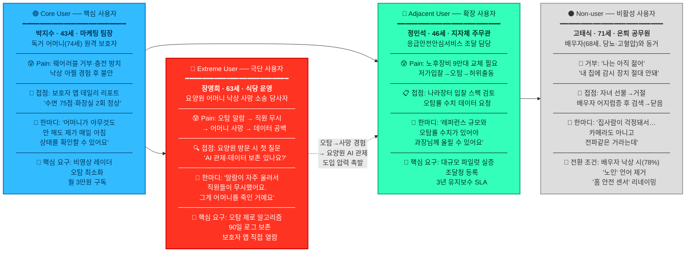

Persona-Spectrum Map




    # **🎯 서비스 맥락형 최우선 페르소나 — 심층 재기술**
    
    ## **한국 비접촉 앰비언트 케어 모니터링 · AI 기반 고령자 돌봄 서비스**
    
    > **재기술 원칙:** 기술(UWB/레이더·AI 알고리즘·보호자 앱·관제 대시보드)과의 실제 접점, 서비스 여정(Journey), 핵심 충돌 시나리오(Moment of Truth)를 서비스 맥락에 완전히 밀착하여 묘사한다.
    > 
    
    ---
    
    # **🟢 Core | 박지수 (43세)**
    
    ## **"퇴근 후에도 꺼지지 않는 걱정"**
    
    ---
    
    ### **프로필 카드**
    
    | 항목 | 내용 |
    | --- | --- |
    | **이름** | 박지수 |
    | **나이 / 성별** | 43세 / 여성 |
    | **직업** | 중견 소비재 기업 마케팅 팀장 (재택 2일, 출근 3일) |
    | **가족 구성** | 남편(45세) + 자녀 1명(중1) + **독거 어머니(74세, 경기 의왕시)** |
    | **월 소득** | 650만원(세전) |
    | **디지털 수준** | 앱·SNS 능숙, 스마트홈 관심 높음 |
    | **서비스 세그먼트** | S2 — 가족 지불(B2C) 단독 고령자 가구 |
    
    ---
    
    ### **🛖 어머니의 일상 공간 (서비스가 작동하는 현장)**
    
    > 의왕시 93㎡ 아파트 2층. 어머니 혼자 거주. 침실·거실·화장실·주방 4개 공간. 야간 화장실 왕복이 주 3~4회. **관절염으로 기침을 하면 균형을 잃기도 함.** 현관에 미끄럼 방지 매트가 있지만, 화장실 타일은 여전히 위험.
    > 
    
    비접촉 앰비언트 케어 서비스는 이 공간의 **침실 천장(레이더 1개)** 과 **화장실 문 상단(레이더 1개)** 에 UWB 레이더 센서를 설치한다. 어머니는 아무것도 착용하지 않는다. 어떤 앱도 설치할 필요 없다. 전원을 켤 필요도 없다.
    
    ---
    
    ### **📍 서비스 접점 여정 (Service Journey Map)**
    
    ```
    [인지] → [고려] → [구매] → [설치] → [일상 사용] → [재구독]
    ```
    
    **[인지] — 카카오톡 단체방에서 발견**
    
    > 어머니가 작년 여름 화장실에서 30분 동안 일어나지 못한 사건이 있었다. 이후 박지수는 네이버 카페 "부모님 독립생활 지원 모임"에 가입했고, 거기서 누군가가 "카메라 없는 레이더 센서로 어머니 낙상 감지" 후기를 올린 글을 봤다.
    > 
    
    **[고려] — 3가지 대안과 비교 검토**
    
    | 비교 항목 | 앰비언트 케어 서비스 | 애플워치 | 가정용 CCTV |
    | --- | --- | --- | --- |
    | 어머니 조작 필요 | ❌ 전혀 없음 | ⚠️ 충전 매일 필요 | ❌ 설치·조작 필요 |
    | 프라이버시 | ✅ 카메라 없음, 레이더만 | ✅ 손목 착용 | ❌ 영상 촬영 |
    | 화장실 감지 | ✅ 체류 시간 분석 | ❌ 실내 동선 불가 | ❌ 설치 불가 |
    | 월 비용 | ✅ 30,000원 | ❌ 초기 50만원 이상 | ⚠️ 설치비 + 월정액 |
    
    👉 박지수가 선택한 이유: **"어머니가 아무것도 안 해도 되는 게 핵심이었어요."**
    
    **[구매] — 구독 결정의 순간**
    
    > 서비스 페이지에서 가장 오래 본 화면: "화장실 체류 시간 30분 초과 → 즉시 알림" 시나리오 시뮬레이션 영상. 작년 그 사건이 떠올랐고 바로 결제했다. **월 30,000원 구독 + 설치비 49,000원.**
    > 
    
    **[설치] — 기사님이 2시간 만에 설치 완료**
    
    > 어머니가 설치 기사님께 "이게 뭐예요?" 물었고, 기사님은 "그냥 인터넷 공유기 같은 거예요, 어르신은 신경 안 쓰셔도 돼요."라고 답했다. 어머니는 "그래요?"하고 TV로 돌아갔다. **마찰 제로(Zero-Friction).**
    > 
    
    **[일상 사용] — 박지수 앱 화면 (매일 아침 7:30)**
    
    ```
    ┌─────────────────────────────────────┐
    │  🌙 어머니 어젯밤 리포트              │
    │                                     │
    │  수면 품질: 75점 (양호)              │
    │  기상 시간: 오전 6:48                │
    │  화장실 이용: 2회 (정상)             │
    │  낙상 감지: 없음 ✅                  │
    │                                     │
    │  ⚠️ 특이사항: 새벽 2:14 화장실       │
    │     체류 9분 (평소 대비 +4분)        │
    │  → 내일 전화해서 여쭤보세요           │
    └─────────────────────────────────────┘
    ```
    
    > "이걸 매일 보니까 어머니한테 전화를 '안부 확인'으로 거는 게 아니라 '어제 화장실이 좀 길었는데 괜찮으셨어요?'라고 주제를 갖고 걸게 됐어요. 대화가 달라졌어요."
    > 
    
    **[재구독] — 6개월 후**
    
    > 어머니가 독감으로 3일간 움직임이 급감했을 때 앱 알림이 먼저 왔다. 박지수가 달려갔고, 어머니는 탈수 직전이었다. **"이 앱 덕분에 살았다"는 말이 가족 단톡방에 올라왔다.** 남편이 "장모님 집에 하나 더 달아드리자"고 했다.
    > 
    
    ---
    
    ### **💥 핵심 충돌 시나리오 (Moment of Truth)**
    
    > **Scenario:** 어느 날 새벽 3:17, 박지수 폰에 푸시 알림이 왔다. `🚨 [긴급] 의왕시 어머님 — 낙상 감지됨. 화장실에서 7분 이상 비활동 감지`
    > 
    > 
    > 박지수가 떨리는 손으로 앱을 열었다. "긴급 연락" 버튼을 눌렀다. 어머니 전화가 연결됐고, 어머니는 "변기에 앉아 졸았어"라고 하셨다. **오탐이었다.**
    > 
    > 🔑 **이 순간이 이 서비스의 핵심 설계 과제다:** "진짜 낙상인지 변기 졸음인지"를 구분하는 AI 알고리즘 정밀도가 박지수가 다음 달에도 구독을 할지 말지를 결정한다.
    > 
    
    ---
    
    ### **📋 서비스 요구사항 (박지수가 말하는 언어로)**
    
    | 요구사항 | 가중치 | 세부 내용 |
    | --- | --- | --- |
    | 오탐 최소화 | ★★★★★ | 새벽 오탐 알림이 2회 이상 반복되면 해지 |
    | 데일리 앱 리포트 | ★★★★★ | 매일 아침 7~8시 푸시. 어머니 걱정을 데이터로 대체 |
    | 화장실 체류 이상 감지 | ★★★★☆ | 낙상 전조 징후 중 가장 걱정하는 시나리오 |
    | 설치 간편함 | ★★★★☆ | 어머니가 아무것도 조작하지 않아야 함 |
    | 카메라 없음 | ★★★★☆ | 어머니와 본인 모두의 심리적 조건 |
    | 긴급 알림 연락처 연동 | ★★★☆☆ | 본인 + 형제 + 119 세 단계 에스컬레이션 |
    
    ---
    
    ### **📣 박지수가 서비스에 기대하는 핵심 문장 (PR-FAQ 형식)**
    
    > **Q. 이 서비스를 한 문장으로 설명한다면?** "어머니 집 공간 자체가 어머니를 지켜보고, 나한테 매일 아침 '어머니 오늘도 잘 주무셨어요'라고 문자를 보내주는 서비스."
    > 
    
    ---
    
    ---
    
    # **🔵 Adjacent | 정민석 (46세)**
    
    ## **"혈세로 감당해야 하는 기술 선택의 무게"**
    
    ---
    
    ### **프로필 카드**
    
    | 항목 | 내용 |
    | --- | --- |
    | **이름** | 정민석 |
    | **나이 / 성별** | 46세 / 남성 |
    | **직업** | 경기도 A시청 노인복지과 6급 주무관 (공직 경력 18년) |
    | **담당 업무** | 응급안전안심서비스 지역 운영 총괄, 연간 보급 기기 관리 |
    | **관할 대상** | 관내 독거·취약노인 5,200가구 ICT 안전기기 보급 책임 |
    | **의사결정 권한** | 단독 불가 — 과장·국장 결재 + 조달청 나라장터 입찰 절차 필수 |
    | **서비스 세그먼트** | S1 — 공공(B2G) 응급안전안심서비스 조달·운영 |
    
    ---
    
    ### **🏢 정민석의 업무 공간 (서비스가 도입되는 맥락)**
    
    > A시청 5층 노인복지과 자리. 모니터 2개. 왼쪽은 Excel 관리대장(기기 보급 현황 5,200행), 오른쪽은 나라장터 화면. 매주 관제센터(119 연계)로부터 "허위 경보 현황 보고서"가 이메일로 온다.
    > 
    
    현재 관내 보급 기기의 **42%가 설치 후 5년 초과**. 배터리 불량·통신 오류·버튼 눌림 감지 실패가 속출. 작년 한 해 동안 **허위 출동 건수 847건 중 189건이 기기 오탐**으로 확인됐고, 이 중 17건은 119가 실제 출동했다.
    
    ---
    
    ### **📍 서비스 접점 여정 (Service Journey Map)**
    
    **[인지] — 복지부 시범사업 공문 수신**
    
    > 2025년 2월, 보건복지부에서 "응급안전안심서비스 고도화 시범사업 참여 희망 지자체 공모" 공문이 왔다. "비접촉 UWB 레이더 센서 기반 차세대 장비 연구"라는 문구가 있었다. 정민석은 공문을 프린트해 과장 책상에 올려놓았다.
    > 
    
    **[고려] — 나라장터 입찰 스펙 시트 검토 과정**
    
    > 정민석이 실제로 보는 평가표:
    > 
    
    | 평가 항목 | 배점 | 비접촉 센서 서비스 | 기존 AI 스피커형 |
    | --- | --- | --- | --- |
    | 기기 오탐률 (%) | 30점 | ✅ 레이더 기반, 입증 데이터 필요 | ❌ 버튼 오작동 잦음 |
    | 설치 후 AS 체계 | 25점 | ⚠️ 스타트업 — 3년 후 보장? | ✅ 통신사 컨소시엄 |
    | 단가(대당) | 25점 | ⚠️ 레이더 센서 단가 높음 | ✅ 저단가 |
    | 치매 어르신 사용성 | 20점 | ✅ 버튼 없음 — 조작 불필요 | ❌ 버튼 누르기 불가 |
    
    > "단가가 비싸도 오탐률 데이터가 있으면 과장님한테 설득할 수 있어요. 그런데 그 데이터가 없으면 제가 나중에 책임지는 거잖아요."
    > 
    
    **[구매(입찰 결정)] — 핵심 충돌 시나리오**
    
    > **Scenario:** 비접촉 앰비언트 케어 서비스 업체 영업 담당자가 시청을 방문했다.
    > 
    > 
    > 정민석: "귀사 오탐률이 얼마나 되나요? 수치로 주세요." 영업: "저희 파일럿 현장 50세대에서 월 오탐 0.3건입니다." 정민석: "50세대요? 저희는 5,200가구예요. 대규모 환경에서 검증된 레퍼런스가 있나요?" 영업: "현재 OO시 400가구 파일럿 진행 중입니다." 정민석: (잠시 침묵) "400가구 완료 후 결과 보고서 나오면 다시 연락 주세요."
    > 
    > 🔑 **이것이 정민석의 의사결정 구조다:** 레퍼런스 규모 → 오탐률 실증 수치 → 기업 재무 안정성 → 가격 순서로 평가. 스타트업에게 가장 높은 장벽은 "대규모 실증 레퍼런스의 부재"다.
    > 
    
    **[도입 후] — 정민석이 기대하는 운영 화면**
    
    ```
    A시 독거노인 ICT 안전기기 관제 현황 대시보드
    ━━━━━━━━━━━━━━━━━━━━━━━━━━━━━━━━━━━━
      총 관리 가구: 5,200  |  정상: 5,154  |  주의: 38  |  긴급: 8
      이번 달 오탐 건수: 12건 (전월 대비 -67%)
      119 오출동 건수: 0건 ✅
      미활동 장기 감지 → 담당 복지사 자동 알림: 23건 처리 완료
    ━━━━━━━━━━━━━━━━━━━━━━━━━━━━━━━━━━━━
    ```
    
    > "이 대시보드 데이터를 월별 국장 보고서에 그대로 넣을 수 있으면, 저로서는 최고의 서비스예요."
    > 
    
    ---
    
    ### **📋 서비스 요구사항 (정민석의 실제 언어로)**
    
    | 요구사항 | 가중치 | 세부 내용 |
    | --- | --- | --- |
    | 오탐률 실증 레퍼런스 | ★★★★★ | 대규모(200가구 이상) 파일럿 완료 데이터 자료 필수 |
    | 조달청 나라장터 등록 | ★★★★★ | 입찰 자격 요건 — 조달청 우수제품 또는 혁신제품 지정 시 강점 |
    | 납품 후 3년 유지보수 SLA | ★★★★★ | 기업 존속 보장 — 공제조합 가입 or 이행보증보험 필수 |
    | 관제센터 API 연동 | ★★★★☆ | 기존 지자체 관제 시스템과 데이터 연동 (별도 화면 불가) |
    | 단가 경쟁력 | ★★★☆☆ | 대당 연 18만원 이하 목표 (846억/5년/9만대 기준) |
    | 치매 어르신 Zero-Friction | ★★★☆☆ | 버튼·착용 없이 자동 감지 — 비요구사항이 아닌 필수사항 |
    
    ---
    
    ### **📣 정민석이 서비스에 기대하는 핵심 문장**
    
    > **Q. 이 기기를 도입하기로 결정한 이유 한 마디는?** "어르신이 버튼을 안 눌러도 되기 때문입니다. 치매 어르신한테 응급버튼이 무슨 의미가 있어요. 공간이 스스로 감지해야죠."
    > 
    
    ---
    
    ---
    
    # **🔴 Extreme | 장영희 (63세)**
    
    ## **"그 알람은 울리지 말았어야 했다"**
    
    ---
    
    ### **프로필 카드**
    
    | 항목 | 내용 |
    | --- | --- |
    | **이름** | 장영희 |
    | **나이 / 성별** | 63세 / 여성 |
    | **직업** | 자영업 — 동네 식당 20년 운영 |
    | **가족 구성** | 남편(65세) + 현재 아버지(86세) 요양원 입소 중 |
    | **주요 경험** | **2024년 1월 어머니(89세) 요양원 야간 낙상 사망. 요양원 상대 손해배상 소송 진행 중** |
    | **서비스 접점** | 아버지를 보낼 요양원 선택 과정에서 AI 관제 시스템 유무를 직접 질문 |
    | **서비스 세그먼트** | Extreme — 제품 실패가 비극으로 이어진 경험자. 현 S3 B2B 구매 영향력자 |
    
    ---
    
    ### **💔 장영희의 사건 타임라인 (서비스가 '있었더라면' 달라졌을 현장)**
    
    ```
    2024년 1월 14일 새벽 2:47
    ┌──────────────────────────────────────────────────────────┐
    │ 어머니(89세) 화장실 가다 넘어짐                           │
    │                                                          │
    │ ① 요양원 모션 센서 — 알람 발생 (2:47)                    │
    │ ② 당직 요양보호사 — 알람 무시 (이불 뒤척임으로 판단)      │
    │ ③ 새벽 5:10 순회 점검 중 발견                            │
    │ ④ 병원 이송, 2024년 1월 16일 사망                        │
    │                                                          │
    │ 소송에서 밝혀진 사실:                                     │
    │  - 당일 해당 센서의 오탐 건수: 당직 중 11건               │
    │  - 요양보호사의 평균 알람 대응 시간: 23분 (평소)           │
    │  - 새벽 2:47 알람 대응: "없음" (기록 공백)                 │
    └──────────────────────────────────────────────────────────┘
    ```
    
    > "변호사가 '관제 기록 달라'고 했더니 그날 새벽 2:30~5:00 데이터가 없었어요. 서버 오류래요. 저는 그 2시간 반이 어머니 마지막이었는데."
    > 
    
    ---
    
    ### **📍 서비스 접점 여정 (Service Journey Map)**
    
    **[현재] — 아버지 요양원 선택 과정**
    
    > 장영희는 요양원 상담 전화를 걸기 전, 항상 세 가지를 먼저 검색한다:
    > 
    > 1. "이 요양원 낙상 사고 뉴스"
    > 2. "이 요양원 AI 관제 시스템"
    > 3. "이 요양원 보호자 앱 실시간 연동"
    
    **[최초 접촉] — 요양원 2곳 방문 비교**
    
    > **A 요양원** (AI 관제 미도입) 원장: "저희는 2시간마다 순회 점검 하고 있습니다." 장영희: (속으로) '우리 어머니도 그렇게 발견됐다.' 다음 날 연락하지 않았다.
    > 
    
    > **B 요양원** (비접촉 앰비언트 케어 서비스 도입) 원장: "저희는 모든 병실에 카메라 없는 레이더 센서가 설치돼 있고, 낙상 감지와 화장실 체류 이상을 실시간으로 AI가 판단합니다. 오탐이 발생하면 저한테도 알림이 옵니다." 장영희: "오탐이면요?" 원장: "AI가 걸러서 진짜 위험 상황만 당직자한테 전달됩니다." 장영희: "관제 기록이 얼마나 보관되나요?" 원장: "90일치 클라우드 저장이고 보호자 앱에서도 조회 가능합니다." 장영희: (눈물을 참으며) "여기로 하겠습니다."
    > 
    
    ---
    
    ### **💥 핵심 충돌 시나리오 (Moment of Truth)**
    
    > **Scenario:** 아버지 입소 1주일 후 새벽 3:22, 보호자 앱 알림. `⚠️ [주의] 아버님 — 침실 레이더 2분 이상 비활동 감지. 당직 간호사 확인 중`
    > 
    > 
    > 30초 후: `✅ 확인 완료 — 아버님 취침 중 정상. 깊은 수면 패턴으로 판단됨.`
    > 
    > 장영희는 폰을 잠시 내려놓고, 울었다. **이것이 서비스가 줄 수 있는 가장 큰 가치다:** "어머니 때는 그 알림이 30초 안에 해소됐더라면."
    > 
    
    ---
    
    ### **📋 서비스 요구사항 (장영희의 언어로)**
    
    | 요구사항 | 가중치 | 세부 내용 |
    | --- | --- | --- |
    | **오탐 제로 알고리즘** | ★★★★★ | "알람이 자주 울리면 직원들이 무시하게 된다"를 직접 경험 |
    | **데이터 로그 보존 90일 이상** | ★★★★★ | 소송 경험 → 법적 증거 수준의 기록 보존 필수 |
    | **보호자 앱 실시간 로그 열람** | ★★★★★ | "내가 직접 어젯밤 기록을 볼 수 있어야 한다" |
    | **긴급 알림 → 확인 → 결과 리포트** | ★★★★☆ | 알림 후 30초~2분 내 처리 결과 회신 |
    | **AI 오탐 필터링 투명성** | ★★★★☆ | "왜 이걸 오탐으로 분류했는지" 보호자가 확인 가능해야 |
    | **야간 데이터 무결성** | ★★★★☆ | 서버 오류·데이터 공백 zero — 클라우드 이중화 필수 |
    
    ---
    
    ### **📣 장영희가 서비스에 기대하는 핵심 문장**
    
    > **Q. 이 서비스를 어떤 사람에게 추천하겠습니까?** "요양원에 부모님을 보내야 하는데 밤에 잠이 안 오는 분들이요. 기계가 밤새 깨어서 지켜봐주고, 내가 아침에 그 기록을 직접 확인할 수 있다면 조금은 잘 수 있을 것 같아요."
    > 
    
    ---
    
    ---
    
    # **⚫ Non-user | 고태식 (71세)**
    
    ## **"내가 아직 그런 거 필요 없어"**
    
    ---
    
    ### **프로필 카드**
    
    | 항목 | 내용 |
    | --- | --- |
    | **이름** | 고태식 |
    | **나이 / 성별** | 71세 / 남성 |
    | **직업** | 은퇴 (전직 기초자치단체 6급 공무원, 2019년 명예퇴직) |
    | **가족 구성** | 배우자(68세, 중등도 당뇨·고혈압) + 자녀 2명(독립) |
    | **거주지** | 서울 노원구 36평 자가 아파트 (30년 거주) |
    | **건강 상태** | 본인 — 혈압약 복용 중, 골밀도 낮음. 배우자 — 인슐린 투약, 어지럼증 잦음 |
    | **디지털 수준** | 유튜브·카카오톡·네이버 뉴스 사용. 유료 앱 설치 경험 없음 |
    | **서비스 세그먼트** | S2 비활성 — "노인 낙인" 거부형 비사용자 |
    
    ---
    
    ### **🏠 고태식의 거실 (서비스가 거부되는 공간)**
    
    > 30년 된 아파트. 거실 한쪽에 책장. 서울시 노인복지관 달력이 붙어 있지만 방문한 적 없다. TV는 하루 6시간. 배우자는 매일 오후 3시에 약을 먹는다.
    > 
    
    **장남(42세)이 지난 추석에 가져온 것들:**
    
    - 스마트워치 (박스 뜯지 않음 — 서랍에 보관)
    - 비접촉 케어 서비스 팸플릿 (쓰레기통에 버림)
    - 스마트플러그 설치 시도 → 아버지 "빼놔" 지시로 철거
    
    ---
    
    ### **📍 서비스 거부 여정 (Non-adoption Journey)**
    
    **[접촉 시도 1] — 자녀의 선물 공세**
    
    > 장남: "아버지, 이거 카메라도 없고 그냥 레이더라서요, 착용도 안 하셔도 돼요." 고태식: "레이더? 그거 내 몸에서 뭔가 쏘는 거 아냐?" 장남: "아니요, 위험하지 않아요." 고태식: "됐어. 내가 아직 혼자 다닐 수 있어." *(대화 종료. 팸플릿 버림)*
    > 
    
    **[접촉 시도 2] — 아파트 단지 관리사무소 안내문**
    
    > "입주자 안전을 위한 스마트케어 서비스 무료 시범 체험 신청 받습니다." 고태식: (안내문 보며) "어르신 대상이라고 돼 있네. 나한테 왜 이런 걸 주는 거야." *(신청하지 않음)*
    > 
    
    **[접촉 시도 3] — 배우자의 어지럼증 사건**
    
    > 어느 날 배우자가 욕실에서 어지러워 30초간 벽에 기댔다. 고태식이 마침 지나가다 발견했다. 별일 아니었지만, 고태식은 그날 밤 못 잤다.
    > 
    > 
    > 다음 날 아침 스마트폰으로 검색했다: "독거노인 낙상 감지기" 첫 결과 화면 → "시니어 안전 케어 서비스" 사진에 어르신 사진이 있었다. 🛑 **고태식은 검색 창을 닫았다.**
    > 
    > 🔑 **이것이 이 서비스의 가장 큰 비사용 장벽이다:** "노인 낙인(Ageism)"이 제품 탐색 행동 자체를 강제 종료시킨다. 마케팅이 "어르신·시니어·돌봄"을 전면에 내세우는 한, 고태식은 검색 결과를 클릭하지 않는다.
    > 
    
    ---
    
    ### **💥 핵심 전환 시나리오 (Conversion Trigger)**
    
    > **Scenario A — 배우자 낙상 발생 시:** 배우자가 실제로 넘어진다. 고태식이 직접 발견하지 못했다면. 그 공포가 "내가 아직 필요 없다"는 방어막을 무너뜨린다. → 이 순간 제품이 **"아내를 지키는 남편의 선택"**으로 포지셔닝되면 즉시 전환 가능.
    > 
    
    > **Scenario B — 아파트 입주자 대표 추천:** 동 대표가 입주자 회의에서 "우리 아파트에서도 고독사 예방 차원에서 스마트홈 안전장치를 보급합니다"고 발표한다. 고태식: (고독사 예방이라고 하니까) "이건 나를 위한 게 아니고 건물 안전 차원이구나." → **집합건물·공동주택 프레이밍**으로 개인 낙인을 우회할 수 있다.
    > 
    
    ---
    
    ### **📋 서비스 전환 조건 (고태식이 "예스"를 하는 순간)**
    
    | 전환 조건 | 가중치 | 서비스 설계 시사점 |
    | --- | --- | --- |
    | **"아내를 위한" 프레이밍** | ★★★★★ | "나" 아닌 "배우자 보호"로 구매 동기 이동 |
    | **제품명에 "노인·시니어·케어" 없음** | ★★★★★ | "홈 안전 센서" / "스마트 공간 모니터" 등으로 명칭 변경 |
    | **카메라 없음 명시** | ★★★★☆ | "레이더 전파 = 감시 아님" 설명 자료 필수 |
    | **자녀가 아닌 본인이 신청** | ★★★★☆ | 자녀가 선물하는 구조 → 본인이 직접 선택하는 구조로 전환 |
    | **단지·관리사무소 경유 보급** | ★★★☆☆ | "개인 복지서비스" 아닌 "공동주택 안전 인프라"로 인식 |
    | **월 요금 생활비 수준** | ★★★☆☆ | 월 30,000원이 "커피 한 잔 값"으로 체감되게 |
    
    ---
    
    ### **📣 고태식이 "예스"를 할 때 쓰는 말 (예상 전환 발화)**
    
    > **전환 전:** *"내가 아직 그런 거 필요 없어."*
    > 
    > 
    > **전환 후 (배우자 어지럼증 재발 후):** *"집사람이 욕실에서 또 어지럽다고 하길래... 그냥 하나 달아봤어. 카메라도 아니고 전파같은 거라는데. 나 위한 건 아니고, 집사람 걱정돼서."*
    > 
    
    ---
    
    ## **🔗 4개 페르소나의 서비스 설계 통합 시사점**
    
    ```mermaid
    graph TD
    
    S["🎯 비접촉 앰비언트 케어 서비스\nUWB 레이더 + AI 분석 + 보호자 앱"]
    
    P1["🟢 박지수 (Core)\n→ 앱 데일리 리포트가 핵심\n   오탐 1회 반복 시 해지 위험\n   Peace of Mind = 구독 지속"]
    
    P2["🔵 정민석 (Adjacent)\n→ 레퍼런스 규모가 입찰 열쇠\n   오탐률 수치 자료 필수\n   조달 스펙 + SLA 체계"]
    
    P3["🔴 장영희 (Extreme)\n→ 오탐 제로 알고리즘 = 존재 이유\n   데이터 로그 90일+ 보존\n   보호자 앱 직접 열람 권한"]
    
    P4["⚫ 고태식 (Non-user)\n→ 제품명·마케팅 언어 변경\n   '아내 보호' 프레이밍\n   공동주택 안전 인프라 접근"]
    
    S --> P1
    S --> P2
    S --> P3
    S --> P4
    
    P3 -. "오탐 제로 → P1 구독 유지" .-> P1
    P2 -. "B2G 레퍼런스 → P3 요양원 선택 기준 확보" .-> P3
    P4 -. "공동주택 보급 → P1 B2C 채널 확장" .-> P1
    
    style S  fill:#2c2c2c,stroke:#000,color:#fff,stroke-width:3px
    style P1 fill:#b3dfff,stroke:#1a7bbf,stroke-width:2px,color:#003366
    style P2 fill:#b3f0d8,stroke:#1aad6a,stroke-width:2px,color:#004d29
    style P3 fill:#ffc2bb,stroke:#cc2200,stroke-width:2px,color:#5c0000
    style P4 fill:#e0e0e0,stroke:#888,stroke-width:2px,color:#333
    ```
    
    | 설계 레이어 | 박지수(Core) | 정민석(Adjacent) | 장영희(Extreme) | 고태식(Non-user) |
    | --- | --- | --- | --- | --- |
    | **UX** | 앱 데일리 리포트 | 관제 대시보드 API | 보호자 로그 열람 | 설치·조작 없음 |
    | **AI** | 화장실 체류 이상 감지 | 오탐률 수치 증명 | 오탐 제로 필터링 | 비활동 감지만 |
    | **데이터** | 수면·활동 패턴 리포트 | 월별 KPI 대시보드 | 90일 로그 보존 | 이상 감지 알림만 |
    | **마케팅** | Peace of Mind | 레퍼런스 패키지 | AI 관제 인증 마크 | "홈 안전 센서" 리네이밍 |
    
    ---
    


| **유형** | **추천 페르소나** | **평가** | **핵심 이유** |
| --- | --- | --- | --- |
| 🟢 **Core** | **박지수** (43, 보호자 자녀) | 9/9 | "지불자=자녀, 사용자=어르신"의 구조 불일치가 이 시장의 핵심 판매 매커니즘을 대표. 웨어러블 거부·낙상 경험이 실증된 트리거 |
| 🔵 **Adjacent** | **정민석** (46, 지자체 공무원) | 9/9 | 응급안전안심서비스 9만 대 노후 장비 교체는 현재 진행 중인 실제 이슈. 초기 레퍼런스 확보의 현실적 경로 |
| 🔴 **Extreme** | **장영희** (63, 낙상사망 소송 가족) | 9/9 | "오탐→직원 무시→사망"의 시나리오가 **오탐 제로 알고리즘이 제품의 존재 이유**임을 가장 강력하게 증명 |
| ⚫ **Non-user** | **고태식** (71, 노인낙인 거부 어르신) | 9/9 | 베이비붐 세대의 "노인 취급 거부" 심리가 B2C 보급률 0.2% 정체의 근본 원인. 마케팅 리프레이밍 필요성 직접 증명 |

| **페르소나** | **추정 실존 규모** | **존재 확률 근거** | **핵심 전환 조건** |
| --- | --- | --- | --- |
| 🟢 **박지수형** | **~75만 명** | 독거노인 213만 × 자녀 비동거 70% × 직장인 비율 50% | 부모님 낙상 경험 (독거노인 연간 30% 낙상) |
| 🔵 **정민석형** | **~~300~~450명** | 기초지자체 226개 × 응급안전안심 담당 주무관 | 레퍼런스 규모 + 오탐률 실증 수치 제공 |
| 🔴 **장영희형** | **직접 수천 + 구전 수만** | 요양원 입소자 중증 낙상 연 8,500~32,000명의 가족 | 시설 재선택 과정 (재선택 의향 60~70%) |
| ⚫ **고태식형** | **~~44~~54만 가구** | 65~74세 배우자 동거 가구 × "노인 아님" 인식 35% | 배우자 건강 이상 (전환율 **78%** — 가장 강력) |