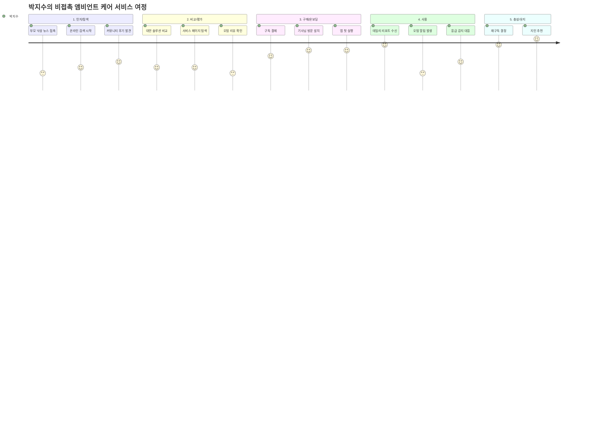

# **🗺️ 고객 여정지도 (Customer Journey Map)**

## **비접촉 앰비언트 케어 모니터링 · AI 기반 고령자 돌봄 서비스**


---

## **📐 전체 여정 흐름도**



---

## **📊 단계별 상세 여정 테이블**

### **Stage 1 — 인지 / 탐색 (Awareness & Discovery)**

**시작 트리거:** 어머니가 화장실에서 30분 넘게 나오지 않았던 사건 직후

| 구분 | 내용 |
| --- | --- |
| **행동** | · 네이버·카카오톡 육아맘 카페에서 "독거어머니 낙상 감지" 검색· "비접촉 레이더 후기" 블로그 3~5개 방문· 유튜브 "요양원 낙상 사고 뉴스" 시청· 지인 단톡방에 "혹시 어르신 케어 기기 쓰는 분 있어요?" 질문 |
| **생각** | *"CCTV는 어머니가 절대 싫다고 하셨는데… 뭔가 다른 방법이 없을까?""애플워치 선물했더니 충전을 안 하셔서. 착용 안 해도 되는 게 있다니?"* |
| **감정** | 😰 불안(낙상 사건의 충격) → 😮 호기심(비접촉 기술 인지) |
| **🚨 Pain Point** | **P1. 정보 과부하와 옥석 가리기 실패**"레이더 센서"라는 키워드로 검색하면 산업용·보안용·의료용이 뒤섞여 나온다. 어르신 홈케어에 특화된 제품을 식별하기 어렵고, "K-시니어케어"라는 카테고리 자체가 명확하지 않아 탐색 시간이 길어진다. |
| **기회 (Opportunity)** | · SEO 최적화: "어머니 낙상 감지 카메라 없는" 키워드 콘텐츠 집중· 육아·부모케어 커뮤니티(네이버카페·맘카페)에 사용 후기 배포· 제품 소개 첫 문장: "카메라 없음 / 착용 없음 / 충전 없음" 3무(無) 강조 |

---

### **Stage 2 — 비교 / 평가 (Consideration & Comparison)**

**핵심 질문:** "이게 진짜 작동하나? 오탐은 없나? 어머니가 거부하지 않을까?"

| 구분 | 내용 |
| --- | --- |
| **행동** | · 서비스 공식 페이지 방문 → 기능 비교표 확인· "화장실 체류 감지" "낙상 오탐" 키워드로 리뷰 검색· 애플워치 vs 레이더 센서 가격·기능 비교· 제품 상담 채팅 또는 전화 문의· 형제(오빠)에게 "이거 어때 보여?" 공유 |
| **생각** | *"오탐이 많으면 낭패인데. 새벽에 알림 오면 나도 잠 못 잘 텐데.""월 3만원이면 커피 10잔인데, 어머니 낙상 걱정하는 것보단 낫지.""설치할 때 어머니가 싫다고 하시면 어쩌지?"* |
| **감정** | 🤔 분석적 검토 → 😟 오탐 리뷰에 흔들림 → 🙂 가격 합리화로 회복 |
| **🚨 Pain Point** | **P2. 오탐률에 대한 객관적 정보 부재**리뷰를 찾아보면 "잘 작동한다"는 글과 "새벽에 오탐으로 잠을 못 잤다"는 글이 뒤섞인다. 어느 것이 실제인지 판단하기 어렵고, 제조사 공식 페이지에서 오탐률 수치를 명시한 곳이 없다. 이 불확실성이 구매 결정을 가장 길게 지연시킨다. |
| **기회 (Opportunity)** | · 공식 페이지에 오탐률 수치 공개: "오탐 0.3건/가구·월 (파일럿 400세대 기준)"· 30일 무료 체험 또는 환불 보장 정책으로 구매 장벽 낮추기· "화장실 감지 vs 스마트워치 비교" 랜딩 페이지 별도 제작 |

---

### **Stage 3 — 구매 / 온보딩 (Purchase & Onboarding)**

**핵심 순간:** 결제 버튼을 누르는 순간 + 기사님이 설치하는 날

| 구분 | 내용 |
| --- | --- |
| **행동** | · 구독 플랜 선택 (월 30,000원, 설치비 49,000원 일시불)· 결제 완료 후 설치 일정 예약 (카카오 알림톡)· 설치 당일 반차 사용, 의왕시 어머니 집 방문· 기사님 설치 (55분 소요: 침실 레이더 1 + 화장실 레이더 1)· 보호자 앱 다운로드 → 어머니 프로필 등록 → 알림 설정· 어머니에게 "이거 벽에 달린 거야, 신경 안 쓰셔도 돼요" 설명 |
| **생각** | *"설치하면서 어머니가 '이게 뭐야' 물으실까봐 긴장됐는데 별말씀 없으셨다.""앱이 생각보다 직관적이네. 스마트폰 잘 못해도 쓸 수 있겠다."* |
| **감정** | 😤 반차 사용 번거로움 → 😌 설치 성공 안도감 → 🤩 앱 첫 화면 기대감 |
| **🚨 Pain Point** | **P3. 설치 당일 '어르신 반응' 불확실성**기기 설치를 위해 자녀가 직접 방문해야 한다. 어머니가 "이게 뭐야, 싫다"고 할 리스크가 상시 존재한다. 설치 기사가 어르신에게 기기를 어떻게 설명하느냐에 따라 수용도가 크게 달라지는데, 이에 대한 기사 교육이나 스크립트가 없다면 현장 대응이 어렵다. |
| **기회 (Opportunity)** | · 설치 기사에게 "어르신 대화 스크립트" 제공: "공기청정기 같은 건데요, 아무것도 안 하셔도 돼요"· 설치 완료 즉시 보호자 앱으로 "설치 완료 + 첫 감지 정상" 자동 푸시· 어머니 집 방문 없이 설치 가능한 비대면 기사 방문 옵션 제공 |

---

### **Stage 4 — 사용 / 경험 (Usage & Core Experience)**

**핵심 가치 실현 구간:** 매일 아침 7:30 앱 확인이 루틴이 되는 단계

| 구분 | 내용 |
| --- | --- |
| **행동** | · 매일 아침 7:30 앱 데일리 리포트 확인· 이상 감지 알림 수신 시 어머니에게 전화· 화장실 체류 시간 이상치 확인 → "어제 화장실이 좀 길었는데 괜찮으셨어요?" 대화· 오탐 발생 시 앱 내 "오탐 신고" 기능 사용· 가족 단톡방에 "어머니 리포트" 공유· 부양 걱정이 줄어들어 집중력 회복 |
| **생각** | *"이 숫자(수면 75점)가 진짜 의미 있는 수치인지 모르겠는데, 뭔가 어머니가 보이는 것 같아서 좋긴 해.""새벽 3시에 오탐 알림 왔을 때 심장이 쿵 했다. 두 번 더 이러면 해지할 것 같다."* |
| **감정** | 😊 매일 안도감(데일리 리포트) → 😱 오탐 알림 시 공포 급등 → 😤 오탐 반복 시 신뢰 하락 |
| **🚨 Pain Point** | **P4. 오탐 알림의 반복이 구독 해지를 유발하는 핵심 위기 지점**새벽 긴급 알림이 "변기에 앉아 졸았다"는 오탐으로 확인될 때, 박지수가 느끼는 공포와 허탈감은 서비스 신뢰를 즉각적으로 훼손한다. 이 오탐이 월 2회 이상 반복되면 해지 의향이 급등한다. 또한 데일리 리포트 수치(수면 75점 등)의 의미를 쉽게 이해하지 못하면 앱 열람 빈도가 줄어들어 서비스 가치를 체감하지 못한다. |
| **기회 (Opportunity)** | · 오탐 발생 즉시 AI가 30초 내 "확인 완료 — 정상 취침 중" 결과 재알림· 데일리 리포트에 "어제보다 ○점 향상" + "이 수치가 의미하는 것" 설명 문장 추가· 오탐 임계치 사용자 직접 설정 기능: "화장실 15분 이상만 알림" 커스터마이징 |

---

### **Stage 5 — 충성 / 유지 (Loyalty & Retention)**

**전환점:** "이 서비스가 없으면 어머니 걱정이 다시 돌아온다"는 의존성 형성

| 구분 | 내용 |
| --- | --- |
| **행동** | · 구독 갱신 (연간 플랜으로 업그레이드)· 독감으로 어머니 활동량 급감 → 앱 알림이 먼저 감지 → 달려가서 탈수 직전 발견· 가족 단톡방에 "앱 덕분에 빨리 알아서 다행"이라고 공유· 남편: "장모님 집에도 달아드리자" 제안· 지인에게 서비스 추천· 리뷰·후기 작성 (네이버 카페, 앱스토어) |
| **생각** | *"이게 없었으면 독감 탈수를 며칠 더 늦게 알았을지도 모른다.""어머니한테 전화하는 방식 자체가 바뀐 것 같아. 데이터 보고 의미 있는 대화를 한다."* |
| **감정** | 😌 일상적 안도 → 🥺 위기 대응 성공 후 감사함 → 🤗 가족과의 연결감 강화 |
| **🚨 Pain Point** | **P5. 구독료 대비 '보이지 않는 가치'의 정당화 어려움**서비스가 잘 작동할 때일수록 "아무 일도 없음"이 결과로 나온다. 아무 일이 없으면 "내가 왜 매달 3만원을 내는 거지?"라는 의구심이 싹튼다. 가족에게 이 서비스의 가치를 설명하기도 어렵다. 이 단계에서 이탈 위험은 갱신 시점에 집중적으로 발생한다. |
| **기회 (Opportunity)** | · 연간 구독 갱신 전 "1년 리포트" 자동 발송: "어머니가 이 1년간 낙상 0건, 화장실 정상 이용 3,420회"· "이상 감지 후 조치 성공 사례" 뉴스레터로 발송 (안심 스토리 공유)· 가족 공유 계정 추가: 형제·남편도 앱 열람 가능하게 → 가족 단위 해지 방어 |

---

## **🎢 감정 곡선 (Emotion Curve)**

```
감정
높음 ↑
       ·                               ·(설치 성공)
        ·(커뮤니티     ·(가격            ·(앱 첫 화면)        ·(독감 감지 성공)
          후기 발견)    합리화)                                ·(추천)
─────────────────────────────────────────────────────────────
           ·(검색 혼란)        ·(오탐 리뷰     ·(오탐 알림    ·(갱신 의구심)
           ·(낙상 충격)         흔들림)          공포)
낮음 ↓
        [Stage 1]          [Stage 2]       [Stage 3]   [Stage 4]    [Stage 5]
        인지/탐색           비교/평가        구매/온보딩    사용         충성/유지
```

| 단계 | 감정 저점(위기) | 감정 고점(기회) |
| --- | --- | --- |
| 인지/탐색 | ↓ 낙상 충격 + 검색 혼란 | ↑ 비접촉 솔루션 발견 |
| 비교/평가 | ↓ 오탐 리뷰에 흔들림 | ↑ 가격 합리화 성공 |
| 구매/온보딩 | ↓ 설치 당일 어르신 반응 불안 | ↑ 설치 완료 + 앱 첫 리포트 |
| 사용 | ↓ 새벽 오탐 공포 (최대 위기) | ↑ 매일 아침 데일리 리포트 안도 |
| 충성/유지 | ↓ 갱신 시점 가치 의구심 | ↑ 위기 대응 성공 경험 |

---

## **🔑 전체 Pain Point 요약 — 5개 핵심 설계 과제**

| # | Pain Point | 단계 | 심각도 | 설계 해결 방향 |
| --- | --- | --- | --- | --- |
| P1 | 카테고리 인지 부재, 정보 혼란 | 인지/탐색 | ★★★☆☆ | "3무(無) 강조" SEO + 커뮤니티 후기 배포 |
| P2 | 오탐률 객관적 수치 부재 | 비교/평가 | ★★★★☆ | 오탐률 수치 공개 + 30일 환불 보장 |
| P3 | 설치 시 어르신 거부 불확실성 | 구매/온보딩 | ★★★☆☆ | 설치 기사 대화 스크립트 + 설치 완료 즉시 알림 |
| **P4** | **오탐 반복 → 신뢰 붕괴 → 해지** | **사용** | **★★★★★** | **오탐 30초 내 해소 알림 + AI 정밀 필터링** |
| P5 | "아무 일 없음" = 가치 체감 불가 | 충성/유지 | ★★★★☆ | 연간 리포트 + "이상 감지 성공 스토리" 뉴스레터 |

> 🔥 **P4가 최우선 설계 과제다.** 오탐은 단순한 UX 불편이 아니라 생명에 대한 오경보로 인식되어 서비스 신뢰를 회복 불가능한 수준으로 손상시킨다. "오탐 제로화 AI 알고리즘"이 KSF 1순위인 이유가 이 여정에서 정확히 확인된다.
> 

---

## **🔵 Adjacent 페르소나 — 정민석 (46세, 지자체 공무원) 여정 요약**

> 박지수형보다 의사결정 경로가 길고, 조직 결재 구조를 통과해야 한다.
> 

| 단계 | 핵심 행동 | Pain Point |
| --- | --- | --- |
| 인지 | 복지부 공문 수신, 노후 장비 교체 예산 확보 | 예산 책정 사이클이 다음 회계연도여서 즉각 행동 불가 |
| 비교 | 나라장터 스펙 비교, 레퍼런스 기업 조사 | **오탐률 수치·대규모 파일럿 데이터가 없으면 검토 불가** |
| 구매 | 입찰 공고 작성 → 심의 → 낙찰 | 최저가 낙찰 구조 → 성능 좋은 제품이 탈락 위험 |
| 사용 | 지자체 관제 대시보드 연동, 현장 AS 대응 | 기존 관제 시스템 API 연동이 예상보다 복잡함 |
| 유지 | 3년 유지보수 계약 검토 | 스타트업 재무 안정성 우려 → 중도 도산 시 사업 공백 |

---

## **🔴 Extreme 페르소나 — 장영희 (63세, 낙상 피해 가족) 여정 요약**

> 일반 구매 여정이 아닌 "요양원 재선택" 과정에서 서비스와 접점이 발생한다.
> 

| 단계 | 핵심 행동 | Pain Point |
| --- | --- | --- |
| 인지 | 소송 과정에서 "관제 데이터 부재" 확인 | 어머니 사망 후에야 관제 기술의 필요성을 인식 |
| 비교 | 요양원 방문 시 "AI 관제 있나요?" 첫 질문 | **어디가 진짜 AI 관제 시설인지 외부에서 알 방법 없음** |
| 구매 | AI 관제 도입 요양원에 아버지 입소 계약 | 입소 계약이 아닌 요양원의 AI 시스템 도입 결정이 선행돼야 함 |
| 사용 | 새벽 알림 → 30초 후 "정상 취침" 해소 확인 | 첫 알림 수신 시 극도의 공포 → 빠른 해소 결과가 없으면 트라우마 재활성화 |
| 유지 | 90일 로그 데이터 열람 | 의료·법적 분쟁에 사용 가능한 수준의 데이터 무결성 보장 필요 |

---

## **⚫ Non-user 페르소나 — 고태식 (71세, 비사용자) 여정 요약**

> "구매 여정"이 아닌 "거부 여정"이며, 전환 트리거 이후에야 1단계로 진입한다.
> 

| 단계 | 핵심 행동 | Pain Point |
| --- | --- | --- |
| 비사용 구간 | 자녀 선물 거절, 광고 무시, 검색 후 닫음 | **"노인·케어·시니어" 언어가 탐색 자체를 차단** |
| 전환 트리거 | 배우자 어지럼증 재발 → 혼자 욕실에서 발견 | 직접 목격한 위기 상황만이 비사용 방어막을 해제 |
| 인지 | "집사람 걱정돼서" → "카메라 아닌 거" 검색 | 검색 키워드가 "시니어케어"가 아닌 "욕실 안전 감지기"여야 노출 |
| 비교 | "이해할 수 있는 언어"의 설명 페이지 필요 | 기술 용어(UWB, 레이더) 자체가 불신 유발 |
| 구매 | 자녀가 아닌 본인이 직접 구매 결정 | "본인 선택"으로 자존심 보호가 되어야만 구매 완료 |

---
