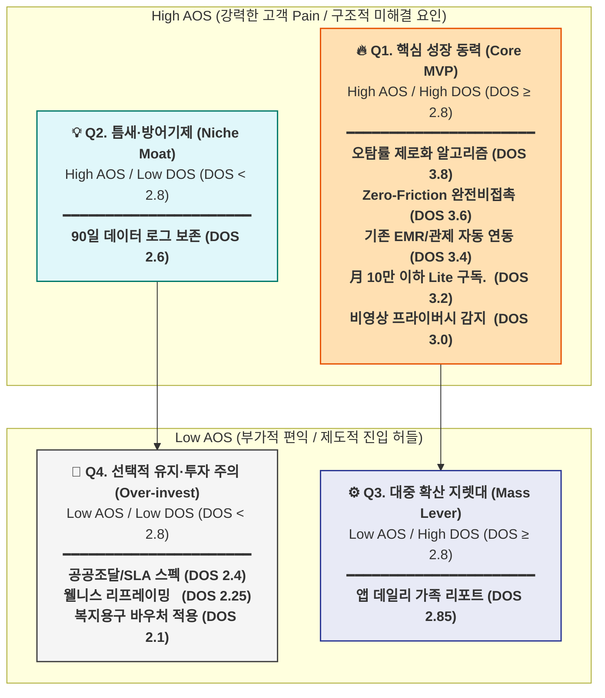
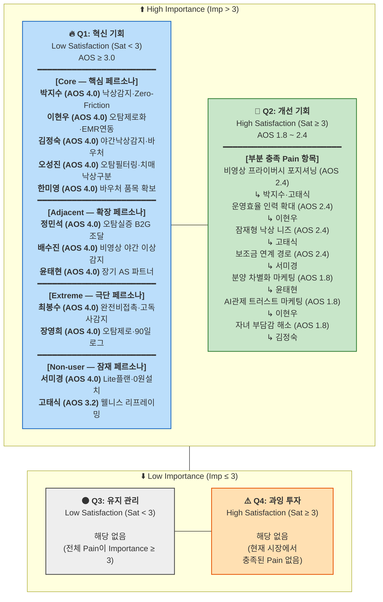

# **📊 AOS vs DOS 비교 매트릭스 분석**

## **한국 비접촉 앰비언트 케어 · AI 고령자 돌봄 서비스**


---

### **📈 AOS - DOS 사분면 매트릭스 (Mermaid)**



---

### **📋 상세 테이블 및 전략적 시사점**

| Pain/Goal 항목 | AOS | DOS | 사분면 (Quadrant) | 핵심 연관 페르소나 | 프로덕트 & GTM 전략 시사점 (Action Item) |
| --- | --- | --- | --- | --- | --- |
| **오탐률 제로 알고리즘** | 4.0 | 3.8 | **🔥 Q1. 핵심 성장 동력** | 이현우, 오성진 등 | 시장 침투를 위한 Product의 최우선 R&D 목표이자 절대 포기 불가 영역 |
| **Zero-Friction 기술** | 4.0 | 3.6 | **🔥 Q1. 핵심 성장 동력** | 박지수, 최봉수 등 | B2C, B2B 막론하고 사용자(어르신) 거부감을 없애는 1순위 기술 가치 |
| **기존 EMR/관제 연동** | 4.0 | 3.4 | **🔥 Q1. 핵심 성장 동력** | 이현우, 정민석 등 | B2B/B2G 스케일업 시 전환 비용(Lock-in)을 만들고 업무 마찰을 줄일 솔루션 |
| **Lite 구독형 모델** | 4.0 | 3.2 | **🔥 Q1. 핵심 성장 동력** | 서미경 원장 | 초기 제품 개발 후 Long-tail 시장(중소 요양원)을 휩어올 캐시카우 BM |
| **비영상 프라이버시 감지** | 4.0 | 3.0 | **🔥 Q1. 핵심 성장 동력** | 배수진, 박지수 | 인권과 감시의 경계를 무너뜨려 심리적 저항을 우회하는 B2C/B2B 전환 키워드 |
| **앱 데일리 가족 리포트** | 3.2 | 2.85 | **⚙️ Q3. 대중 확산 지렛대** | 박지수 독거 자녀 | 생존 직결의 Pain(AOS)은 아니나, 잦은 앱 방문과 보호자 바이럴(DOS)을 유발하는 성장 엔진 |
| **90일 데이터 로그 보존** | 4.0 | 2.6 | **💡 Q2. 틈새·방어기제** | 장영희 소송 가족 등 | 시장 파급력(DOS)은 좁으나 결정적 분쟁, 책임소재 판결 시 최강의 법적 방어 해자가 됨 |
| **공공조달 SLA/스펙** | 3.0 | 2.4 | **🚫 Q4. 선택적 투자 주의** | 정민석 주무관 등 | B2G, B2B2C 진입을 위한 '티켓' 개념이므로 필수적이나, 과도한 자원 투자는 지양 |
| **웰니스 리프레이밍** | 3.2 | 2.25 | **🚫 Q4. 선택적 투자 주의** | 고태식 등 | 비활성(Non-user) 심리 장벽을 녹이기 위한 커뮤니케이션 영역(R&D보다 마케팅 자원 투입 요망) |
| **복지용구 바우처 적용** | 3.2 | 2.1 | **🚫 Q4. 선택적 투자 주의** | 김정숙, 한미영 대표 | 매출 부스팅을 도울 유통 경로이나 심사 등 제도적 시간 지연이 크므로 병행 사업으로 처리 |

---

### **🧠 최종 전략 요약 (Top Strategy)**

AOS(문제 심각도)와 DOS(시장 파급력)를 교차로 분석함으로써 다음과 같은 프로덕트 자원 분배의 로드맵이 실증되었습니다.

1. **승부수 (Q1):** "오탐 제로 + 무조작 + EMR 연동"이 **모든 GTM 전략의 전제 조건**입니다. 여기서 타협하면 시장 붕괴를 초래합니다.
2. **성장 지렛대 (Q3):** 위에서 확보된 신뢰를 바탕으로 **'모바일 데일리 리포트'**가 추가되는 순간 마케팅과 바이럴 확산 속도(DOS)가 폭발적으로 증가합니다.
3. **선택과 집중 (Q4):** 초기 단계에서 공공 입찰과 바우처 적용 등 **제도적인 벽(Q4)은 후순위 채널 진출 수단으로 배치**하여 자원의 낭비(Over-investment)를 막아야 합니다.

# **📊 AOS 기반 기회점수 평가**

## **한국 비접촉 앰비언트 케어 · AI 고령자 돌봄 서비스**

### **Adjusted Opportunity Score (조정형 기회점수) 전체 페르소나 분석**


---

## **📐 평가 기준 정의**

| 항목 | 평가 근거 |
| --- | --- |
| **Importance** | 페르소나의 목표 강도·감정 표현·트리거 사건 심각도·대체 솔루션 포기 여부 기반 |
| **Satisfaction** | 현재 대체 솔루션이 Pain을 실제로 해결하는 정도 (1=전혀 해결 안됨, 5=완전 해결) |

---

# **🟢 Core 페르소나 (5명)**

---

## **Core-01 | 박지수 (43세, 독거 어머니 보호자 자녀)**

| # | Pain / Goal | Importance | Satisfaction | AOS | 해석 |
| --- | --- | --- | --- | --- | --- |
| C1-1 | **실시간 낙상·이상 감지 자동 알림** | 5 | 1 | `5×(1−0.2)=4.0` | 🔥 최우선 혁신기회 |
| C1-2 | **어르신 조작 없는 Zero-Friction 작동** | 5 | 1 | `5×(1−0.2)=4.0` | 🔥 최우선 혁신기회 |
| C1-3 | **카메라 없는 비영상 프라이버시 보장** | 4 | 2 | `4×(1−0.4)=2.4` | 개선 필요 |
| C1-4 | **앱 데일리 리포트 (수면·활동·화장실)** | 4 | 1 | `4×(1−0.2)=3.2` | 혁신기회 |

> **평가 근거:** Satisfaction=1 — 현재 대체재(전화·웨어러블·CCTV) 모두 어르신 거부 또는 방치로 실패. 낙상 직접 경험 트리거 → Importance 최대치(5).
> 

---

## **Core-02 | 이현우 (50세, 프리미엄 실버타운 원장)**

| # | Pain / Goal | Importance | Satisfaction | AOS | 해석 |
| --- | --- | --- | --- | --- | --- |
| C2-1 | **오탐률 제로화 (알람 피로 해소)** | 5 | 1 | `5×(1−0.2)=4.0` | 🔥 최우선 혁신기회 |
| C2-2 | **EMR 연동 · 관제 대시보드 통합** | 5 | 1 | `5×(1−0.2)=4.0` | 🔥 최우선 혁신기회 |
| C2-3 | **야간 직원 1인당 커버 세대 수 확대** | 4 | 2 | `4×(1−0.4)=2.4` | 개선 필요 |
| C2-4 | **"AI 관제 시설" 보호자 트러스트 마케팅** | 3 | 2 | `3×(1−0.4)=1.8` | 개선 기회 |

> **평가 근거:** 현재 ODM 모션 센서: 오탐 일 20~30회 → Satisfaction=1. EMR 연동 솔루션 시장에 존재하지 않음 → Satisfaction=1. 낙상 법적 책임 리스크 → Importance=5.
> 

---

## **Core-03 | 김정숙 (68세, 재가 수급자 독거 어르신)**

| # | Pain / Goal | Importance | Satisfaction | AOS | 해석 |
| --- | --- | --- | --- | --- | --- |
| C3-1 | **야간 낙상 자동 감지 + 자녀 알림** | 5 | 1 | `5×(1−0.2)=4.0` | 🔥 최우선 혁신기회 |
| C3-2 | **기기 착용·조작 없는 완전 자동 작동** | 5 | 1 | `5×(1−0.2)=4.0` | 🔥 최우선 혁신기회 |
| C3-3 | **복지용구 바우처(연 160만원) 적용 가능** | 4 | 1 | `4×(1−0.2)=3.2` | 혁신기회 |
| C3-4 | **자녀 부담감 해소 (자율적 생활 증명)** | 3 | 2 | `3×(1−0.4)=1.8` | 개선 기회 |

> **평가 근거:** GPS 손목벨트·웨어러블 모두 충전 방치 → 기존 해결책 완전 실패 → Satisfaction=1. 바우처 적용 가능 제품이 현재 시장에 거의 없음 → Satisfaction=1.
> 

---

## **Core-04 | 오성진 (37세, 요양원 수간호사)**

| # | Pain / Goal | Importance | Satisfaction | AOS | 해석 |
| --- | --- | --- | --- | --- | --- |
| C4-1 | **오탐 필터링 (진짜 낙상만 알림)** | 5 | 1 | `5×(1−0.2)=4.0` | 🔥 최우선 혁신기회 |
| C4-2 | **치매 배회 vs 낙상 AI 자동 구분** | 5 | 1 | `5×(1−0.2)=4.0` | 🔥 최우선 혁신기회 |
| C4-3 | **전 병동 직관적 실시간 대시보드** | 4 | 1 | `4×(1−0.2)=3.2` | 혁신기회 |
| C4-4 | **EMR 자동 연동 (수작업 기록 제거)** | 4 | 1 | `4×(1−0.2)=3.2` | 혁신기회 |

> **평가 근거:** 알람 피로 → 번아웃 위기 → 현장 안전 위협 → Importance=5. 현재 저가 모션센서+화이트보드 수동 기록: Satisfaction=1 전체.
> 

---

## **Core-05 | 한미영 (55세, 복지용구 사업소 대표)**

| # | Pain / Goal | Importance | Satisfaction | AOS | 해석 |
| --- | --- | --- | --- | --- | --- |
| C5-1 | **바우처 적용 가능 AI 모니터링 품목 확보** | 5 | 1 | `5×(1−0.2)=4.0` | 🔥 최우선 혁신기회 |
| C5-2 | **설치 후 자동 작동 (AS·CS 부담 최소화)** | 4 | 1 | `4×(1−0.2)=3.2` | 혁신기회 |
| C5-3 | **제조사의 앱·CS 대리 지원 파트너십** | 4 | 1 | `4×(1−0.2)=3.2` | 혁신기회 |
| C5-4 | **신규 AI 카테고리 마진율 개선** | 3 | 2 | `3×(1−0.4)=1.8` | 개선 기회 |

> **평가 근거:** AI 스피커 시범 취급 → 반품 다수 → Satisfaction=1. 바우처 적용 AI 케어 기기가 현재 제도적으로 거의 없음 → Satisfaction=1.
> 

---

# **🔵 Adjacent 페르소나 (3명)**

---

## **Adjacent-01 | 정민석 (46세, 지자체 복지 공무원)**

| # | Pain / Goal | Importance | Satisfaction | AOS | 해석 |
| --- | --- | --- | --- | --- | --- |
| A1-1 | **오탐률 수치 실증된 비접촉 AI 기기 조달** | 5 | 1 | `5×(1−0.2)=4.0` | 🔥 최우선 혁신기회 |
| A1-2 | **조달청 나라장터 등록·입찰 요건 충족** | 5 | 2 | `5×(1−0.4)=3.0` | 혁신기회 |
| A1-3 | **3년 유지보수 SLA + 기업 존속 보장** | 5 | 2 | `5×(1−0.4)=3.0` | 혁신기회 |
| A1-4 | **허위 출동 감소 → 119 행정 부담 완화** | 4 | 1 | `4×(1−0.2)=3.2` | 혁신기회 |

> **평가 근거:** 현재 최저가 ODM 기기 = 오탐 극심, 검증 데이터 없음 → Satisfaction=1. 공공 조달 리스크 회피 성향 → 기업 안정성 Importance=5.
> 

---

## **Adjacent-02 | 배수진 (41세, 장애인 시설 생활재활교사)**

| # | Pain / Goal | Importance | Satisfaction | AOS | 해석 |
| --- | --- | --- | --- | --- | --- |
| A2-1 | **CCTV 없는 비영상 야간 이상 감지** | 5 | 1 | `5×(1−0.2)=4.0` | 🔥 최우선 혁신기회 |
| A2-2 | **언어 표현 불가 장애인 이상 징후 조기 감지** | 5 | 1 | `5×(1−0.2)=4.0` | 🔥 최우선 혁신기회 |
| A2-3 | **기존 케어 기록 시스템 연동** | 3 | 2 | `3×(1−0.4)=1.8` | 개선 기회 |
| A2-4 | **인권 침해 없는 모니터링 → 민원 해소** | 4 | 1 | `4×(1−0.2)=3.2` | 혁신기회 |

> **평가 근거:** CCTV 운영 중단 요청 + 야간 인력 부족 → 동시 실패 상태 → Satisfaction=1.
> 

---

## **Adjacent-03 | 윤태현 (39세, 건설사 스마트홈 PM)**

| # | Pain / Goal | Importance | Satisfaction | AOS | 해석 |
| --- | --- | --- | --- | --- | --- |
| A3-1 | **시니어 특화 생체 모니터링 빌트인 솔루션** | 4 | 1 | `4×(1−0.2)=3.2` | 혁신기회 |
| A3-2 | **전 세대 일괄 설치 → 구독 자동 전환 모델** | 4 | 1 | `4×(1−0.2)=3.2` | 혁신기회 |
| A3-3 | **10년 장기 AS 파트너사 안정성 보장** | 5 | 1 | `5×(1−0.2)=4.0` | 🔥 최우선 혁신기회 |
| A3-4 | **분양 차별화 프리미엄 ("AI 케어 빌트인")** | 3 | 2 | `3×(1−0.4)=1.8` | 개선 기회 |

> **평가 근거:** SmartThings·기가지니: 시니어 생체감지 기능 없음 → Satisfaction=1. 장기 파트너 안정성이 계약의 핵심 허들 → Importance=5.
> 

---

# **🔴 Extreme 페르소나 (2명)**

---

## **Extreme-01 | 최봉수 (82세, 치매 무연고 독거 어르신)**

*대리 평가 주체: 담당 사회복지사 / 지자체*

| # | Pain / Goal | Importance | Satisfaction | AOS | 해석 |
| --- | --- | --- | --- | --- | --- |
| E1-1 | **기기 조작 Zero — 완전 비접촉 작동** | 5 | 1 | `5×(1−0.2)=4.0` | 🔥 최우선 혁신기회 |
| E1-2 | **무연고 → 복지사 자동 알림 연결 체계** | 5 | 1 | `5×(1−0.2)=4.0` | 🔥 최우선 혁신기회 |
| E1-3 | **농촌 저대역(LTE) 환경 작동** | 4 | 1 | `4×(1−0.2)=3.2` | 혁신기회 |
| E1-4 | **비활동 패턴 감지 → 고독사 예방** | 5 | 1 | `5×(1−0.2)=4.0` | 🔥 최우선 혁신기회 |

> **평가 근거:** 스마트워치·GPS밴드·응급버튼 전부 실패 → 대체 솔루션 완전 소진. 치매 무연고 = 자력 대응 불가 최고 취약군 → Importance=5.
> 

---

## **Extreme-02 | 장영희 (63세, 낙상 사망사고 피해 가족)**

| # | Pain / Goal | Importance | Satisfaction | AOS | 해석 |
| --- | --- | --- | --- | --- | --- |
| E2-1 | **오탐 제로 → 직원 알람 무시 구조 해소** | 5 | 1 | `5×(1−0.2)=4.0` | 🔥 최우선 혁신기회 |
| E2-2 | **90일 이상 데이터 로그 (법적 증거 수준)** | 5 | 1 | `5×(1−0.2)=4.0` | 🔥 최우선 혁신기회 |
| E2-3 | **보호자 앱 실시간 야간 데이터 열람** | 5 | 1 | `5×(1−0.2)=4.0` | 🔥 최우선 혁신기회 |
| E2-4 | **"AI 관제 도입 시설" 외부 식별 기준** | 3 | 1 | `3×(1−0.2)=2.4` | 개선 필요 |

> **평가 근거:** 어머니 사망 직접 경험 → 모든 Pain에 Importance 극대화. 현재 시장: 데이터 로그 보존·보호자 열람 기능 거의 없음 → Satisfaction=1.
> 

---

# **⚫ Non-user 페르소나 (2명)**

---

## **Non-user-01 | 고태식 (71세, 노인 낙인 거부 어르신)**

| # | Pain / Goal | Importance | Satisfaction | AOS | 해석 |
| --- | --- | --- | --- | --- | --- |
| N1-1 | **"노인 취급" 없는 웰니스·안전 프레이밍** | 4 | 1 | `4×(1−0.2)=3.2` | 혁신기회 (마케팅) |
| N1-2 | **카메라 없는 비영상 → 감시 불신 해소** | 4 | 2 | `4×(1−0.4)=2.4` | 개선 필요 |
| N1-3 | **배우자 낙상 시 즉시 감지 (잠재 니즈)** | 3 | 1 | `3×(1−0.2)=2.4` | 개선 필요 |
| N1-4 | **본인이 직접 선택하는 구조 (자존심 보호)** | 3 | 1 | `3×(1−0.2)=2.4` | 개선 기회 |

> **평가 근거:** 현재 케어 서비스 전체가 "시니어/노인" 언어 사용 → 탐색 차단 → Satisfaction=1. 아직 실질 Pain 미경험 → Importance 다소 낮음.
> 

---

## **Non-user-02 | 서미경 (47세, 소형 요양원 원장)**

| # | Pain / Goal | Importance | Satisfaction | AOS | 해석 |
| --- | --- | --- | --- | --- | --- |
| N2-1 | **월 10만원 이하 Lite 구독 플랜** | 5 | 1 | `5×(1−0.2)=4.0` | 🔥 잠재 혁신기회 |
| N2-2 | **0원 설치 + 월정액 (초기 비용 제거)** | 4 | 1 | `4×(1−0.2)=3.2` | 혁신기회 |
| N2-3 | **최소 UX — 알람만 오는 단순 인터페이스** | 4 | 1 | `4×(1−0.2)=3.2` | 혁신기회 |
| N2-4 | **정부 보조금 연계 시범사업 신청 경로** | 3 | 1 | `3×(1−0.2)=2.4` | 개선 기회 |

> **평가 근거:** 구독비 자체는 필요성 공감, 현금 흐름 불가 → Importance=5 / Satisfaction=1.
> 

---

# **📊 전체 AOS 사분면 매트릭스 (Mermaid)**

```mermaid
quadrantChart
    title AOS 기회점수 사분면 — 비접촉 앰비언트 케어 전 페르소나(12명)
    x-axis 낮은 충족도(Sat=1) --> 높은 충족도(Sat=5)
    y-axis 낮은 중요도(Imp=1) --> 높은 중요도(Imp=5)
    quadrant-1 "🔥 Q1 혁신기회 (High I · Low S)"
    quadrant-2 "💎 Q2 개선기회 (High I · High S)"
    quadrant-3 "⚫ Q3 유지관리 (Low I · Low S)"
    quadrant-4 "⚠️ Q4 과잉투자 (Low I · High S)"
    C1_낙상감지알림: [0.10, 0.95]
    C1_ZeroFriction: [0.12, 0.90]
    C1_데일리리포트: [0.15, 0.80]
    C2_오탐제로화: [0.10, 1.00]
    C2_EMR연동: [0.12, 0.95]
    C3_야간낙상알림: [0.10, 0.93]
    C3_바우처적용: [0.15, 0.80]
    C4_오탐필터링: [0.10, 0.98]
    C4_치매낙상구분: [0.12, 0.93]
    C4_대시보드: [0.15, 0.80]
    C5_바우처품목확보: [0.10, 0.90]
    C5_자동설치AS: [0.15, 0.78]
    A1_오탐실증조달: [0.10, 0.88]
    A1_나라장터등록: [0.30, 0.88]
    A1_SLA기업존속: [0.32, 0.85]
    A2_비영상야간감지: [0.10, 0.93]
    A2_장애징후감지: [0.12, 0.88]
    A3_장기AS파트너: [0.10, 0.88]
    A3_빌트인모니터: [0.15, 0.78]
    E1_완전비접촉: [0.10, 0.92]
    E1_무연고알림: [0.12, 0.88]
    E1_고독사감지: [0.10, 0.85]
    E2_오탐제로구조: [0.10, 0.98]
    E2_90일로그: [0.12, 0.93]
    E2_보호자열람: [0.14, 0.88]
    N1_웰니스리프레이밍: [0.15, 0.75]
    N2_Lite플랜: [0.10, 0.87]
    N2_0원설치: [0.15, 0.78]
    C1_비영상프라이버시: [0.32, 0.78]
    C2_운영효율: [0.32, 0.80]
    N1_비영상감시해소: [0.35, 0.78]
    N1_잠재낙상: [0.17, 0.60]
    A3_분양차별화: [0.38, 0.60]
    C2_AI관제마케팅: [0.38, 0.57]
    C3_자녀부담해소: [0.38, 0.57]
    N2_보조금연계: [0.17, 0.57]
```

---

# **🏆 페르소나별 최고 AOS 종합 순위표**

| 순위 | 페르소나 | 유형 | 핵심 Pain (최고 AOS) | AOS | 사분면 | 전략 우선순위 |
| --- | --- | --- | --- | --- | --- | --- |
| 1 | **이현우** | Core | 오탐률 제로화 + EMR 연동 | **4.0** | 🔥 Q1 | P-1 MVP 핵심 |
| 1 | **오성진** | Core | 오탐 필터 + 치매/낙상 구분 | **4.0** | 🔥 Q1 | P-1 MVP 핵심 |
| 1 | **박지수** | Core | 낙상 감지 + Zero-Friction | **4.0** | 🔥 Q1 | P-2 B2C 타깃 |
| 1 | **김정숙** | Core | 야간 감지 + 바우처 적용 | **4.0** | 🔥 Q1 | P-3 제도 연동 |
| 1 | **한미영** | Core | 바우처 품목 인증 확보 | **4.0** | 🔥 Q1 | P-3 유통 채널 |
| 1 | **정민석** | Adjacent | 오탐 실증 기기 B2G 조달 | **4.0** | 🔥 Q1 | P-4 레퍼런스 확보 |
| 1 | **배수진** | Adjacent | 비영상 야간 이상 감지 | **4.0** | 🔥 Q1 | 확장 시장 파일럿 |
| 1 | **장영희** | Extreme | 오탐 제로 + 90일 로그 | **4.0** | 🔥 Q1 | 설계 + 마케팅 자산 |
| 1 | **최봉수** | Extreme | 완전 비접촉 + 무연고 알림 | **4.0** | 🔥 Q1 | 공공 복지 설계 |
| 1 | **서미경** | Non-user | Lite 플랜 月10만 이하 | **4.0** | 🔥 Q1 | 소형 시설 상품 |
| 1 | **윤태현** | Adjacent | 장기 AS 파트너 안정성 | **4.0** | 🔥 Q1 | 건설사 파트너십 |
| 3 | **고태식** | Non-user | 웰니스 리프레이밍 | **3.2** | Q1/Q2 경계 | 마케팅 언어 전략 |

---

# **🎯 AOS 기반 시장 접근 우선순위 전략**

## **Q1 혁신기회 Pain 클러스터 — 개발 액션 맵**

> 📌 **"오탐 제로화 AI 알고리즘"** 이 전체 Q1 Pain의 핵심 공통 해결 요소
> 

| 개발 우선순위 | Pain 클러스터 | 연관 페르소나 | 제품 액션 |
| --- | --- | --- | --- |
| **1순위** | 오탐 제로 알고리즘 | C2·C4·E2·A1 | MVP 핵심 알고리즘 — 오탐 0.3건/월/가구 이하 목표 |
| **2순위** | Zero-Friction 비접촉 설치 | C1·C3·E1·N2 | 조작 없는 레이더 — 설치 즉시 자동 작동 |
| **3순위** | 바우처·제도 연동 | C3·C5·N2 | 복지용구 품목 등록 + 6개월 내 인증 |
| **4순위** | 데이터 로그 보존 | E2·A1 | 90일 클라우드 이중화 + 보호자 열람 API |
| **5순위** | B2G 공공 조달 스펙 | A1·E1 | 나라장터 등록 + 파일럿 레퍼런스 패키지 |

## **Q2 개선기회 Pain — 마케팅·UX 액션**

| Pain | 페르소나 | 개선 방향 |
| --- | --- | --- |
| 비영상 프라이버시 포지셔닝 | C1·N1 | 마케팅 "카메라 없음" 전면화 |
| 웰니스 리프레이밍 | N1 | UI·제품명에서 "노인·돌봄" 언어 제거 |
| 나라장터 조달 스펙 충족 | A1 | 혁신제품 또는 우수제품 지정 신청 |

## **전체 개발 로드맵 제안**

```
[Phase 1 — 0~6개월] MVP 필수
  ├─ 오탐 제로 알고리즘 (파일럿 400세대 실증)
  └─ Zero-Friction 설치 자동화

[Phase 2 — 6~12개월] 채널 확장
  ├─ 복지용구 바우처 품목 인증
  ├─ B2G 파일럿 레퍼런스 확보
  └─ 90일 데이터 로그 보존 클라우드

[Phase 3 — 12~18개월] 시장 확장
  ├─ EMR 연동 턴키 솔루션
  ├─ 보호자 앱 UI 고도화
  └─ Lite 플랜 소형 시설 설계

[Phase 4 — 18개월 이상] 생태계 확장
  ├─ 건설사 빌트인 채널
  ├─ 농촌 LTE 대응 모델
  └─ AI 관제 인증 마크 제도화
```

---


# **📊 AOS 기회점수 사분면 — Flowchart 형식**

## **비접촉 앰비언트 케어 · AI 고령자 돌봄 서비스 (12명 전체 페르소나)**


---



---

## **📌 사분면 해석**

| 사분면 | 조건 | 결과 | 전략 행동 |
| --- | --- | --- | --- |
| **Q1 혁신기회** | High I + Low S / AOS ≥ 3.0 | **12명 전원 해당** | MVP 실험 우선 · JTBD 인터뷰 즉시 착수 |
| **Q2 개선기회** | High I + 상대적 High S / AOS 1.8~2.4 | Pain 7개 항목 해당 | 마케팅·UX 개선 중심 |
| **Q3 유지관리** | Low I + Low S | **해당 없음** | — |
| **Q4 과잉투자** | Low I + High S | **해당 없음** | — |

> **핵심 시사점:** Q3·Q4가 완전히 비어있는 것은 이 시장이 **"구조적으로 미충족된 Unmet Need 상태"** 임을 시각적으로 증명한다. 오탐 제로 알고리즘 + Zero-Friction 비접촉 설계가 시장 진입의 필요충분조건이다.
> 

---


# **🎯 DOS (Discovered Opportunity Simulation) 기반 혁신기회 평가**

## **한국 비접촉 앰비언트 케어 · AI 고령자 돌봄 서비스**


---

### **📊 DOS 평가 결과 (점수 내림차순 정렬)**

| Pain/Goal (도출된 핵심 문제/목표) | Importance | Satisfaction | Market Relevance | DOS | 기회 해석 (Insight) |
| --- | --- | --- | --- | --- | --- |
| **1. 오탐률 제로화 알고리즘 (알람/오출동 피로 해소)** | 5 | 1 | **0.95** | **3.80** | **[B2B/B2G 생존 필수 조건]**모든 요양시설(B2B)과 관제(B2G) 고객의 근본적 이탈 사유. 오탐을 잡지 못하면 시장 진입 자체가 불가능하며, 성공 시 압도적인 진입장벽(Moat)이 됨. |
| **2. 조작·착용 없는 Zero-Friction 기술 (완전 비접촉)** | 5 | 1 | **0.90** | **3.60** | **[B2C 수용성 극대화]**웨어러블 기기가 실패하는 근본 원인(사용자 저항/방치)을 제거. '아무것도 안 해도 되는' 가치가 B2C 전환율을 결정하는 핵심 트리거. |
| **3. 기존 관제/EMR 시스템과의 턴키 연동** | 5 | 1 | **0.85** | **3.40** | **[B2B 점유율 확산의 축]**요양보호사의 이중 입력 수고를 줄이고 실무(오성진 수간호사 등) 수용도를 획기적으로 높여, 시설 도입의 마찰을 제거하는 고가치 B2B 기회. |
| **4. B2B 소형 요양시설용 月 10만원 이하 Lite 구독 플랜** | 5 | 1 | **0.80** | **3.20** | **[Long-Tail B2B 침투]**기존 고가 시스템을 도입하지 못해 인력에 의존하던 중소형/영세 시설(서미경 원장 등) 시장을 묶어서 개척할 수 있는 강력한 캐시카우 모델. |
| **5. CCTV 수준을 대체하는 프라이버시(비영상) 정밀 감지** | 5 | 1 | **0.75** | **3.00** | **[법적/윤리적 리스크 회피]**요양원이나 장애인 시설 내 인권침해 이슈를 원천 차단하면서도 야간 관제가 가능한, 강력한 B2G/B2B 세일즈 포인트. |
| **6. 가족 보호자 대상 자동 데일리 리포트 (수면/활동 등)** | 4 | 1 | **0.95** | **2.85** | **[B2C Lock-in 및 바이럴 핵심]**비상시 알람뿐만 아니라 '매일의 일상 데이터'를 시각화해 줌으로써 구독 가치를 매일 증명. 자녀(지불자)의 입소문을 통해 폭발적 확산 기대. |
| **7. 90일 이상 데이터 로그 보존 (의료/법적 대응 목적)** | 5 | 1 | **0.65** | **2.60** | **[Extreme 방어 및 트러스트 구축]**보통 때는 체감되지 않으나, 낙상 및 사고 분쟁(장영희 등) 시 법적 증거로 쓰여 브랜드 신뢰도를 견고하게 지키는 보험형 경쟁 우위. |
| **8. 공공·건설사(빌트인) 입찰 스펙 충족 및 장기 SLA 보장** | 5 | 2 | **0.80** | **2.40** | **[B2B2C 파이프라인 개척]**정민석 주무관, 윤태현 PM 같은 핵심 B2G/건설사 실무자가 도입(조달) 결정을 내릴 수 있도록 돕는 최소한의 기업 안정성 담보 요소. |
| **9. '노인/돌봄' 스티그마를 배제한 스마트 웰니스 포지셔닝** | 4 | 1 | **0.75** | **2.25** | **[Non-user 시장 전환]**기기 거부감과 낙인 효과를 없애 잠재적 대규모 B2C 예비군(고태식 등)이 스스로 채택하도록 만드는 커뮤니케이션 전략 기회. |
| **10. 복지용구 바우처 기반 시스템 인증 (B2B2C 채널 확보)** | 4 | 1 | **0.70** | **2.10** | **[정부 지원금 활용 유통 확장]**제품 기능 외적인 제도적 관문. 인증 획득 시 160만 원 한도의 재가 수급자 바우처 시장에 올라타 초기 B2B2C 유통 조직을 단기간에 구축할 수 있음. |

---

### **💡 전략적 의사결정 시사점 (Actionable Insights)**

1. **상위 3개 핵심 돌파구 (DOS 3.4 이상):**
    - **오탐 제로화(3.8)** + **Zero-Friction 센싱(3.6)** + **EMR 연동(3.4)**
    - 이 세 가지가 하나로 통합된 MVP 솔루션이 나오는 순간, 파편화되고 신뢰를 잃은 기존 시장(모션센서/웨어러블)의 점유율을 즉각적으로 흡수(Disrupt)할 수 있는 막강한 폭발력을 지닙니다.
2. **비즈니스 모델 확장(GTM)의 지렛대 (DOS 2.85 ~ 3.2):**
    - 저렴한 하드웨어 설치의 **Lite 구독 플랜(3.2)**과 B2C 사용성을 극대화시키는 **데일리 리포트(2.85)**는 앰비언트 케어 기술을 캐즘(Chasm) 너머의 대중화 시장으로 이끄는 결정적 프로덕트 무기가 됩니다.
3. **장기 해자(Moat) 영역:**
    - 로그 보존, 프라이버시 보호, 웰니스 포지셔닝 등 DOS 2.0~3.0 영역은 경쟁사가 뒤따라올 때 **전환 비용(Switching Cost)**과 **브랜드 충성도**를 높여주는 수비적 혁신 영역입니다.
