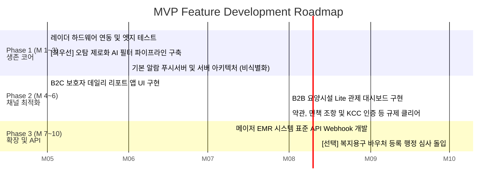

# **💡 비접촉 앰비언트 케어 솔루션 — Value Proposition Sheet (V1)**

> **문서 버전:** V1  
> **작성일:** 2026-04-12  
> **문서 목적:** TAM-SAM-SOM, 페르소나, JTBD 심층 분석, DOS/AOS 기회 평가, 경쟁사 분석 자료를 기반으로 도출한 통합 가치 제안 및 MVP 구현 상세 계획서.  
> **통합 원본:** `01.value-proposition-draft.md` + `02.job-feature-map+MVP-plan.md`

---

## 목차

1. [Value Proposition 통합 시트](#1-value-proposition-통합-시트)
2. [해결해야 할 절박한 문제](#2-해결해야-할-절박한-문제-why-we-build-this-mvp)
3. [MVP 핵심 스펙 (Must-Have Feature List)](#3-mvp-핵심-스펙-must-have-feature-list)
4. [1차 MVP에서 버려야 할 것 (Not To-Do List)](#4-1차-mvp에서-버려야-할-것-not-to-do-list)
5. [MVP 진출(GTM) 최우선 타겟 및 전략 모델](#5-mvp-진출gtm-최우선-타겟-및-전략-모델)
6. [검증 지표 (Success Metrics)](#6-검증-지표-success-metrics)
7. [Job–Feature 맵 (기능 대응 및 리스크 설계)](#7-job-feature-맵-기능-대응-및-리스크-설계)
8. [단계별 개발 우선순위 로드맵 (Roadmap)](#8-단계별-개발-우선순위-로드맵-roadmap)

---

## **1. 📊 Value Proposition 통합 시트**

| 항목 | 내용 |
| --- | --- |
| **페르소나 및 CJM 방식의 고객별 핵심 문제 서술 (Pain, Needs)** | **- 핵심 사용자(B2C 보호자):** 독거 부모님의 낙상/응급 상황에 대한 끊임없는 불안 존재. 기존 스마트워치 등 웨어러블 기기는 충전의 부담과 어르신의 강력한 착용 거부로 자주 방치됨. CCTV 설치는 "감시당한다"는 불쾌감과 프라이버시 침해로 시도조차 어려움.  **- 요양시설 및 관제 종사자(B2B/B2G):** 제한된 야간 인력으로 다수를 돌봐야 하는 제약이 큼. 기존 모션 기기들은 이불 뒤척임조차 오탐하여 잦은 알람을 발생시켜 최악의 업무 번아웃과 '알람 피로'를 유발함. 또한 기존 EMR 시스템과 연동되지 않아 이중 기록 업무가 늘어남. |
| **JTBD 관점 인터뷰 결과에 따른 고객 상황에 따른 목표 서술 (Goal, Job)** | **- Job Statement 1 (안심/지속성):** "부모님의 일상생활에 어떠한 조작, 충전, 착용(Zero-Friction) 등의 제약을 주지 않으면서도, 실제 위급 상황 시에만 시스템이 능동적으로 연결해 주어 안심하고 원래 하던 직장/일상에 집중하고자 함."  **- Job Statement 2 (데이터 예방):** "낙상만이 아니라 야간 빈뇨, 수면 시간 등 데일리 패턴 변화 등의 데이터를 꾸준히 제공받아 건강 이상 전조 현상을 조기에 방어하고자 함."  **- Job Statement 3 (운영 효율):** "오탐 없이 진짜 응급에만 알림을 받아 야간 요양 관제 효율성을 높이고 법적/책임 소지 불안을 줄이고 싶음." |
| **고객이 원하는 Outcome** | **- 오탐 제로화:** 허위 알람(오탐률) 주 1회 이하, 실제 낙상/응급 상황 감지 정확도 100%. **- 완전한 Zero-Friction:** 어르신의 기기 충전, 착용, 수동 조작 횟수 "0회" (높은 사용 유지율 보장). **- 비영상 프라이버시 보호:** 감시당한다는 느낌 없이 카메라 없이도 주야간 체류, 호흡/수면 빈도 감지 측정. **- 턴키 시스템 연동:** 요양 시설 B2B 고객 타겟 기존 EMR 직결망 형성 (입력 시간 단축). |
| **기존 대안 (Competitor / Substitute)** | - **직접 행동 대안:** 의무적인 일일 안부 전화 통화, 휴일을 반납한 잦은 본가 방문, 이웃 및 요양보호사의 방문 확인(야간 돌봄 사각지대 존재). - **하드웨어/서비스 대안:** &nbsp;&nbsp;1) 저가 동작 IoT 센서: 비용은 싸지만 심각한 오경보 노이즈 발생. &nbsp;&nbsp;2) 애플워치 등 웨어러블: 고가이지만 어르신의 사용 거부 등 마찰 존재. &nbsp;&nbsp;3) CCTV/홈캠: 인권 보호 및 사생활 침해로 반발 봉착. - **주요 시장 경쟁사:** 케어벨(프리미엄 요양시설 점유율 우위), 오파스넷(공공 B2G 관제 인프라 장악), 아카라라이프(아파트 등 B2B 건설사 빌트인 중심), 비알랩(심화 수면 분석 특화). |
| **우리 솔루션의 핵심 제안 (Value Proposition)** | **"어떤 착용도, 터치도, 카메라도 필요 없는 완전 비접촉(Zero-Friction) AI 앰비언트 케어 솔루션"**  독보적인 AI 기반 오탐 필터링 레이더 분석 기술을 통해 어르신의 자존심(프라이버시)을 지켜드리면서, 보호자와 시설 근무자들에게는 알람 피로 없는 '진짜 단 하나의 응급 알람'과 '평소 일상 리포트'를 전달합니다. |
| **우리가 제공하는 차별적 가치** | **- (B2B 지향) 오탐 제로 AI 알고리즘 & EMR 턴키:** 현장에서 제일 고통받는 알림 피로를 제거해 ROI 자체를 탈바꿈시킴. 90일 데이터 로그 보존을 통해 소송 및 사고 분쟁을 대비하는 법적 방어망 제공.  **- (B2C 지향) 스마트 웰니스 포지셔닝:** 낙상/치매 등 '노인 스티그마'를 배제하고 스마트홈 센서처럼 포장. 자녀들에게는 데일리 케어 리포트(수면, 화장실 빈도 등 오차율 10% 미만)를 자동 발송하여 헬스케어로의 긍정적인 경험으로 전환시킴. |
| **Proof (근거 / 검증 데이터)** | **1) 시장 잠재력(TAM-SAM-SOM):** - 2025년 기준 SAM(유효시장: 단독 고령자 가구 213만 및 요양 시설 포함)은 연간 한화 약 0.99조 원 규모에 달하며, 매우 보수적인 초기 침투 기반 기대 SOM은 연간 47.4억 원 규모로 빠른 안정화 가능성 시사.  **2) 정량/정성적 고객 증명 (인터뷰 VoC 등):** - *"이불만 뒤척여도 알림이 와서 오히려 응급 알림에 무뎌진다"* (오탐 여과의 필요성 1순위 증명). - *"비싼 손목시계 사드렸지만 충전 안 하신다고 다투기만 했다. 내가 조작 안 해도 알아서 되는 기계에 수백만 원도 내겠다"* (Zero-Friction 필수 충족).  **3) 평가 지표 객관성(DOS):** - 혁신 우선순위 결과 시 '오탐률 제로화 알고리즘'이 DOS 최고점 3.8점 획득 (B2B 핵심조건). '조작 없는 기술(Zero-Friction)' 3.6점 획득 등 B2C 수용성 과제 등 객관적인 Opportunity 지표 일치. |

---

## **2. 🔥 해결해야 할 절박한 문제 (Why we build this MVP)**

**개발 철학:** "완벽하고 다재다능한 앱"을 만드는 것이 아닙니다. 고객의 가장 절박한 Pain Point인 **'오탐률 제로'**와 **'완전한 비접촉(Zero-Friction)'**만을 해결하는 "결정적인 AI 필터링 기능"을 가장 빨리 검증하는 데 사활을 겁니다.

데이터 분석 결과, 시장 내 경쟁 솔루션(스마트워치, 저가 모션 센서, CCTV)은 고객에게 두 가지 치명적인 피로도를 발생시키고 있었습니다. 이를 제거하는 본 MVP의 존재 의의입니다.

1. **[B2B 시설/관제] 최악의 알람 피로 (오탐의 늪):** 이불만 뒤척여도 '낙상'으로 인식하는 오탐이 야간 인력의 번아웃을 초래하며 '안전 불감증'을 유발.
2. **[B2C/고령자] 조작과 시선의 폭력 (마찰의 발생):** 기기를 충전하고 착용해야 하는 수고스러움 분쟁, 그리고 CCTV로 감시당한다는 프라이버시 침해 모멸감.

---

## **3. ⚙️ MVP 핵심 스펙 (Must-Have Feature List)**

제품팀은 초기 검증 단계에서 다음 3가지 엔진에만 리소스를 집중 편성해야 합니다.

### **3.1. 하드웨어 아키텍처: UWB(초광대역) 레이더 단일 폼팩터**

- **스펙:** 카메라 렌즈 없이 레이더 파형만으로 실내 거주자의 동선, 호흡수, 심박, 체류 시간을 센싱하는 비접촉 기기.
- **핵심 역할:** 어르신이 기기를 인지조차 하지 못하게 만드는 'Invisible UX' (Zero-Friction) 완수.

### **3.2. 소프트웨어/AI 아키텍처: "오탐 제로화(False Alarm Zeroing)" 알고리즘 엔진**

- **스펙:** 단순 움직임에서 실제 '위급 상황(바닥 낙상, 수면 무호흡, 장시간 화장실 체류)' 파형만을 정밀하게 걸러내는 딥러닝/신호처리 특화 모델.
- **핵심 역할:** MVP에서 가장 귀중한 핵심 자산(Moat). DOS 매트릭스 1위 기능. 월 오탐율을 0.3건 이하로 통제하지 못하면 시장에 존속할 수 없으므로 개발의 최우선 타겟 지정.

### **3.3. 플랫폼 및 UI 스펙 (B2B / B2C 분리 최적화)**

- **B2C 보호자용 앱 – '안심 데일리 리포트':** 응급 알람뿐만 아니라 '수면의 질', '야간 배뇨(화장실 가동) 횟수' 패턴을 점수화해 일간/주간 리포트로 발송. ("위급하지 않을 때에도 돈값을 하는 서비스"로 록인)
- **B2B 요양시설용 대시보드 – 'EMR 턴키 연동 및 직관 관제':** 영세/중소 요양원의 당직자가 한눈에 세대 상황을 파악할 수 있는 신호등 방식(안전/주의/경고) 인터페이스. 초기부터 시설의 전자의무기록(EMR)과 연동될 수 있도록 개방형 API/웹훅(Webhook) 지원.

---

## **4. 🚫 1차 MVP에서 버려야 할 것 (Not To-Do List)**

"가장 빨리 시장에 테스트를 던지기 위해" 이 항목들은 스프린트에서 삭제합니다.

1. **복잡한 스마트홈 제어 연동 배제:** 조명 켜기, 가전 제어 등 범용 IoT 구축(아카라라이프 방식)은 시니어 안전이라는 본질을 흔들므로 배제합니다.
2. **"치매/노인"을 강조하는 마케팅 언어 삭제:** 고령자의 자존심을 심각하게 훼손(N1 고태식 페르소나 발현)하므로 제품명이나 매뉴얼에 '노인/돌봄/치매' 스티그마 단어를 완전히 배제하고, "프리미엄 웰니스·스마트 홈 안전장치"로 리프레이밍합니다.
3. **공공 B2G 최저가 입찰 납품 스펙(SLA)의 후순위화:** 정부 입찰 스펙, 무리한 보안 등급 구비는 론칭 시점을 무기한 연기시킵니다. 민간 시장을 통해 데이터를 확보하는 것이 먼저입니다.

---

## **5. 🎯 MVP 진출(GTM) 최우선 타겟 및 전략 모델**

- **1차 검증 데스크 (B2B Lite):** 운영 인력이 절박하지만 수천만 원의 SI 통합관제를 들일 자본이 없는 **중소형 요양원 (30병상 이하)**. 설치비(HW/시공비)를 '0원'으로 만들고 **월 10만 원 안팎의 Lite 구독형 모델**로 침투하여 핵심 AI 데이터를 단기 대량 수집합니다.
- **2차 검증 데스크 (B2C Niche):** 불안감이 극에 달했으나 웨어러블/CCTV 도입에 실패한 '원격지 직장인 자녀'. 이들에게 매월 합리적인 커피값 정기 구독으로 '평화로운 데이터 리포트'를 선사합니다.

---

## **6. 📈 검증 지표 (Success Metrics)**

1. **신뢰 지표:** 오탐 빈도가 월 2회 이하 유지 (거짓 경보 발생 시 자녀 및 운영자의 이탈율 급증 분기점 방어율 관찰).
2. **활성 지표 (B2C):** 자녀가 앱 내 '데일리 리포트'를 확인하는 주간 빈도수.
3. **마찰 지표:** 물리적 센서 설치 후 어르신의 불만 민원, 설치 취소 요청 사례 0% 달성.

---

## **7. 🗺️ Job–Feature 맵 (기능 대응 및 리스크 설계)**

JTBD(고객의 해결 과제)와 AOS-DOS 매트릭스 데이터를 실제 제품의 '개발 기능(Feature)'으로 매핑합니다. 단순 추정이 아닌, 국내 법률 규제(의료기기법, 개인정보보호법 등) 및 기술적 제한 사항을 반영하여 구현 난이도와 리스크 방어 전략을 설계했습니다.

### **[기능 1] AI 기반 오탐 필터링 및 응급 상황 인지 알고리즘**

- **관련 JTBD:** "오탐 없는 진짜 위급 상황 100% 분별 수신 (알람 피로 제거)" [AOS 4.0 / 우선순위: Q1 최우선]
- **MVP 구현 Feature:**
    - UWB 레이더 파형 데이터를 학습하여 '단순 뒤척임/착석'과 '바닥 낙상/무호흡'을 구별하는 딥러닝 엣지(Edge) 모델 적용.
    - 월 오탐률 0.3건 이하 타겟의 위급 상황 긴급 푸시 알림.
- **기술적/규제적 제약 (Risk):**
    - [규제] 맥박, 호흡수 데이터를 바탕으로 질병을 "진단/알림"할 경우 **'의료기기법'**상 의료기기로 분류되어 까다로운 식약처 인허가가 필요함 (기간/비용 막대함).
- **리스크 방어 전략 (Mitigation):**
    - 제품 포지셔닝을 진단 기기가 아닌 **"라이프케어 스마트홈 기기(웰니스/안전 확인용)"**로 우회 설계.
    - 앱 UI 및 알림 메시지상 "의학적 진단 목적으로 사용될 수 없음" 면책 조항(Disclaimer) 필수 삽입.

### **[기능 2] 완전 자동화 비접촉 센서 모듈 (Zero-Friction)**

- **관련 JTBD:** "어르신 조작·착용 개입 0건 (사용 지속성 확보)" [AOS 4.0 / 우선순위: Q1 최우선]
- **MVP 구현 Feature:**
    - 카메라 렌즈가 없는 플러그 앤 플레이(통신모듈 자체 내장) 방식의 벽걸이/천장 부착형 UWB 센서. 시공 기사가 전원만 연결하면 자동 캘리브레이션 작동.
- **기술적/규제적 제약 (Risk):**
    - [기술] 레이더 전파 특성상 콘크리트 벽 투과 한계, 금속 재질에 의한 난반사 및 간섭 현상 (1개 센서로 집안 전체 커버 불가).
- **리스크 방어 전략 (Mitigation):**
    - "1실 1센서"의 엄격한 설치 가이드라인 적용(예: 주로 체류하는 침실 1, 사고 위험이 높은 화장실 1 기본 패키지). 센서 설치 위치 오차를 줄이는 기사용 앱 도입.

### **[기능 3] 비영상(Non-vision) 기반 프라이버시 보호 동선 추적**

- **관련 JTBD:** "카메라 없는 완벽한 실내 체류 동선 파악 및 장기 체류 알람" [AOS 3.2 / 우선순위: Q1 핵심]
- **MVP 구현 Feature:**
    - 화장실 등 특정 구역 내 장기 재실(설정 임계치 초과, 예: 30분 이상 움직임 약함) 시 보호자에게 알람을 전송하는 로직.
- **기술적/규제적 제약 (Risk):**
    - [규제] 수집된 동선 데이터와 생체 수치가 서버에 누적될 시 **'개인정보보호법'**상 민감정보/생체인식정보 관리 지침 위반 우려. B2B 요양시설의 경우 다수 환자 데이터 혼재 문제.
- **리스크 방어 전략 (Mitigation):**
    - 기기 자체(엣지단)에서 레이더 신호를 원시 데이터가 아닌 "이진수/수치적 이벤트 결과값"으로 비식별 변환 처리 후 클라우드 전송. 서버에는 누구인지 식별 불가한 메타데이터만 저장. B2B용 다자 동의서 템플릿 제공.

### **[기능 4] 요양시설용 관제 대시보드 연동(EMR Webhook)**

- **관련 JTBD:** "오탐 없이 진짜 응급에만 알림을 받아 야간 요양 관제 효율성을 높임" (이중 기록 업무 단절) [AOS 4.0 / 우선순위: Q1 핵심]
- **MVP 구현 Feature:**
    - 신호등(적/황/녹) 방식의 직관적 야간 상황판 UI 제공.
    - 요양원에서 기존에 사용하는 전산망/EMR에 데이터 이벤트를 쏴줄 수 있는 Open API 및 Webhook 브릿지 제공.
- **기술적/규제적 제약 (Risk):**
    - [기술] 요양 병원마다 사용하는 EMR 시스템이 폐쇄망(VPN) 환경이거나 파편화되어 있어, 개별 커스터마이징(SI 구축)의 늪에 빠질 위험이 큼.
- **리스크 방어 전략 (Mitigation):**
    - MVP 단계에서는 독립형(Stand-alone) SaaS형 대시보드 웹을 우선 공급. 이후 점유율 1위 EMR 벤더(예: 케어포 등)와의 B2B 전략적 제휴를 통한 '표준 플러그인' 형태로만 연동을 제한하여 R&D 리소스 누수 방지.

### **[기능 5] 웰니스 데일리 리포트 발송 (B2C)**

- **관련 JTBD:** "야간 수면 시간, 화장실 방문 빈도 등 데일리 패턴 변화 리포팅" [AOS 3.2 / 우선순위: Q3 마케팅 지렛대]
- **MVP 구현 Feature:**
    - 자녀(보호자)의 앱으로 매일 아침 "수면 점수, 총 화장실 체류 회수"를 요약한 긍정적 톤앤매너의 자동 푸시 알림 발송.
- **기술적/규제적 제약 (Risk):**
    - [기술] 실제 수면 다원 검사 수준을 기대하는 고객의 항의 발생 가능성 (오차/수치 불만족).
- **리스크 방어 전략 (Mitigation):**
    - 수치의 정확성(정량)보다는 어제와 비교한 "패턴의 변화율(정성적 추이)"을 강조하는 방사형 그래프 UI 활용. '노인/환자'가 아닌 '스마트 웰니스 라이프'의 마케팅 언어로 기대치 관리.

---

## **8. 🚀 단계별 개발 우선순위 로드맵 (Roadmap)**

기술 난이도와 DOS(시장 파급력)를 고려하여 자원을 효율적으로 배분하는 로드맵입니다.

### **💡 로드맵 이행을 위한 핵심 원칙**

1. **Phase 1에서는 UI 디자인에 과투자하지 않습니다.** 기능의 핵심은 **"데이터 필터링(오탐 제로)"** 이므로, 디자인보다는 센서의 로우 데이터를 실증 환경에서 테스트하고 알고리즘 정확도를 99%로 끌어올리는 데 개발의 80%를 쏟아야 합니다.
2. **의료/진단 키워드 전면 배제:** 기획, 개발 단의 DB 컬럼 네이밍, API 파라미터명에서조차 'diagnosis', 'medical' 등 식약처 규제를 촉발할 수 있는 단어를 사용하지 않고, 이벤트 기반의 'wellness_score', 'activity_alert' 등으로 통일합니다.
3. **오탐 대응 리소스 배분:** 초기 런칭 시 예상치 못한 환경 노이즈(반려동물, 외풍)로 인한 오탐 보고가 발생할 수 있으므로, 원격에서 펌웨어와 필터 임계치를 즉각 업데이트할 수 있는 OTA(Over-The-Air) 인프라를 최우선으로 구축합니다.
