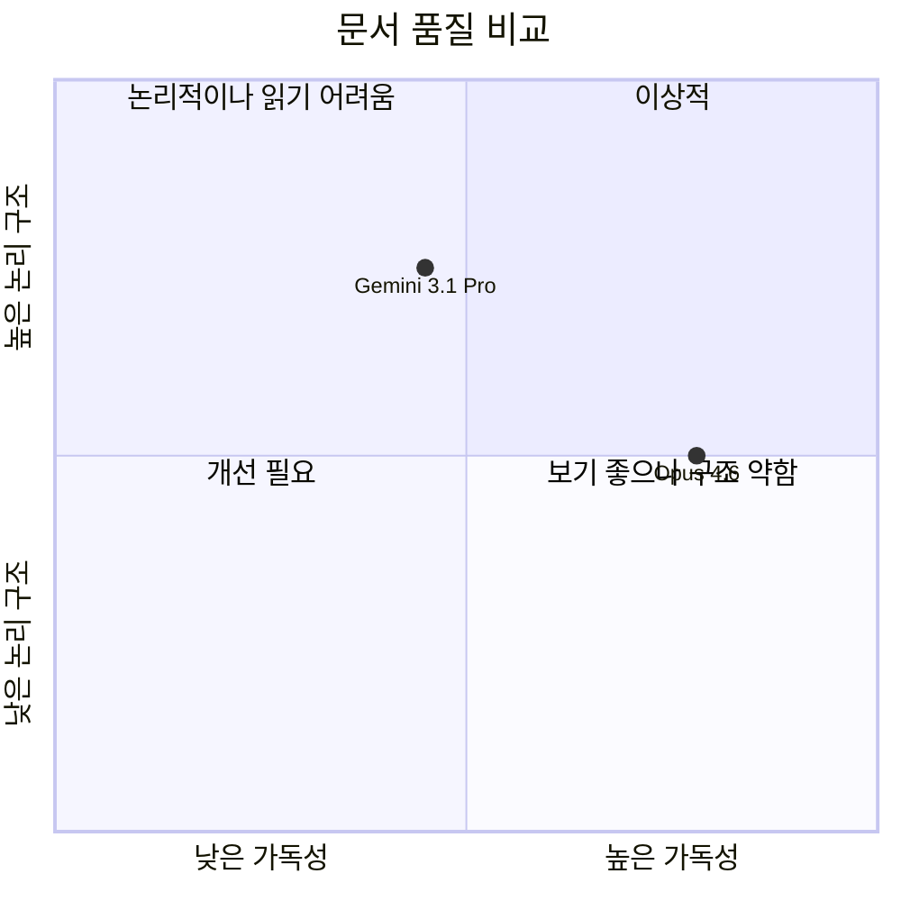

# 📊 VPS 문서 비교 분석: Gemini 3.1 Pro vs Opus 4.6

> **비교 대상:**
> - [03.value-proposition-sheet_Gemini3.1pro_v1.md](file:///Users/srlee_rx48/강의/Modu_Workspace/weeks_3/PRD-From-VPS-Sample/02.VPS-Drafts/03.value-proposition-sheet_Gemini3.1pro_v1.md) (160줄 / 18,472 bytes)
> - [04.value-proposition-sheet_Opus4.6_v1.md](file:///Users/srlee_rx48/강의/Modu_Workspace/weeks_3/PRD-From-VPS-Sample/02.VPS-Drafts/04.value-proposition-sheet_Opus4.6_v1.md) (183줄 / 18,784 bytes)

---

## 1. 핵심 차이점 요약

| 비교 항목 | Gemini 3.1 Pro | Opus 4.6 |
|---|---|---|
| **문서 메타정보** | ❌ 없음 | ✅ 버전, 작성일, 문서 목적, 통합 원본 명시 |
| **목차 (TOC)** | ❌ 없음 | ✅ 8개 섹션 앵커 링크 목차 제공 |
| **섹션 넘버링** | 비일관적 (혼합 사용) | 일관된 숫자 넘버링 (1~8) |
| **섹션 구분선** | 3개의 `---` 사용 | 7개의 `---` 사용 (모든 섹션 사이) |
| **헤딩 구조** | `##` → `###` → `####` 혼합 | `##` → `###` 일관적 계층 |
| **"MVP 핵심 스펙" 배치** | VPS 테이블 바로 아래 통합 | 별도 독립 섹션 (§3) |
| **"Job-Feature 맵" 배치** | 독립 대섹션 `##` | 하위 번호 섹션 (§7) |
| **이모지 사용** | 💡📊🗺️ (3종) | 💡📊🔥⚙️🚫🎯📈🗺️🚀 (9종, 섹션마다) |
| **Value Proposition 테이블 내용** | **동일** | **동일** (줄바꿈 `<br><br>` 추가) |
| **MVP/Feature 세부 내용** | **동일** | **동일** |
| **Mermaid 간트 차트** | **동일** | **동일** |
| **로드맵 핵심 원칙** | **동일** | **동일** |

---

## 2. 구조적 차이 상세 분석

### 2.1 Gemini 3.1 Pro의 문서 구조

```
# VPS 제목
 └─ ## VPS 통합 시트 (테이블)
 └─ ## MVP 핵심 스펙 및 방향성 정의서  ← "작성 목적 + 개발 철학" 통합
     ├─ ### 해결해야 할 절박한 문제
     ├─ ### MVP 핵심 스펙
     │    ├─ #### 2.1 HW
     │    ├─ #### 2.2 SW/AI
     │    └─ #### 2.3 플랫폼 UI
     ├─ ### 1차 MVP에서 버려야 할 것
     ├─ ### MVP GTM 타겟
     └─ ### 검증 지표
 └─ ## Job-Feature 대응표 및 로드맵  ← 별도 대섹션
     ├─ ### Job-Feature 맵  
     │    ├─ #### 기능 1~5
     └─ ### 로드맵 + 핵심 원칙
```

### 2.2 Opus 4.6의 문서 구조

```
# VPS 제목
 └─ 문서 메타정보 (blockquote)
 └─ 목차 (8개 앵커 링크)
 └─ ## 1. VPS 통합 시트 (테이블)
 └─ ## 2. 해결해야 할 절박한 문제  ← 독립 섹션으로 승격
 └─ ## 3. MVP 핵심 스펙
 │    ├─ ### 3.1 HW
 │    ├─ ### 3.2 SW/AI
 │    └─ ### 3.3 플랫폼 UI
 └─ ## 4. 1차 MVP에서 버려야 할 것
 └─ ## 5. MVP GTM 타겟
 └─ ## 6. 검증 지표
 └─ ## 7. Job-Feature 맵
 │    ├─ ### 기능 1~5
 └─ ## 8. 로드맵 + 핵심 원칙
```

> [!IMPORTANT]
> **핵심 차이:** Opus는 모든 하위 섹션을 `##` 레벨의 **독립 최상위 섹션**으로 평탄화(flatten) 했고, Gemini는 **계층적 중첩** 구조를 유지합니다.

---

## 3. 장단점 비교

### 🟢 Gemini 3.1 Pro

| 구분 | 설명 |
|---|---|
| **✅ 장점 1: 논리적 계층 구조** | "MVP 핵심 스펙 및 방향성 정의서"라는 상위 섹션 아래에 문제 정의 → 스펙 → Not-To-Do → GTM → 지표를 **종속적으로 배치**하여, "왜(Why) → 무엇을(What) → 어떻게(How)" 라는 논리 흐름이 자연스럽습니다. |
| **✅ 장점 2: '작성 목적' + '개발 철학' 병기** | MVP 정의서 섹션 상단에 "작성 목적"과 "개발 철학"을 함께 서술하여, 해당 섹션을 처음 읽는 독자에게 즉시 맥락(context)을 제공합니다. |
| **✅ 장점 3: 간결한 분량** | 메타정보/목차 없이 160줄로 압축. 핵심 내용에 바로 도달할 수 있어 리뷰 속도가 빠릅니다. |
| **✅ 장점 4: Job–Feature 맵 독립 강조** | Job–Feature 맵을 `##` 대섹션으로 분리하여 "기능 명세서"로서의 독자적 위상을 부여합니다. 개발팀에게 별도 핸드오프 문서로 추출하기 용이합니다. |
| **❌ 단점 1: 메타정보 부재** | 문서 버전, 작성일, 통합 원본 소스 등이 없어 버전 관리가 어렵습니다. |
| **❌ 단점 2: 목차 부재** | 160줄이라 문제가 작지만, 문서가 성장하면 네비게이션이 불편해집니다. |
| **❌ 단점 3: 섹션 간 구분선 부족** | `---` 구분선이 3곳에만 사용되어, 긴 문서에서 섹션 경계가 시각적으로 모호합니다. |
| **❌ 단점 4: 넘버링 불일관** | 최상위 섹션은 넘버링 없고 하위는 1, 2, 3... 으로 번호가 매겨져 참조 시 혼란 가능성이 있습니다. |

---

### 🔵 Opus 4.6

| 구분 | 설명 |
|---|---|
| **✅ 장점 1: 완전한 문서 메타정보** | 문서 상단에 버전(V1), 작성일, 문서 목적, 통합 원본 출처를 blockquote로 명시. 팀 협업과 버전 이력 관리에 필수적인 정보입니다. |
| **✅ 장점 2: 전체 목차 (TOC)** | 8개 섹션을 앵커 링크와 함께 제공하여 문서 내 빠른 점프가 가능합니다. 이해관계자 리뷰 시 특정 섹션으로 즉시 이동할 수 있습니다. |
| **✅ 장점 3: 일관된 섹션 넘버링** | 1~8까지 모든 최상위 섹션에 순차 번호를 부여하여, "6번 섹션 검증 지표를 보세요"와 같은 커뮤니케이션이 명확합니다. |
| **✅ 장점 4: 시각적 구분선 일관성** | 모든 `##` 섹션 사이에 `---`를 삽입하여 시각적 경계가 명확하고, 프린트 시에도 영역 구분이 쉽습니다. |
| **✅ 장점 5: 이모지 기반 시각 코드** | 각 섹션마다 고유 이모지(🔥⚙️🚫🎯📈🗺️🚀)를 부여하여 스캔 속도를 높이고 섹션 식별이 즉각적입니다. |
| **✅ 장점 6: 테이블 내 가독성 향상** | VPS 통합 테이블에서 `<br><br>` (이중 줄바꿈)과 `&nbsp;` 등을 사용하여 셀 내 단락 구분이 더 명확합니다. |
| **❌ 단점 1: 계층 구조 평탄화** | 모든 것을 `##` 레벨로 올려 놓아, "해결할 문제 → MVP 스펙 → Not-To-Do"로 이어지는 **인과적·종속적 관계**가 구조적으로 드러나지 않습니다. 각 섹션이 나열(list)처럼 보여 논리 흐름의 위계가 약화됩니다. |
| **❌ 단점 2: 분량 증가 (실질 내용 동일)** | 메타정보·목차·구분선 추가로 183줄이 되었지만, 본문 내용은 Gemini와 동일합니다. "포장"으로 인한 줄 수 증가입니다. |
| **❌ 단점 3: "작성 목적" 누락** | Gemini에 있던 "MVP 핵심 스펙 및 방향성 정의서"의 독립적 작성 목적 문구가 제거되어, 해당 섹션의 맥락 설명이 약합니다. |

---

## 4. 종합 평가



| 평가 기준 | Gemini 3.1 Pro | Opus 4.6 | 우위 |
|---|:---:|:---:|:---:|
| **논리적 계층 구조** | ⭐⭐⭐⭐ | ⭐⭐⭐ | 🟢 Gemini |
| **시각적 가독성** | ⭐⭐⭐ | ⭐⭐⭐⭐⭐ | 🔵 Opus |
| **문서 관리 (메타/버전)** | ⭐⭐ | ⭐⭐⭐⭐⭐ | 🔵 Opus |
| **네비게이션 (목차/넘버링)** | ⭐⭐ | ⭐⭐⭐⭐⭐ | 🔵 Opus |
| **협업 커뮤니케이션 용이성** | ⭐⭐⭐ | ⭐⭐⭐⭐⭐ | 🔵 Opus |
| **핵심 내용 밀도** | ⭐⭐⭐⭐ | ⭐⭐⭐ | 🟢 Gemini |
| **개발팀 핸드오프 적합성** | ⭐⭐⭐⭐ | ⭐⭐⭐⭐ | 무승부 |
| **본문 내용 품질** | ⭐⭐⭐⭐ | ⭐⭐⭐⭐ | 무승부 |

---

## 5. 결론 및 추천

> [!TIP]
> **본문 내용(VPS 테이블, MVP 스펙, Job-Feature 맵, 로드맵)은 두 문서가 사실상 동일합니다.** 차이는 오직 **문서 구조와 포맷**에 있습니다.

### 이상적인 최종 문서를 위한 제안

두 문서의 장점을 결합하면 최적의 결과물을 얻을 수 있습니다:

1. **Opus의 메타정보 + 목차 + 일관된 넘버링** 채택 → 문서 관리와 협업에 필수
2. **Gemini의 계층적 논리 구조** 채택 → "왜(Why) → 무엇(What) → 어떻게(How)" 흐름 유지
3. **Opus의 시각적 구분선 + 이모지 코드** 채택 → 스캔 가독성 확보
4. **Gemini의 "작성 목적 + 개발 철학" 병기** 복원 → MVP 섹션의 맥락 제공
