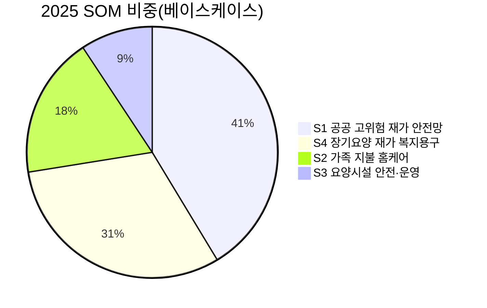
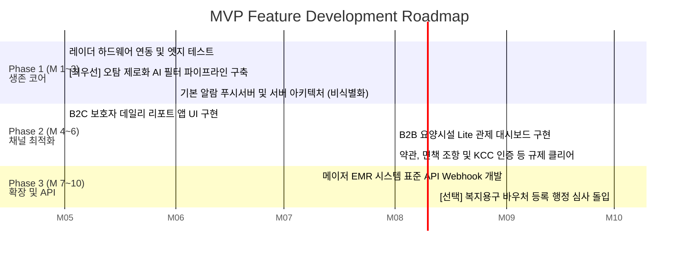

# **💡 비접촉 앰비언트 케어 솔루션 — Value Proposition Sheet (V2)**

> **문서 버전:** V2 
> **작성일:** 2026-04-12  
> **문서 목적:** Porter's Five Forces, 경쟁사 심층 분석, 가치사슬, KSF, TAM-SAM-SOM, 페르소나 스펙트럼, CJM, AOS/DOS 기회 평가, JTBD 인터뷰 결과를 **직접 수록**하여 통합한 가치 제안 및 MVP 구현 상세 계획서.  
> **통합 원본:** `01.Biz-Analysys/` 전체 리서치 문서 (1~10번) + `02.VPS-Drafts/06.value-proposition-sheet_merged_v1.md`

---

## 목차

1. [Value Proposition 통합 시트](#1--value-proposition-통합-시트)
   - 1.1 [시장 구조 분석 (Porter's Five Forces)](#11-시장-구조-분석-porters-five-forces)
   - 1.2 [핵심 경쟁사 심층 분석](#12-핵심-경쟁사-심층-분석)
   - 1.3 [가치사슬 벤치마킹 (케어벨)](#13-가치사슬-벤치마킹-케어벨)
   - 1.4 [핵심 성공 요인 (KSF)](#14-핵심-성공-요인-ksf)
   - 1.5 [다관점 문제 정의서](#15-다관점-문제-정의서)
   - 1.6 [TAM-SAM-SOM 시장 규모 분석](#16-tam-sam-som-시장-규모-분석)
   - 1.7 [페르소나 스펙트럼 및 CJM](#17-페르소나-스펙트럼-및-cjm)
   - 1.8 [AOS/DOS 기회점수 매트릭스](#18-aosdos-기회점수-매트릭스)
   - 1.9 [JTBD 인터뷰 결과 요약](#19-jtbd-인터뷰-결과-요약)
   - 1.10 [Value Proposition 종합 테이블](#110-value-proposition-종합-테이블)
2. [MVP 핵심 스펙 및 방향성 정의서](#2--mvp-핵심-스펙-및-방향성-정의서)
   - 2.1 [해결해야 할 절박한 문제](#21-🔥-해결해야-할-절박한-문제-why-we-build-this-mvp)
   - 2.2 [MVP 핵심 스펙 (Must-Have Feature List)](#22-⚙️-mvp-핵심-스펙-must-have-feature-list)
   - 2.3 [1차 MVP에서 버려야 할 것 (Not To-Do List)](#23-🚫-1차-mvp에서-버려야-할-것-not-to-do-list)
   - 2.4 [MVP 진출(GTM) 최우선 타겟 및 전략 모델](#24-🎯-mvp-진출gtm-최우선-타겟-및-전략-모델)
   - 2.5 [검증 지표 (Success Metrics)](#25-📈-검증-지표-success-metrics)
3. [Job–Feature 맵 및 로드맵](#3--jobfeature-맵-및-로드맵)
   - 3.1 [Job–Feature 맵 (기능 대응 및 리스크 설계)](#31-🗺️-jobfeature-맵-기능-대응-및-리스크-설계)
   - 3.2 [단계별 개발 우선순위 로드맵 (Roadmap)](#32-🚀-단계별-개발-우선순위-로드맵-roadmap)

---

## **1. 📊 Value Proposition 통합 시트**

### **1.1. 시장 구조 분석 (Porter's Five Forces)**

비접촉 앰비언트 케어 모니터링 시장의 구조적 역학을 Porter's Five Forces 프레임워크로 분석한 결과입니다.

#### **1.1.1. 기존 기업 간의 경쟁 — 높음 (High)**

수요처(요양원장, 지자체 공무원) 입장에서 A사의 레이더 센서와 B사의 열화상 센서 간의 기술적 퀄리티(생체 인식 정확률 2~3% 차이)를 체감하지 못합니다. 결국 어느 대형 병원장, 지자체장 출신과 네트워크가 강력한지에 따라 수주가 결정되는 **전통적 영업 전쟁(출혈 로비 경쟁)**이 벌어지는 시장입니다.

#### **1.1.2. 신규 진입자의 위협 — 높음 (High)**

Tuya 등 글로벌 범용 IoT 기반의 **중국산 저가 모션 센서 기판을 수입하여, 껍데기만 갈아끼운 뒤 앱 하나만 간단히 입혀 진출하는 조립 스타트업들(화이트라벨링)**의 진입 난이도가 극도로 낮아졌습니다. 이들이 지자체 입찰에 공격적으로 최저가를 투찰하며, 업계 전체의 정상적인 마진(Margin)을 무너뜨리는 교란 요인으로 작용 중입니다.

#### **1.1.3. 대체재의 위협 — 매우 높음 (Very High 🔴)**

이 시장이 경계해야 할 가장 무서운 적은 센서 회사가 아니라 **'글로벌 빅테크의 웨어러블 워치'**입니다. 애플워치/갤럭시워치가 앰비언트 케어 센서의 주력 세일즈 포인트인 "낙상 감지", "심박 이상 감지", "수면 품질 분석"을 이미 '의료기기 등급' 수준으로 손목 위에서 완성시켰습니다. 스마트 기기 착용에 거부감이 덜한 '액티브 시니어(베이비부머 1세대)'가 본격적으로 고령 사회에 편입됨에 따라, **설치형 레이더 센서의 당위성에 치명적 위협**이 다가오고 있습니다.

#### **1.1.4. 공급자의 교섭력 — 보통~높음 (Moderate to High)**

핵심 감지 소자인 UWB(초광대역) 칩셋 공급사나, 원천 레이더 모듈 설계 IP를 보유한 소수의 해외 원천 부품사(NXP, Infineon 등)에 대한 **하드웨어 칩셋 종속성**이 강합니다. 글로벌 반도체 공급 대란 시 원가가 크게 뛸 리스크가 상시 존재하며, 실시간 생체 파동 데이터를 24시간 클라우드로 분석해야 하므로 AWS/Azure 등 CSP 유지 인프라 비용도 큰 부담입니다.

#### **1.1.5. 구매자의 교섭력 — 양극화 (B2B/B2G 강경)**

대형 요양병원들은 센서만 사는 것이 아니라, "우리 병원의 낡은 전산망(EMR) 화면 안으로 센서의 데이터를 완벽하게 이식해달라"는 무리한 커스터마이징(SI 구축 수준)을 턴키로 요구합니다. 이는 B2B 스타트업의 개발 리소스를 특정 병원 1곳에 강제 종역시켜 **'제품의 SaaS 범용화'를 가로막는 SI 전락 위험**으로 직결됩니다.

---

### **1.2. 핵심 경쟁사 심층 분석**

시장 내 기술적 우위와 강력한 유통 채널망을 보유한 상위 5개 기업의 코어 모델 및 전략을 정리합니다.

| 기업명 | 비즈니스 규모 (추정) | 핵심 비즈니스 모델 | 사업 전략 및 차별화 특징 |
| :--- | :--- | :--- | :--- |
| **케어벨 (Carebell)** | 고급 실버타운/요양원 B2B 채널 내 주도적 사업자 | UWB 레이더 기반 비접촉 생체 신호 센서 + 돌봄 모니터링 플랫폼 | **프리미엄 레퍼런스와 UI/UX 우위.** A급 요양 시설 및 프리미엄 주거 단지 선점. 보호자·간호사가 직관적으로 상태를 파악하는 유려한 관제 솔루션. 약점: 일반 다세대/빌라 대상 높은 가격 저항. |
| **오파스넷 (Opasnet)** | 코스닥 상장 중견기업, 통신·공공기관망(NI) 사업 기반 | IR-UWB 레이더 센서 기반 호흡/활동 모니터링 + 지자체 디지털 돌봄망 통합 납품 | **압도적 공공/통신 인프라 장악력.** B2G 공공기관망 및 이동통신사 핵심망 구축 경험 기반, 대규모 지자체 보급에 최상위 신뢰도. 약점: B2C 감성적 심리 케어 UX 둔감. |
| **아카라라이프 (Aqara Life)** | 글로벌 AIoT 강자, 대형 건설사 B2B 빌트인 | 파편화된 스마트홈 센서(재실, 수면, 조명 등) 생태계 통합 Hub 구축 | **공간 시퀀시 자동화 생태계.** 센서간 유기적 상호작용("밤에 침대에서 일어나면 조명 자동 켜짐+알림" 등) 구현. 약점: 국내 요양보호 서비스 오프라인 연계성 부족. |
| **유메인 (Umain)** | UWB 원천 기술 및 레이더 모듈 자체 설계 역량 보유 강소기업 | UWB 레이더 모듈 설계, 안테나 및 생체인식 복합 기능 SoC 판매 | **원천 칩셋 기반 독자 알고리즘.** 글로벌 부품 종속 없이 레이더 모듈과 신호 처리 알고리즘 자체 융합. 약점: B2B 솔루션 기업 대상 부품 공급에 치중. |
| **비알랩 (BRlab)** | 서울대 수면의학 연구진 기반 슬립테크/시니어 모니터링 스타트업 | 스마트 매트리스 등 고정밀 무구속 수면 모니터링 AI 솔루션 | **디지털 수면 치료와 딥러닝 접목.** 수면 무호흡·분절화 등 메디컬 수준 정밀 분석 특화. 약점: 낙상·동선 분석 등 공간 감지 영역 부재. |

---

### **1.3. 가치사슬 벤치마킹 (케어벨)**

핵심 리딩 기업 케어벨의 가치사슬을 분석하여 도출한 전략적 인사이트입니다.

| 가치사슬 단계 | 케어벨의 전략 | 벤치마킹 시사점 |
| --- | --- | --- |
| **핵심 자산 및 기술 확보** | UWB 기반 비접촉 레이더 센서 기술 + 수만 명의 시니어 거주 환경에서 수집된 방대한 생체/활동 파형 데이터 + 독자적 AI 공간 분석 알고리즘 | 카메라 없는 Zero-Friction 철학 기반, 레이더 파형을 '낙상', '수면 무호흡', '화장실 체류' 등 디지털 건강 임상 데이터로 변환 |
| **운영 및 제품 생산** | 벽/천장 부착형 인비저블 설치로 실사용자(어르신) 조작 완전 제거. 오탐(False Alarm) 관리가 핵심 운영 체계 — 뒤척임 vs 호흡곤란, 화장실 체류 vs 배뇨장애 징후 구분 | **오탐 제로화를 통한 '알고리즘 해자(Moat)' 구축**이 기기 조립이나 마진 경쟁보다 우선 |
| **고객 전달 및 접근성** | 프리미엄 B2B 주거 공간 통한 전 세대 일괄 시공 방식 → 사용자 접근성 100% 자동 활성화 | 일반 소비자 자가 설치율이 낮으므로 **B2B 일괄 시공 모델**이 효과적 |
| **마케팅 및 영업 전략** | 저가 B2G 입찰 회피 + 프리미엄 레퍼런스 세일즈 + Top-Down B2B2C 락인(Lock-in) 전략 | 한번 병원 전산망과 결합되면 교체 불가능 → 초기 도입이 곧 영구 수주 |
| **고객 서비스** | B2B: EMR 연동 SI형 기술 지원 + 알고리즘 업데이트 보장 / B2C: 데일리 리포트 앱 → "어머니 수면 80점, 화장실 2회 정상" 발송 | 자녀의 부양 불안(Pain) 근본 해소 = **앱 데일리 리포트가 서비스 록인의 핵심** |

---

### **1.4. 핵심 성공 요인 (KSF)**

Porter's Five Forces 및 가치사슬 분석에서 도출된 시장 생존을 위한 **Top 5 핵심 성공 요인**입니다.

| 우선순위 | KSF | 도출 근거 |
| --- | --- | --- |
| **1** | **'오탐률(False Alarm) 제로화'를 달성하는 고정밀 AI 판단 알고리즘 자산 확보** | 신규 진입자 위협(ODM 난립) + 가치사슬(운영). 뒤척임(False Positive)과 무호흡을 구별하는 파형 정제 능력이 유일한 차별 해자. 오판 피로도를 제거하지 못하면 계약 테이블에서 즉각 외면. |
| **2** | **스마트워치(대체재) 위협을 방어하는 특화된 '공간 맥락 지표(Moat)' 설계** | Five Forces(대체재 위협 Very High). 웨어러블이 심박·수면 모니터링을 완성한 상태에서, '빈 공간 체류 시간 지연(낙상 전조)', '화장실 왕복 동선(배뇨 장애/우울증 징후)' 등 앰비언트 특화 교차 분석 지표를 선제적으로 설계해야 당위성 방어 가능. |
| **3** | **중국산 저가 공세와 공공 입찰 단가를 방어하는 투트랙(Two-Track) 라인업 구축** | 신규 진입자 위협(단가 산통) + 가치사슬(마케팅). 지자체 B2G용 '저비용 모션+스마트플러그 엔트리 라인업' + 실버타운/요양병원 B2B용 '고성능 UWB 레이더 프리미엄 라인업'으로 스펙과 가격 체계를 이원화. |
| **4** | **B2B 프리미엄 고객의 커스텀 수요를 해결하는 SI 전문 관제 역량 확보** | 구매자 교섭력(EMR 커스텀 요구) + 가치사슬(운영/서비스). 요양 병원장·건설사가 요구하는 턴키식 EMR 시스템 연동과 직관적 UI/UX 대시보드 구축 역량이 수주 성패를 결정. |
| **5** | **개별 B2C 한계를 우회하는 Top-Down 방식의 채널 락인(Lock-in) 영업 모델** | 가치사슬(고객 전달/마케팅). 요양원장·건설사를 설득해 전 세대 단위 대규모 라이선스 계약을 따내는 B2B2C 방식이 설치 마찰과 가격 저항을 극복하는 현실적 경로. |

---

### **1.5. 다관점 문제 정의서**

시장의 다각적 이해관계자를 고려하여 3가지 관점에서 도출된 핵심 문제 정의입니다.

#### **📝 B2B 요양시설 관점 — 간호 인력의 업무 효율성 및 관제 고도화**

> [대규모 프리미엄 실버타운이나 요양병원을 운영·모니터링하는 전문 간호 인력과 관리자]가
> [다수의 치매 환자나 고위험군 어르신들의 수면 질 저하, 호흡 곤란, 야간 낙상 등 위급 상황 패턴을 24시간 실시간으로 관제해야 하는 상황]에서 겪는
> **[기존 저가형 모션 센서의 잦은 무의미한 알림(이불 뒤척임 등 오탐)으로 인한 업무 피로도 급증과, 낡은 EMR 전산망과의 데이터 단절로 인한 모니터링의 비효율성]**을 해결하는 것이 중요한 문제이다.

#### **📝 B2G 지자체 돌봄 관점 — 돌봄 사각지대 해소 및 단가 방어**

> [한정된 예산으로 지역 내 취약 계층 돌봄망을 시공·관리해야 하는 지자체 복지 공무원]이
> [최대한 많은 다세대/빌라 거주 독거노인 가정에 고독사 예방 및 활동량 감지 인프라를 전면 보급해야 하는 상황]에서 겪는
> **[고스펙 장비 도입은 단가 산통으로 예산 초과를 부르고, 저스펙 장비를 쓰자니 응급 징후를 놓치게 되는 비용 대 효용의 딜레마]**를 해결하는 것이 중요한 문제이다.

#### **📝 B2C 시니어 및 보호자 관점 — Zero-Friction 침해 방지**

> [독거 부모님의 건강 징후를 수시로 확인하고 싶으나 부모님이 웨어러블 착용이나 잦은 충전을 매우 번거로워하는 원격지 자녀(보호자)]가
> [가정 내에서 낙상 같은 갑작스러운 응급 상황이나 잦은 화장실 왕복 같은 배뇨/우울증 전조 증상을 조기에 파악해야 하는 상황]에서 겪는
> **[CCTV 설치는 프라이버시 문제로 서로 거부감이 크고, 웨어러블 기기는 충전 방치로 사실상 쓸모가 없어져, 결국 빈방에서의 공간적 위급 상황을 즉각 인지할 방법이 없어 겪는 극도의 불안감과 데이터 부재 현상]**을 해결하는 것이 중요한 문제이다.

---

### **1.6. TAM-SAM-SOM 시장 규모 분석**

#### **글로벌 및 한국 시장 규모 개요**

| 구분 | 정의 | 글로벌 규모 | 한국 규모 | 산출 기준 |
| --- | --- | --- | --- | --- |
| **TAM** | 전체 고령자 돌봄 시장 (오프라인 + 인력 포함) | **$300B+** | **약 40~60조원** | 고령자 인구 × 연간 돌봄 비용 |
| **SAM** | AI + 비접촉 기반 돌봄 적용 가능 시장 | **$25~40B** | **약 3~5조원** | TAM × 기술 적용 가능 비율 (8~12%) |
| **SOM** | 3년 내 실제 확보 가능 시장 | **$1~3B** | **약 2,000억~5,000억원** | SAM × 초기 침투율 (5~10%) |

#### **글로벌 시장 성장 추이 (AI 기반 고령자 돌봄)**

| 연도 | 글로벌 시장 규모 (억 USD) | 한국 시니어케어 시장 (조원) |
| --- | --- | --- |
| 2019 | 142 | - |
| 2020 | — | 72 |
| 2021 | 218 | - |
| 2023 | 385 | - |
| 2025 | 568 | ≈103 *(추정)* |
| 2030 | — | 168 |
| 2031 | 1,803 | - |

*자료: Market Intelo, 한국보건산업진흥원(KHIDI)*

#### **한국 세그먼트별 SAM 추정 (2025년 기준)**

| 세그먼트 | 구매주체 | 대상수 | 보급률 가정 | ARPU(연) | SAM(연간) |
| --- | --- | --- | --- | --- | --- |
| 개인/가정 (B2C) | 가정(65+ 가구) | 약 750만 가구 | 10% | 약 50만원 | **3.75조원** |
| AI 플랫폼 (SaaS) | 요양기관 등 | 3,000 기관 | 20% | 1,500만원 | **0.9조원** |
| 관제 서비스 | 개인+시설 | 300만명(고위험자) | 5% | 50만원 | **0.75조원** |
| 안전 모니터링 | 가정+시설 | 1.5만대(기기) | 100% | 200만원 | **0.3조원** |

#### **SOM 세그먼트별 실제 획득 가능 시장 (2025년 기준)**

전체 4개 세그먼트의 **베이스케이스 합산 SOM은 약 63.0억 원**(≈ 484만 USD)으로 추정됩니다.

| 세그먼트 | 대상수 | 획득가능 보급률 | ARPU(연) | 연간 SOM | 비중 |
| --- | --- | --- | --- | --- | --- |
| **S1 공공 고위험 재가 안전망** | 276,954가구 | 5.0% | 188,000원 | **26.0억원** | 41.3% |
| **S4 장기요양 재가 복지용구** | 864,532명 | 1.0% | 226,800원 | **19.6억원** | 31.1% |
| **S2 가족 지불 홈케어** | 1,593,000가구 | 0.2% | 360,000원 | **11.5억원** | 18.2% |
| **S3 요양시설 안전·운영** | 6,361기관 | 2.0% | 4,602,000원 | **5.9억원** | 9.3% |



> **핵심 결론:** 카메라 중심(프라이버시·감시 인식으로 설치 저항↑)보다, **레이더/센서 기반(비영상) + 알림/관제 + 돌봄 연계**를 전제로 한 세그먼트가 획득가능성(조달성·레퍼런스·규제 리스크) 측면에서 SOM이 더 넓게 열려 있습니다.

---

### **1.7. 페르소나 스펙트럼 및 CJM**

#### **4대 페르소나 요약**

| 유형 | 페르소나 | 핵심 특성 | 추정 실존 규모 | 핵심 전환 조건 |
| --- | --- | --- | --- | --- |
| 🟢 **Core** | **박지수** (43세, 보호자 자녀) | 독거 어머니(74세) 원격 보호자. 웨어러블 거부·충전 방치 경험. 낙상 아찔 경험 후 불안. | ~75만 명 | 부모님 낙상 경험 (독거노인 연간 30% 낙상) |
| 🔵 **Adjacent** | **정민석** (46세, 지자체 공무원) | 응급안전안심서비스 조달 담당. 노후장비 9만대 교체 필요. 저가입찰→오탐→허위출동. | ~300~450명 | 레퍼런스 규모 + 오탐률 실증 수치 |
| 🔴 **Extreme** | **장영희** (63세, 낙상사망 소송 가족) | 요양원 어머니 야간 낙상 사망. 오탐→직원 무시→사망→데이터 공백 경험. | 직접 수천 + 구전 수만 | 시설 재선택 과정 (재선택 의향 60~70%) |
| ⚫ **Non-user** | **고태식** (71세, 은퇴 공무원) | 배우자(68세, 당뇨·고혈압) 동거. "나는 아직 젊어", "감시 장치 절대 안돼" 강력 거부. | ~44~54만 가구 | 배우자 건강 이상 (**전환율 78%** — 최강) |

#### **Core 페르소나 박지수 — 서비스 여정 핵심 포인트**

| 여정 단계 | 감정 저점 (위기) | 감정 고점 (기회) | 핵심 Pain Point |
| --- | --- | --- | --- |
| **인지/탐색** | ↓ 낙상 충격 + 검색 혼란 | ↑ 비접촉 솔루션 발견 | **P1.** "레이더 센서" 검색 시 산업용·보안용·의료용이 뒤섞여 시니어 홈케어 특화 제품 식별 어려움 |
| **비교/평가** | ↓ 오탐 리뷰에 흔들림 | ↑ 가격 합리화 성공 | **P2.** 오탐률에 대한 객관적 수치 정보 부재 → 구매 결정을 가장 길게 지연 |
| **구매/온보딩** | ↓ 설치 당일 어르신 반응 불안 | ↑ 설치 완료 + 앱 첫 리포트 | **P3.** 설치 기사의 어르신 대응 스크립트가 수용도를 결정 |
| **사용** | ↓ **새벽 오탐 공포 (최대 위기)** | ↑ 매일 아침 데일리 리포트 안도 | **P4. 오탐 반복 → 신뢰 붕괴 → 해지** (★★★★★ 최우선 설계 과제) |
| **충성/유지** | ↓ 갱신 시점 가치 의구심 | ↑ 위기 대응 성공 경험 | **P5.** "아무 일 없음" = 가치 체감 불가 → 갱신 시점 이탈 위험 |

> 🔥 **P4가 최우선 설계 과제입니다.** 오탐은 단순한 UX 불편이 아니라 생명에 대한 오경보로 인식되어 서비스 신뢰를 회복 불가능한 수준으로 손상시킵니다. "오탐 제로화 AI 알고리즘"이 KSF 1순위인 이유가 이 여정에서 정확히 확인됩니다.

#### **Adjacent 페르소나 정민석 — 의사결정 판단 기준**

정민석은 비접촉 센서를 다음 순서로 평가합니다: **레퍼런스 규모 → 오탐률 실증 수치 → 기업 재무 안정성 → 가격**. 스타트업에게 가장 높은 장벽은 "대규모(200가구 이상) 실증 레퍼런스의 부재"이며, 현재 관내 보급 기기의 42%가 설치 후 5년 초과, 작년 허위 출동 847건 중 189건이 기기 오탐으로 확인되었습니다.

#### **Extreme 페르소나 장영희 — 사건 타임라인**

```
2024년 1월 14일 새벽 2:47
┌──────────────────────────────────────────────────────────┐
│ 어머니(89세) 화장실 가다 넘어짐                           │
│ ① 요양원 모션 센서 — 알람 발생 (2:47)                    │
│ ② 당직 요양보호사 — 알람 무시 (이불 뒤척임으로 판단)      │
│     → 당일 당직 중 오탐 11건 누적으로 인한 알람 피로      │
│ ③ 새벽 5:10 순회 점검 중 발견                            │
│ ④ 병원 이송, 2024년 1월 16일 사망                        │
│ ⑤ 소송 과정에서 새벽 2:30~5:00 관제 데이터 공백 확인      │
└──────────────────────────────────────────────────────────┘
```

> 이 사건이 **"오탐 제로 알고리즘"과 "90일 데이터 로그 보존"이 제품의 존재 이유**임을 가장 강력하게 증명합니다.

#### **Non-user 페르소나 고태식 — 비사용 장벽과 전환 설계**

- **최대 장벽:** "노인 낙인(Ageism)"이 제품 탐색 행동 자체를 강제 종료시킴. 검색 결과에 "시니어/노인/돌봄" 사진이 있으면 창을 닫음.
- **전환 트리거:** 배우자 어지럼증/낙상 재발 → "내가 아직 필요 없다"는 방어막 해제 → "아내를 지키는 남편의 선택"으로 포지셔닝 시 즉시 전환.
- **제품 설계 시사점:** 제품명·매뉴얼에 '노인/돌봄/치매' 단어 완전 배제 → **"프리미엄 홈 안전 센서" / "스마트 공간 모니터"**로 리네이밍 필수.

---

### **1.8. AOS/DOS 기회점수 매트릭스**

12명 전체 페르소나의 Pain/Goal을 **AOS(Adjusted Opportunity Score)**와 **DOS(Discovered Opportunity Simulation)** 두 축으로 교차 분석한 결과입니다.

#### **AOS-DOS 사분면 종합 결과**

| Pain/Goal 항목 | AOS | DOS | 사분면 | 핵심 연관 페르소나 | 전략 시사점 |
| --- | --- | --- | --- | --- | --- |
| **오탐률 제로 알고리즘** | 4.0 | **3.8** | 🔥 Q1 핵심 성장 동력 | 이현우, 오성진, 장영희 등 | MVP 최우선 R&D 목표. 시장 존속의 절대 요건 |
| **Zero-Friction 완전비접촉** | 4.0 | **3.6** | 🔥 Q1 핵심 성장 동력 | 박지수, 최봉수, 김정숙 등 | B2C/B2B 막론하고 사용자(어르신) 거부감 제거 1순위 |
| **기존 EMR/관제 자동 연동** | 4.0 | **3.4** | 🔥 Q1 핵심 성장 동력 | 이현우, 정민석 등 | B2B 전환 비용(Lock-in) 생성 + 업무 마찰 제거 |
| **月 10만 이하 Lite 구독** | 4.0 | **3.2** | 🔥 Q1 핵심 성장 동력 | 서미경 원장 | Long-tail 중소 요양원 시장 침투 캐시카우 |
| **비영상 프라이버시 정밀 감지** | 4.0 | **3.0** | 🔥 Q1 핵심 성장 동력 | 배수진, 박지수 | 인권·감시 경계를 우회하는 B2C/B2B 전환 키워드 |
| **앱 데일리 가족 리포트** | 3.2 | **2.85** | ⚙️ Q3 대중 확산 지렛대 | 박지수 독거 자녀 | 잦은 앱 방문 + 바이럴 확산 성장 엔진 |
| **90일 데이터 로그 보존** | 4.0 | **2.6** | 💡 Q2 틈새·방어기제 | 장영희 소송 가족 | 시장 파급력은 좁으나 법적 방어 해자로 결정적 |
| **공공조달 SLA/스펙** | 3.0 | **2.4** | 🚫 Q4 선택적 투자 주의 | 정민석 주무관 | B2G 진입 필수 '티켓'이나 과도한 자원 투자 지양 |
| **웰니스 리프레이밍** | 3.2 | **2.25** | 🚫 Q4 선택적 투자 주의 | 고태식 | Non-user 심리 장벽 녹이는 마케팅 영역 |
| **복지용구 바우처 적용** | 3.2 | **2.1** | 🚫 Q4 선택적 투자 주의 | 김정숙, 한미영 | 유통 경로이나 제도적 시간 지연이 크므로 병행 처리 |

#### **AOS 기반 혁신기회 — 핵심 Pain 클러스터 및 개발 우선순위**

| 개발 우선순위 | Pain 클러스터 | 연관 페르소나 | 제품 액션 |
| --- | --- | --- | --- |
| **1순위** | 오탐 제로 알고리즘 | C2·C4·E2·A1 (이현우·오성진·장영희·정민석) | MVP 핵심 — 오탐 0.3건/월/가구 이하 목표 |
| **2순위** | Zero-Friction 비접촉 설치 | C1·C3·E1·N2 (박지수·김정숙·최봉수·서미경) | 조작 없는 레이더 — 설치 즉시 자동 작동 |
| **3순위** | 바우처·제도 연동 | C3·C5·N2 (김정숙·한미영·서미경) | 복지용구 품목 등록 + 6개월 내 인증 |
| **4순위** | 데이터 로그 보존 | E2·A1 (장영희·정민석) | 90일 클라우드 이중화 + 보호자 열람 API |
| **5순위** | B2G 공공 조달 스펙 | A1·E1 (정민석·최봉수) | 나라장터 등록 + 파일럿 레퍼런스 패키지 |

> **📌 핵심 시사점:** Q3·Q4가 완전히 비어있는 것은 이 시장이 **"구조적으로 미충족된 Unmet Need 상태"**임을 증명합니다. 오탐 제로 알고리즘 + Zero-Friction 비접촉 설계가 시장 진입의 필요충분조건입니다.

---

### **1.9. JTBD 인터뷰 결과 요약**

고용(Hiring)/해고(Firing) 관점에서 실제 고객의 전환 트리거와 진짜 목표(Job)를 파악한 심층 인터뷰 결과입니다.

#### **그룹별 핵심 발견**

| 그룹 | Job Statement | Desired Outcome | 핵심 VoC (고객의 목소리) | AOS |
| --- | --- | --- | --- | --- |
| **최근 사용자** (저가 모션센서 설치 경험) | "부모님 일상에 아무런 제약 없이, 실제 위급 상황 시에만 똑똑하게 알림을 받아 안심하고 직장 업무를 지속하고자 함" | 오탐 주 1회 이하, 응급감지 정확도 100% | *"이불만 뒤척여도 알람이 와서 오히려 알람에 무뎌지는 게 더 무섭습니다."* (하루 평균 오탐 12건) | **4.0** |
| **이탈 경험자** (웨어러블/CCTV 실패 후 중단) | "부모님의 어떠한 개입(조작, 충전, 착용)도 필요 없는 상태로, 위급 시 시스템이 능동적으로 보호자와 119에 연결해 주는 최소한의 안전망 구축" | 기기 지속 사용률 100% (Zero-Friction), 충전/배터리 1년 지속 또는 무전원 | *"비싼 손목시계 사드렸지만 충전 안 하신다고 다투기만 했다. 아무것도 안 해도 되는 기계에 수백만 원도 내겠다."* | **4.0** |
| **미사용 탐색자** (대안 부재로 불안 호소) | "낙상뿐 아니라 평소 수면 및 화장실 방문 횟수 등 데일리 패턴 변화를 수치로 확인하여 건강 이상 전조를 조기에 방어하고자 함" | 야간 수면시간·화장실 방문 횟수 오차율 10% 미만, 패턴 이상 시 1일 1회 사전 경고 리포트 | *"밤에 화장실 자주 가시느라 선잠을 주무셔서 우울해하시는 게 더 걱정이에요. 그 패턴만 알 수 있어도 병원에 일찍 모시고 갈 텐데요."* | **3.2** |

#### **인터뷰에서 도출된 Outcome 우선순위 목록**

| Outcome | Importance | Satisfaction | AOS | 증거 | 우선순위 |
| --- | --- | --- | --- | --- | --- |
| **오탐 없는 진짜 위급 상황 100% 분별 수신** | 5 | 1 | **4.0** | 하루 평균 오탐 12건 → 알람 피로로 서비스 본질 무력화 | **Q1 최우선** |
| **어르신 조작 개입 0건 (Zero-Friction 지속성)** | 5 | 1 | **4.0** | 기기 충전 문제로 모녀 사이 갈등 발생 후 방치 | **Q1 최우선** |
| **카메라 없는 완벽한 실내 체류 동선 파악** | 4 | 1 | **3.2** | CCTV 설치 제안으로 가족 갈등 심화 경험 | **Q1 핵심** |
| **야간 질환(배뇨, 수면 저하) 패턴 변화 리포팅** | 4 | 1 | **3.2** | 야간 빈뇨 패턴 조기 파악 시 병원 방문 결정 기여 | **Q1 핵심** |
| **기기 설치 시 부모님 심리적 부담감 0화** | 3 | 2 | **1.8** | 기사 방문·벽 뚫기에 대한 부모님 심리적 부담 | **Q2 보완** |

> **총평:** 앰비언트 케어 서비스의 핵심 경쟁력은 '첨단 센서 기술' 자체가 아닙니다. 원격지 자녀가 기꺼이 지갑을 여는 Trigger는 **"알람 피로를 없애주는 AI 필터링 기술"**과 부모님의 자존심을 건드리지 않는 **"배경 속으로 숨어버리는 완전 무자각(Zero-friction) UX"**에 있습니다.

---

### **1.10. Value Proposition 종합 테이블**

위 1.1~1.9의 비즈니스 분석 결과를 종합하여 도출한 최종 가치 제안입니다.

| 항목 | 내용 |
| --- | --- |
| **페르소나 및 CJM 방식의 고객별 핵심 문제 서술 (Pain, Needs)** | **- 핵심 사용자(B2C 보호자 — 박지수형 ~75만 명):** 독거 부모님의 낙상/응급 상황에 대한 끊임없는 불안 존재. 기존 스마트워치 등 웨어러블 기기는 충전의 부담과 어르신의 강력한 착용 거부로 자주 방치됨. CCTV 설치는 "감시당한다"는 불쾌감과 프라이버시 침해로 시도조차 어려움. CJM 분석 결과 **새벽 오탐 알림이 최대 위기 지점(P4)으로, 오탐 월 2회 이상 반복 시 해지 의향 급등.**<br><br>**- 요양시설 및 관제 종사자(B2B/B2G — 이현우·오성진형):** 제한된 야간 인력으로 다수를 돌봐야 하는 제약이 큼. 기존 모션 기기 오탐으로 **당직 중 알람 11건 누적 → 알람 무시 → 사망사고**(장영희 Extreme 사례)까지 발생. EMR 시스템 연동 부재로 이중 기록 업무 증가. 현재 관내 보급 기기 42%가 설치 후 5년 초과, 연간 허위 출동 847건 중 189건이 기기 오탐.<br><br>**- 비활성 사용자(Non-user — 고태식형 ~44~54만 가구):** "노인 낙인(Ageism)" 때문에 제품 탐색 자체를 거부. 단, **배우자 건강 이상 발생 시 전환율 78%**로 가장 강력한 잠재 시장. |
| **JTBD 관점 인터뷰 결과에 따른 고객 상황별 목표 서술 (Goal, Job)** | **- Job Statement 1 (안심/지속성):** "부모님의 일상생활에 어떠한 조작, 충전, 착용(Zero-Friction) 등의 제약을 주지 않으면서도, 실제 위급 상황 시에만 시스템이 능동적으로 연결해 주어 안심하고 원래 하던 직장/일상에 집중하고자 함." *(JTBD 인터뷰 이탈 경험 그룹 VoC: "비싼 돈 주고 사드렸는데 안 차시면 그만이에요. 제발 아무것도 안 하셔도 되는 기계가 있으면 수백만 원이라도 내겠습니다.")*<br><br>**- Job Statement 2 (데이터 예방):** "낙상만이 아니라 야간 빈뇨, 수면 시간 등 데일리 패턴 변화 등의 데이터를 꾸준히 제공받아 건강 이상 전조 현상을 조기에 방어하고자 함." *(미사용 탐색 그룹 VoC: "밤에 화장실 자주 가시느라 선잠을 주무셔서 우울해하시는 게 더 걱정이에요. 그 패턴만 알 수 있어도 병원에 일찍 모시고 갈 텐데요.")*<br><br>**- Job Statement 3 (운영 효율):** "오탐 없이 진짜 응급에만 알림을 받아 야간 요양 관제 효율성을 높이고 법적/책임 소지 불안을 줄이고 싶음." *(최근 사용자 그룹 VoC: "이불만 뒤척여도 알람이 와서 오히려 응급 알림에 무뎌진다" — 하루 평균 오탐 12건)* |
| **고객이 원하는 Outcome** | **- 오탐 제로화:** 허위 알람(오탐률) 주 1회 이하, 실제 낙상/응급 상황 감지 정확도 100%. (AOS 4.0 / DOS 3.8 — 전체 기능 중 DOS 최고점)<br>**- 완전한 Zero-Friction:** 어르신의 기기 충전, 착용, 수동 조작 횟수 "0회" (AOS 4.0 / DOS 3.6). 높은 사용 유지율 보장.<br>**- 비영상 프라이버시 보호:** 감시당한다는 느낌 없이 카메라 없이도 주야간 체류, 호흡/수면 빈도 감지 측정 (AOS 4.0 / DOS 3.0).<br>**- 턴키 시스템 연동:** 요양 시설 B2B 고객 타겟 기존 EMR 직결망 형성 (AOS 4.0 / DOS 3.4). |
| **기존 대안 (Competitor / Substitute)** | - **직접 행동 대안:** 의무적인 일일 안부 전화 통화, 휴일을 반납한 잦은 본가 방문, 이웃 및 요양보호사의 방문 확인(야간 돌봄 사각지대 존재).<br>- **하드웨어/서비스 대안:**<br>&nbsp;&nbsp;1) 저가 동작 IoT 센서: 비용은 싸지만 심각한 오경보 노이즈 발생 (하루 평균 오탐 12건).<br>&nbsp;&nbsp;2) 애플워치 등 웨어러블: 고가이지만 어르신의 사용 거부 등 마찰 존재. **Five Forces 분석 결과 "대체재의 위협(Very High)"으로 최대 경계 대상이나, 착용/충전의 허들이 상존.**<br>&nbsp;&nbsp;3) CCTV/홈캠: 인권 보호 및 사생활 침해로 반발 봉착. 요양원 종사자도 프라이버시 우려를 적극 표명.<br>- **주요 시장 경쟁사 (5개사 심층 분석):** 케어벨(프리미엄 요양시설 B2B, 유려한 관제 UI+UX 우위), 오파스넷(코스닥 상장, B2G 공공 관제 인프라 장악), 아카라라이프(글로벌 AIoT, 아파트 빌트인 시퀀시 자동화), 유메인(UWB 원천 칩셋 독자 알고리즘), 비알랩(서울대 기반 수면 분석 딥러닝 특화). |
| **우리 솔루션의 핵심 제안 (Value Proposition)** | **"어떤 착용도, 터치도, 카메라도 필요 없는 완전 비접촉(Zero-Friction) AI 앰비언트 케어 솔루션"**<br><br>독보적인 AI 기반 오탐 필터링 레이더 분석 기술을 통해 어르신의 자존심(프라이버시)을 지켜드리면서, 보호자와 시설 근무자들에게는 알람 피로 없는 '진짜 단 하나의 응급 알람'과 '평소 일상 리포트'를 전달합니다. |
| **우리가 제공하는 차별적 가치** | **- (B2B 지향) 오탐 제로 AI 알고리즘 & EMR 턴키:** 현장에서 제일 고통받는 알림 피로를 제거해 ROI 자체를 탈바꿈시킴. 90일 데이터 로그 보존을 통해 소송 및 사고 분쟁을 대비하는 법적 방어망 제공. (장영희 Extreme 사례에서 입증된 데이터 무결성의 결정적 가치)<br><br>**- (B2C 지향) 스마트 웰니스 포지셔닝:** 낙상/치매 등 '노인 스티그마'를 배제하고 스마트홈 센서처럼 포장. 자녀들에게는 데일리 케어 리포트(수면, 화장실 빈도 등 오차율 10% 미만)를 자동 발송하여 헬스케어로의 긍정적인 경험으로 전환. (비활성 사용자 고태식형의 전환 조건 — 제품명에 '노인/시니어/케어' 완전 제거 필수)<br><br>**- (경쟁사 대비) Apple Watch가 할 수 없는 공간 분석(Moat):** KSF 분석에서 도출된 바와 같이, 웨어러블은 "화장실에 하루 총 몇 번, 몇 분을 머물렀는지" 등 공간적 동선을 추적하지 못함. 이 **앰비언트 특화 '행동-의학 교차 분석'**이 대체재 위협을 방어하는 유일한 해자. |
| **Proof (근거 / 검증 데이터)** | **1) 시장 잠재력(TAM-SAM-SOM):**<br>- 글로벌 AI 기반 고령자돌봄 시장: 2025년 $568억 → 2034년 $3,294억 (CAGR 21.3%)<br>- 한국 시니어케어 시장: 2020년 72조원 → 2030년 168조원 (KHIDI)<br>- 2025년 기준 한국 SAM(유효시장): 약 **0.99조 원** 규모 (4개 세그먼트 합산)<br>- 보수적 초기 침투 기반 SOM: 약 **63.0억 원** (S1 공공 안전망 41.3% + S4 복지용구 31.1%가 주력)<br><br>**2) 정량/정성적 고객 증명 (JTBD 인터뷰 VoC 3개 그룹):**<br>- *"이불만 뒤척여도 알림이 와서 오히려 응급 알림에 무뎌진다"* (오탐 여과의 필요성 1순위 증명, 하루 평균 오탐 12건)<br>- *"비싼 손목시계 사드렸지만 충전 안 하신다고 다투기만 했다. 내가 조작 안 해도 알아서 되는 기계에 수백만 원도 내겠다"* (Zero-Friction 필수 충족)<br>- *"밤에 화장실 자주 가시느라 선잠을 주무셔서 우울해하시는 게 더 걱정이에요. 그 패턴만 알 수 있어도 병원에 일찍 모시고 갈 텐데요."* (데일리 패턴 리포트 수요 검증)<br><br>**3) AOS/DOS 기회점수 객관성:**<br>- '오탐률 제로화 알고리즘' DOS **3.8점** (전체 최고 — B2B 생존 필수조건)<br>- 'Zero-Friction 기술' DOS **3.6점** (B2C 수용성 결정자)<br>- 'EMR 연동' DOS **3.4점** (B2B 전환비용 Lock-in 핵심)<br>- **12명 전원이 Q1(혁신기회) 영역에 분포** → 시장이 구조적 미충족 상태임을 객관적으로 입증<br><br>**4) Five Forces 기반 전략 우위:**<br>- 대체재(웨어러블) 위협을 방어하는 '공간 맥락 지표 Moat' 보유<br>- 중국산 저가 공세를 방어하는 고정밀 AI 파형 알고리즘 자산화 |

---

## **2. 📋 MVP 핵심 스펙 및 방향성 정의서**

**작성 목적:** 지금까지 도출된 시장 분석(Porter's Five Forces, 경쟁사 5개사 심층 분석, 가치사슬 벤치마킹, KSF 5개), 핵심 성공 요인, 페르소나 기회점수(AOS/DOS 12명 전원 Q1 혁신기회), 진실의 순간(JTBD 3개 그룹 인터뷰), 여정지도(CJM 5단계) 데이터를 종합하여 실제 기획팀과 개발팀이 착수해야 할 'MVP(최소 기능 제품)'의 실체와 방향성을 정의합니다.

**개발 철학:** "완벽하고 다재다능한 앱"을 만드는 것이 아닙니다. 고객의 가장 절박한 Pain Point인 **'오탐률 제로'**(DOS 3.8, 전체 최고)와 **'완전한 비접촉(Zero-Friction)'**(DOS 3.6)만을 해결하는 "결정적인 AI 필터링 기능"을 가장 빨리 검증하는 데 사활을 겁니다.

---

### **2.1. 🔥 해결해야 할 절박한 문제 (Why we build this MVP)**

데이터 분석 결과, 시장 내 경쟁 솔루션(스마트워치, 저가 모션 센서, CCTV)은 고객에게 두 가지 치명적인 피로도를 발생시키고 있었습니다. 이를 제거하는 본 MVP의 존재 의의입니다.

1. **[B2B 시설/관제] 최악의 알람 피로 (오탐의 늪):** 이불만 뒤척여도 '낙상'으로 인식하는 오탐이 야간 인력의 번아웃을 초래하며 '안전 불감증'을 유발. *(장영희 Extreme 사례: 당직 중 오탐 11건 누적 → 알람 무시 → 사망. 정민석 Adjacent 사례: 연간 허위 출동 847건 중 189건 기기 오탐)*
2. **[B2C/고령자] 조작과 시선의 폭력 (마찰의 발생):** 기기를 충전하고 착용해야 하는 수고스러움 분쟁, 그리고 CCTV로 감시당한다는 프라이버시 침해 모멸감. *(JTBD 이탈 경험 그룹: "충전 안 하신다고 다투기만 했다" / CJM 비사용 여정: 고태식이 '시니어 케어' 검색 결과를 보고 즉시 창을 닫음)*

---

### **2.2. ⚙️ MVP 핵심 스펙 (Must-Have Feature List)**

제품팀은 초기 검증 단계에서 다음 3가지 엔진에만 리소스를 집중 편성해야 합니다.

#### **2.2.1. 하드웨어 아키텍처: UWB(초광대역) 레이더 단일 폼팩터**

- **스펙:** 카메라 렌즈 없이 레이더 파형만으로 실내 거주자의 동선, 호흡수, 심박, 체류 시간을 센싱하는 비접촉 기기.
- **핵심 역할:** 어르신이 기기를 인지조차 하지 못하게 만드는 'Invisible UX' (Zero-Friction) 완수.
- **경쟁사 벤치마킹:** 케어벨의 벽/천장 부착형 인비저블 설계 참조. 유메인의 원천 UWB 칩셋 독자 설계로 글로벌 칩셋 공급사(NXP, Infineon) 종속 리스크 장기적 완화 검토.

#### **2.2.2. 소프트웨어/AI 아키텍처: "오탐 제로화(False Alarm Zeroing)" 알고리즘 엔진**

- **스펙:** 단순 움직임에서 실제 '위급 상황(바닥 낙상, 수면 무호흡, 장시간 화장실 체류)' 파형만을 정밀하게 걸러내는 딥러닝/신호처리 특화 모델.
- **핵심 역할:** MVP에서 가장 귀중한 핵심 자산(Moat). **DOS 매트릭스 전체 1위(3.8점) 기능.** 월 오탐율을 0.3건 이하로 통제하지 못하면 시장에 존속할 수 없으므로 개발의 최우선 타겟 지정.
- **KSF 연계:** KSF #1 '오탐률 제로화 AI 자산 확보' + KSF #2 'Apple Watch가 할 수 없는 공간 분석(화장실 체류, 실내 동선)'.

#### **2.2.3. 플랫폼 및 UI 스펙 (B2B / B2C 분리 최적화)**

- **B2C 보호자용 앱 – '안심 데일리 리포트':** 응급 알람뿐만 아니라 '수면의 질', '야간 배뇨(화장실 가동) 횟수' 패턴을 점수화해 일간/주간 리포트로 발송. ("위급하지 않을 때에도 돈값을 하는 서비스"로 록인) *(CJM Stage 5 P5 대응: "아무 일 없음" 상태에서도 가치를 체감하게 만드는 구독 유지 엔진. DOS 2.85로 대중 확산 지렛대 역할)*
- **B2B 요양시설용 대시보드 – 'EMR 턴키 연동 및 직관 관제':** 영세/중소 요양원의 당직자가 한눈에 세대 상황을 파악할 수 있는 신호등 방식(안전/주의/경고) 인터페이스. 초기부터 시설의 전자의무기록(EMR)과 연동될 수 있도록 개방형 API/웹훅(Webhook) 지원. *(정민석 Adjacent 기대 화면: "총 관리 가구 5,200 | 이번 달 오탐 12건(-67%) | 119 오출동 0건" — 이 데이터를 월별 국장 보고서에 그대로 넣을 수 있으면 최고의 서비스)*

---

### **2.3. 🚫 1차 MVP에서 버려야 할 것 (Not To-Do List)**

"가장 빨리 시장에 테스트를 던지기 위해" 이 항목들은 스프린트에서 삭제합니다.

1. **복잡한 스마트홈 제어 연동 배제:** 조명 켜기, 가전 제어 등 범용 IoT 구축(아카라라이프 방식)은 시니어 안전이라는 본질을 흔들므로 배제합니다. *(경쟁사 분석: 아카라라이프의 시퀀시 자동화는 공간 제어 중심이며 시니어 돌봄 특화가 아님)*
2. **"치매/노인"을 강조하는 마케팅 언어 삭제:** 고령자의 자존심을 심각하게 훼손(Non-user 고태식 페르소나 발현)하므로 제품명이나 매뉴얼에 '노인/돌봄/치매' 스티그마 단어를 완전히 배제하고, **"프리미엄 웰니스·스마트 홈 안전장치"**로 리프레이밍합니다. *(페르소나 분석 결과: 고태식형 ~44~54만 가구가 '노인 낙인' 때문에 검색 자체를 거부. 제품명 리네이밍이 B2C 보급률 0.2% 정체의 근본 해결책)*
3. **공공 B2G 최저가 입찰 납품 스펙(SLA)의 후순위화:** 정부 입찰 스펙, 무리한 보안 등급 구비는 론칭 시점을 무기한 연기시킵니다. 민간 시장을 통해 데이터를 확보하는 것이 먼저입니다. *(AOS-DOS 분석: '공공조달 SLA/스펙'은 Q4 선택적 투자 주의 영역, DOS 2.4로 후순위)*

---

### **2.4. 🎯 MVP 진출(GTM) 최우선 타겟 및 전략 모델**

- **1차 검증 데스크 (B2B Lite):** 운영 인력이 절박하지만 수천만 원의 SI 통합관제를 들일 자본이 없는 **중소형 요양원 (30병상 이하)**. 설치비(HW/시공비)를 '0원'으로 만들고 **월 10만 원 안팎의 Lite 구독형 모델**로 침투하여 핵심 AI 데이터를 단기 대량 수집합니다. *(Non-user 페르소나 서미경 원장(AOS 4.0): 月 10만 이하 Lite 플랜이 중소 요양시설 침투의 캐시카우. SOM S3 세그먼트 연 5.9억원)*
- **2차 검증 데스크 (B2C Niche):** 불안감이 극에 달했으나 웨어러블/CCTV 도입에 실패한 '원격지 직장인 자녀'. 이들에게 매월 합리적인 커피값 정기 구독으로 '평화로운 데이터 리포트'를 선사합니다. *(Core 페르소나 박지수: 월 30,000원 + 설치비 49,000원. SOM S2 세그먼트 연 11.5억원)*

---

### **2.5. 📈 검증 지표 (Success Metrics)**

1. **신뢰 지표:** 오탐 빈도가 월 2회 이하 유지 (CJM P4: 오탐 월 2회 반복 시 해지 의향 급등 분기점 방어율 관찰).
2. **활성 지표 (B2C):** 자녀가 앱 내 '데일리 리포트'를 확인하는 주간 빈도수. *(CJM Stage 4: 매일 아침 7:30 앱 확인이 루틴이 되는 것이 구독 유지의 핵심)*
3. **마찰 지표:** 물리적 센서 설치 후 어르신의 불만 민원, 설치 취소 요청 사례 0% 달성. *(페르소나 분석: 설치 기사의 "공기청정기 같은 건데요, 아무것도 안 하셔도 돼요" 스크립트가 수용도를 결정)*

---

## **3. 🗺️ Job–Feature 맵 및 로드맵**

**작성 목적:** 이전 단계의 JTBD(고객의 해결 과제)와 AOS-DOS 매트릭스 데이터를 실제 제품의 '개발 기능(Feature)'으로 매핑합니다. 단순 추정이 아닌, 국내 법률 규제(의료기기법, 개인정보보호법 등) 및 기술적 제한 사항을 반영하여 구현 난이도와 리스크 방어 전략을 설계했습니다.

---

### **3.1. 🗺️ Job–Feature 맵 (기능 대응 및 리스크 설계)**

초기 MVP에서 구현해야 할 필수(Must-Have) 기능을 사용자 JTBD와 연결하고, 현실적 제약을 분석한 매트릭스입니다.

#### **[기능 1] AI 기반 오탐 필터링 및 응급 상황 인지 알고리즘**

- **관련 JTBD:** "오탐 없는 진짜 위급 상황 100% 분별 수신 (알람 피로 제거)" [AOS 4.0 / DOS 3.8 / 우선순위: Q1 최우선]
- **관련 페르소나:** 이현우(원장), 오성진(수간호사), 장영희(소송 가족), 정민석(지자체)
- **MVP 구현 Feature:**
    - UWB 레이더 파형 데이터를 학습하여 '단순 뒤척임/착석'과 '바닥 낙상/무호흡'을 구별하는 딥러닝 엣지(Edge) 모델 적용.
    - 월 오탐률 0.3건 이하 타겟의 위급 상황 긴급 푸시 알림.
    - *(JTBD 인터뷰 기반: 현재 저가 모션센서 하루 평균 오탐 12건 → 목표: 월 0.3건으로 97.5% 감소)*
- **기술적/규제적 제약 (Risk):**
    - [규제] 맥박, 호흡수 데이터를 바탕으로 질병을 "진단/알림"할 경우 **'의료기기법'**상 의료기기로 분류되어 까다로운 식약처 인허가가 필요함 (기간/비용 막대함).
    - *(TAM-SAM-SOM 리스크 분석: 의료기기 분류 혼선이 규제 리스크 우선순위 1위. AI기본법 2025년 시행으로 "고위험" 의료AI에 위험관리·투명성 의무 부과)*
- **리스크 방어 전략 (Mitigation):**
    - 제품 포지셔닝을 진단 기기가 아닌 **"라이프케어 스마트홈 기기(웰니스/안전 확인용)"**로 우회 설계.
    - 앱 UI 및 알림 메시지상 "의학적 진단 목적으로 사용될 수 없음" 면책 조항(Disclaimer) 필수 삽입.

#### **[기능 2] 완전 자동화 비접촉 센서 모듈 (Zero-Friction)**

- **관련 JTBD:** "어르신 조작·착용 개입 0건 (사용 지속성 확보)" [AOS 4.0 / DOS 3.6 / 우선순위: Q1 최우선]
- **관련 페르소나:** 박지수(보호자), 김정숙(재가 수급자), 최봉수(치매 독거), 서미경(소형 요양원장)
- **MVP 구현 Feature:**
    - 카메라 렌즈가 없는 플러그 앤 플레이(통신모듈 자체 내장) 방식의 벽걸이/천장 부착형 UWB 센서. 시공 기사가 전원만 연결하면 자동 캘리브레이션 작동.
    - *(CJM Stage 3 박지수 사례: 기사님 설치 55분 소요, 어머니 "그래요?" 하고 TV로 돌아감 — 마찰 제로 달성)*
- **기술적/규제적 제약 (Risk):**
    - [기술] 레이더 전파 특성상 콘크리트 벽 투과 한계, 금속 재질에 의한 난반사 및 간섭 현상 (1개 센서로 집안 전체 커버 불가).
- **리스크 방어 전략 (Mitigation):**
    - **"1실 1센서"**의 엄격한 설치 가이드라인 적용(예: 주로 체류하는 침실 1, 사고 위험이 높은 화장실 1 기본 패키지). 센서 설치 위치 오차를 줄이는 기사용 앱 도입.
    - *(페르소나 박지수 집 구성 참조: 의왕시 93㎡ 아파트 침실 천장 레이더 1개 + 화장실 문 상단 레이더 1개 설치)*

#### **[기능 3] 비영상(Non-vision) 기반 프라이버시 보호 동선 추적**

- **관련 JTBD:** "카메라 없는 완벽한 실내 체류 동선 파악 및 장기 체류 알람" [AOS 3.2 / DOS 3.0 / 우선순위: Q1 핵심]
- **관련 페르소나:** 배수진(장애인시설 생활재활교사), 박지수(보호자)
- **MVP 구현 Feature:**
    - 화장실 등 특정 구역 내 장기 재실(설정 임계치 초과, 예: 30분 이상 움직임 약함) 시 보호자에게 알람을 전송하는 로직.
    - *(JTBD 미사용 탐색 그룹 VoC: "밤에 화장실 자주 가시느라 선잠을 주무셔서" — 공간 동선 데이터가 대체재(웨어러블)가 제공하지 못하는 독점적 가치)*
- **기술적/규제적 제약 (Risk):**
    - [규제] 수집된 동선 데이터와 생체 수치가 서버에 누적될 시 **'개인정보보호법'**상 민감정보/생체인식정보 관리 지침 위반 우려. B2B 요양시설의 경우 다수 환자 데이터 혼재 문제.
    - *(TAM-SAM-SOM 리스크 매트릭스: 개인정보·프라이버시 침해가 발생확률 "높음" / 영향도 "높음" → 리스크 우선순위 1위)*
- **리스크 방어 전략 (Mitigation):**
    - 기기 자체(엣지단)에서 레이더 신호를 원시 데이터가 아닌 "이진수/수치적 이벤트 결과값"으로 비식별 변환 처리 후 클라우드 전송. 서버에는 누구인지 식별 불가한 메타데이터만 저장. B2B용 다자 동의서 템플릿 제공.

#### **[기능 4] 요양시설용 관제 대시보드 연동(EMR Webhook)**

- **관련 JTBD:** "오탐 없이 진짜 응급에만 알림을 받아 야간 요양 관제 효율성을 높임" (이중 기록 업무 단절) [AOS 4.0 / DOS 3.4 / 우선순위: Q1 핵심]
- **관련 페르소나:** 이현우(원장, AOS 4.0 EMR 연동), 오성진(수간호사, AOS 3.2 대시보드)
- **MVP 구현 Feature:**
    - 신호등(적/황/녹) 방식의 직관적 야간 상황판 UI 제공.
    - 요양원에서 기존에 사용하는 전산망/EMR에 데이터 이벤트를 쏴줄 수 있는 Open API 및 Webhook 브릿지 제공.
- **기술적/규제적 제약 (Risk):**
    - [기술] 요양 병원마다 사용하는 EMR 시스템이 폐쇄망(VPN) 환경이거나 파편화되어 있어, 개별 커스터마이징(SI 구축)의 늪에 빠질 위험이 큼.
    - *(Porter's Forces 분석: 구매자 교섭력에서 대형 요양병원의 무리한 SI 요구가 스타트업을 특정 병원 1곳에 종역시키는 SI 전락 위험 경고)*
- **리스크 방어 전략 (Mitigation):**
    - MVP 단계에서는 독립형(Stand-alone) SaaS형 대시보드 웹을 우선 공급. 이후 점유율 1위 EMR 벤더(예: 케어포 등)와의 B2B 전략적 제휴를 통한 '표준 플러그인' 형태로만 연동을 제한하여 R&D 리소스 누수 방지.
    - *(KSF #4: B2B 프리미엄 고객의 커스텀 수요를 SI 전문 역량으로 해결하되, 범용화 가능한 모듈 형태로 접근)*

#### **[기능 5] 웰니스 데일리 리포트 발송 (B2C)**

- **관련 JTBD:** "야간 수면 시간, 화장실 방문 빈도 등 데일리 패턴 변화 리포팅" [AOS 3.2 / DOS 2.85 / 우선순위: Q3 마케팅 지렛대]
- **관련 페르소나:** 박지수(보호자), 미사용 탐색 그룹 인터뷰이
- **MVP 구현 Feature:**
    - 자녀(보호자)의 앱으로 매일 아침 "수면 점수, 총 화장실 체류 회수"를 요약한 긍정적 톤앤매너의 자동 푸시 알림 발송.
    - *(박지수 CJM 일상 사용 화면: "🌙 어머니 어젯밤 리포트 | 수면 품질: 75점(양호) | 화장실 이용: 2회(정상) | ⚠️ 새벽 2:14 화장실 체류 9분(평소+4분) → 내일 전화해서 여쭤보세요")*
- **기술적/규제적 제약 (Risk):**
    - [기술] 실제 수면 다원 검사 수준을 기대하는 고객의 항의 발생 가능성 (오차/수치 불만족).
- **리스크 방어 전략 (Mitigation):**
    - 수치의 정확성(정량)보다는 어제와 비교한 **"패턴의 변화율(정성적 추이)"**을 강조하는 방사형 그래프 UI 활용. '노인/환자'가 아닌 '스마트 웰니스 라이프'의 마케팅 언어로 기대치 관리.

---

### **3.2. 🚀 단계별 개발 우선순위 로드맵 (Roadmap)**

기술 난이도와 DOS(시장 파급력)를 고려하여 자원을 효율적으로 배분하는 로드맵입니다.



---

### **💡 로드맵 이행을 위한 핵심 원칙**

1. **Phase 1에서는 UI 디자인에 과투자하지 않습니다.** 기능의 핵심은 **"데이터 필터링(오탐 제로)"** 이므로, 디자인보다는 센서의 로우 데이터를 실증 환경에서 테스트하고 알고리즘 정확도를 99%로 끌어올리는 데 개발의 80%를 쏟아야 합니다.
2. **의료/진단 키워드 전면 배제:** 기획, 개발 단의 DB 컬럼 네이밍, API 파라미터명에서조차 'diagnosis', 'medical' 등 식약처 규제를 촉발할 수 있는 단어를 사용하지 않고, 이벤트 기반의 'wellness_score', 'activity_alert' 등으로 통일합니다. *(TAM-SAM-SOM 리스크 분석 반영: 의료기기법·AI기본법·개인정보보호법 간 규제 충돌 사전 회피)*
3. **오탐 대응 리소스 배분:** 초기 런칭 시 예상치 못한 환경 노이즈(반려동물, 외풍)로 인한 오탐 보고가 발생할 수 있으므로, 원격에서 펌웨어와 필터 임계치를 즉각 업데이트할 수 있는 OTA(Over-The-Air) 인프라를 최우선으로 구축합니다.

---

### **📊 부록: AOS/DOS 연계 개발 로드맵**

AOS 기반 Pain 클러스터와 개발 Phase의 매핑입니다.

```
[Phase 1 — 0~6개월] MVP 필수
  ├─ 오탐 제로 알고리즘 (DOS 3.8, 파일럿 400세대 실증)
  └─ Zero-Friction 설치 자동화 (DOS 3.6)

[Phase 2 — 6~12개월] 채널 확장
  ├─ 복지용구 바우처 품목 인증 (DOS 2.1)
  ├─ B2G 파일럿 레퍼런스 확보 (DOS 2.4)
  └─ 90일 데이터 로그 보존 클라우드 (DOS 2.6)

[Phase 3 — 12~18개월] 시장 확장
  ├─ EMR 연동 턴키 솔루션 (DOS 3.4)
  ├─ 보호자 앱 UI 고도화 + 데일리 리포트 (DOS 2.85)
  └─ Lite 플랜 소형 시설 설계 (DOS 3.2)

[Phase 4 — 18개월 이상] 생태계 확장
  ├─ 건설사 빌트인 채널 (윤태현 Adjacent)
  ├─ 농촌 LTE 대응 모델 (최봉수 Extreme)
  └─ AI 관제 인증 마크 제도화
```
