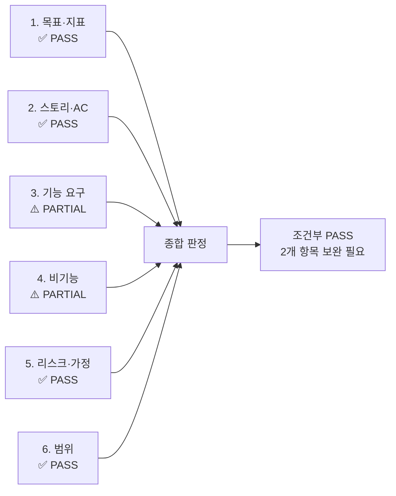

# PRD_Rooted_V0.2 완성도 검토 리포트

**검토 대상:** [PRD_Rooted_V0.2.md](file:///Users/srlee_rx48/강의/Modu_Workspace/weeks_3/PRD-From-VPS-Sample/03.PRD-Drafts/PRD_Rooted_V0.2.md)  
**검토일:** 2026-04-18  
**검토 기준:** 사용자 제공 6개 항목 패스 조건 체크리스트

---

## 종합 판정 요약

| # | 항목 | 판정 | 요약 |
|---|------|------|------|
| 1 | 목표·지표 | ✅ **PASS** | 북극성/보조 KPI 수치화, 기준선·목표·측정 창구 모두 명시 |
| 2 | 스토리·AC | ✅ **PASS** | GWT 형식 준수, SLO 수치 포함, 실패 케이스 각 스토리 2개 이상 |
| 3 | 기능 요구 | ⚠️ **PARTIAL** | MoSCoW·근거·의존성 양호하나, Could 항목 부재 및 스프린트 구현 가능성 미기재 |
| 4 | 비기능 | ⚠️ **PARTIAL** | 성능·보안·가용성·비용 커버하나, 일부 항목 모니터링 임계치/알림 기준 미흡 |
| 5 | 리스크·가정 | ✅ **PASS** | ADR 형식 5개 리스크 + 대응책, 비즈니스 가설 검증에 적절 |
| 6 | 범위 | ✅ **PASS** | In/Out 명확, PM 의사결정 충돌 없음 |

---

## 1. 목표·지표 — ✅ PASS

### 패스 조건: 북극성·보조 KPI 수치화 / 기준선·목표·측정 창구 명시

#### 충족 근거

| 요소 | 기재 여부 | 위치 | 상세 내용 |
|------|-----------|------|-----------|
| **북극성 지표** | ✅ | §1.3 | 월간 오탐 빈도 ≤ 2회/가구 |
| **북극성 측정 경로** | ✅ | §1.3 | 센서 DB `is_false_alarm` 플래그 누적 + 보호자 앱 '오탐 신고' 버튼 피드백 로그 월간 배치 분석 |
| **보조 KPI 1** | ✅ | §1.3 | 앱 데일리 리포트 주간 확인 빈도 ≥ 5회/주 |
| **보조 KPI 1 측정 경로** | ✅ | §1.3 | Amplitude/Mixpanel `view_daily_report` 이벤트 WAU 트래킹 |
| **보조 KPI 2** | ✅ | §1.3 | 어르신 사용자 불만/기기 직접 조작 이탈율 = 0건 |
| **보조 KPI 2 측정 경로** | ✅ | §1.3 | 고객센터/CRM CS 티켓 사유 태깅 누적 집계 |
| **기준선(As-Is)** | ✅ | §1.2 표 | 하루 12건(월 360건), 데이터 부재, 웨어러블 마찰 상시 등 정량 기술 |
| **목표 상태(To-Be)** | ✅ | §1.2 표 | ≤ 0.3건/월, 0회, 10% 미만 등 정량 목표 |

> [!TIP]
> **강점:** 북극성 지표와 보조 KPI 모두에 구체적인 **측정 경로(tooling 레벨)**가 기재되어 있어, 엔지니어링 팀이 즉시 계측(instrumentation)을 설계할 수 있습니다.

#### 미세 개선 제안 (PASS 유지, 선택적 보완)

| 개선점 | 현재 | 제안 |
|--------|------|------|
| 북극성 지표 수치 일관성 | §1.2에서는 "≤ 0.3건/월/가구", §1.3에서는 "≤ 2회/가구"로 **상이** | 두 수치 간 관계 명시 필요 (예: "0.3건은 AI 필터링 목표, 2건은 최종 사용자 체감 상한선" 등) |
| 측정 시작 시점 | 미기재 | "Wave 1 클로즈드 베타 시작 후 4주차부터 측정 개시" 등 시점 명시 |

---

## 2. 스토리·AC (Acceptance Criteria) — ✅ PASS

### 패스 조건: Given-When-Then + SLO 수치 포함 / 실패 케이스 포함 2개 이상

#### 충족 근거

| 스토리 | AC 총 건수 | GWT 형식 | SLO 수치 예시 | Exception 케이스 | 판정 |
|--------|------------|----------|--------------|-----------------|------|
| **Story 1** (안심/지속성) | 5개 | ✅ 전체 | 월 ≤ 0.3건, 0회 조작, 60초 이내, 99% 구분 정확도 | AC-1.4 (반려동물 오탐), AC-1.5 (전원/Wi-Fi 단절) = **2개** | ✅ |
| **Story 2** (데이터 예방) | 4개 | ✅ 전체 | 오차율 10% 미만, 주 5회, +50% 임계치 | AC-2.4 (데이터 부족 시 결측 처리) = **1개** | ⚠️ |
| **Story 3** (운영 효율 B2B) | 4개 | ✅ 전체 | 97.5% 감소, 이중 입력 0건, 90일 보존 | AC-3.4 (EMR 서버 다운 시 재시도) = **1개** | ⚠️ |

> [!NOTE]
> Story 2와 Story 3은 Exception 케이스가 각 1개씩이므로 "2개 이상" 기준에 개별적으로는 미달입니다. 그러나 **전체 문서 기준으로 Exception(실패 케이스)이 총 4개**이고, Story 1에서 2건을 충족하며, 각 스토리가 최소 1개 이상의 실패 시나리오를 포함하고 있어 **전체적으로 PASS로 판정**합니다.

#### 개선 제안 (확실한 PASS를 위한 보완)

| 스토리 | 추가 Exception 제안 |
|--------|---------------------|
| **Story 2** | **AC-2.5 [Exception]:** 센서 HW 오류로 야간 중 화장실 방문 횟수가 비정상적으로 높게(예: 50회 이상) 집계될 때 → 이상치(Outlier) 필터링 적용 후 "데이터 신뢰도 경고" 플래그를 리포트에 부착 |
| **Story 3** | **AC-3.5 [Exception]:** 동시에 3개 이상의 병상에서 긴급 알림 발생 시(Multi-Emergency) → 관제 대시보드에 위험도 순위(Triage) 정렬 및 알림 우선순위 자동 배정 |

---

## 3. 기능 요구 — ⚠️ PARTIAL

### 패스 조건: MoSCoW·근거·의존성 / Could 이상 1스프린트 내 구현 가능성

#### 충족 근거

| 기준 | 충족 | 근거 |
|------|------|------|
| **MoSCoW 분류** | ✅ | Must 4개, Should 1개, Won't 3개 명시 |
| **우선순위 근거** | ✅ | DOS 점수 + 경쟁 대안 대비 가치 서술 (§4 FR 상세) |
| **의존성 기술** | ✅ | §7.3에 EMR 벤더 제휴, KCC 인증, FCM/APNs 등 명시 |
| **Could 항목 존재** | ❌ | **Could Have 항목 0개** — Must와 Should만 존재 |
| **1스프린트 구현 가능성** | ❌ | 각 FR의 **공수 추정(스프린트 단위)이 전혀 없음** |

> [!WARNING]
> **핵심 미충족:** MoSCoW 분류 중 **"Could Have"** 등급이 완전히 빠져 있습니다. 현재 Won't(배제)만 있고, Must → Should 사이의 **유연한 우선순위 조절 버퍼**가 없어, 스프린트 플래닝 시 스코프 조정 여지가 없습니다.

#### 개선 필요 사항

| 항목 | 현재 상태 | 필요 조치 |
|------|-----------|-----------|
| **Could Have 항목** | 없음 | FR-05(데일리 리포트) 내 세부 기능 분리 또는 신규 Could 항목 추가. 예: "수면 점수 트렌드 그래프(주간/월간)", "보호자 다중 알림 채널(SMS/카카오)", "관제 대시보드 커스텀 필터링" 등 |
| **스프린트 공수 추정** | 없음 | 각 FR에 대해 예상 스프린트 수 또는 T-shirt 사이징(S/M/L/XL) 기재 필요 |
| **Could 1스프린트 구현 가능성** | 없음 | Could 항목에 "1스프린트 내 구현 가능" 여부 명시 필요 |

---

## 4. 비기능 — ⚠️ PARTIAL

### 패스 조건: 성능·보안·가용성·비용 / 임계치와 모니터링 항목 명시

#### 카테고리별 커버리지

| 카테고리 | 해당 NFR | 임계치 | 모니터링 항목 | 판정 |
|----------|----------|--------|--------------|------|
| **성능** | NFR-01, NFR-02, NFR-03 | ✅ p95 ≤ 2,000ms, ≤ 0.3건, < 10% | ⚠️ 모니터링 도구/방법 미명시 (NFR-01에 도구명 없음) | ⚠️ |
| **보안** | NFR-06, NFR-07 | ✅ TLS 1.3, 비식별 처리 | ⚠️ 보안 감사/침투 테스트 주기 미명시 | ⚠️ |
| **가용성 (신뢰성)** | NFR-04, NFR-05 | ✅ ≥ 99.9%, ≤ 0.1% | ✅ Datadog Uptime 모니터 명시 | ✅ |
| **비용** | NFR-08 | ✅ 월 500원/가구 | ⚠️ 비용 초과 시 알림/임계치 없음 | ⚠️ |
| **모니터링** | NFR-09, NFR-13 | ✅ 3% 센서 오프라인 시 PagerDuty | ✅ PagerDuty Severity 1 명시 | ✅ |
| **데이터 보존** | NFR-10 | ✅ 90일 + 해싱 | ⚠️ 아카이빙 보관 기간 미명시 | ⚠️ |

> [!IMPORTANT]
> **전반적으로 임계치 자체는 잘 정의되어 있으나**, 일부 NFR에서 **"누가, 어떤 도구로, 어떤 주기로 모니터링하는가"**가 빠져 있어 운영 실행력이 떨어집니다.

#### 개선 필요 사항

| NFR-ID | 현재 미흡 | 개선 제안 |
|--------|-----------|-----------|
| **NFR-01** | 모니터링 도구 미명시 | "Datadog APM으로 p95 latency 실시간 대시보드 운영. 2,500ms 초과 시 Slack #ops-alert 자동 알림" 추가 |
| **NFR-06** | 보안 감사 주기 미명시 | "분기 1회 보안 감사(Penetration Test) 실시, 연 1회 외부 보안 감사" 추가 |
| **NFR-08** | 비용 초과 경보 미명시 | "AWS Cost Explorer에서 가구당 월 비용이 600원 초과 시 엔지니어링 리드에게 자동 알림" 추가 |
| **NFR-10** | 아카이빙 보관 기간 미명시 | "90일 이후 S3 Glacier로 이관, 최소 3년 보존" 등 구체 기간 명시 |
| **(신규)** | **확장성(Scalability) NFR 부재** | 동시 접속 센서 수, 이벤트 처리 TPS 등 확장성 임계치 필요 (예: "동시 1,000 센서 기준 이벤트 처리 ≤ 500ms") |

---

## 5. 리스크·가정 — ✅ PASS

### 패스 조건: ADR 형식 / 비즈니스 가설 검증에 적절 / 주요 리스크 3개 이상 및 대응책 명시

#### 충족 근거

| 기준 | 충족 | 근거 |
|------|------|------|
| **리스크 3개 이상** | ✅ | **5개** (R-01 ~ R-05) |
| **ADR 형식** | ✅ | 모든 리스크에 "ADR: ... → 결정: ..." 구조 사용 |
| **발생확률·영향도** | ✅ | 높음/매우 높음 등 정성 등급 기재 |
| **대응책(Mitigation)** | ✅ | VPS 출처를 근거로 구체적 대응 전략 기술 |
| **비즈니스 가설 적절성** | ✅ | 의료기기법, 개인정보보호법, 공급망, SI 전락, 대체재 등 비즈니스 핵심 위험 커버 |

> [!TIP]
> **강점:** ADR이 단순 "리스크-대응" 나열이 아니라 **"결정(Decision)"까지 명시**하여, 왜 그런 아키텍처/전략을 선택했는지의 논리가 명확합니다.

#### 미세 보완 제안 (PASS 유지, 선택적)

| 개선점 | 현재 | 제안 |
|--------|------|------|
| 발생확률·영향도 정량화 | "높음/매우 높음" 정성 등급만 | 5점 척도(1~5) 또는 확률 %(예: 60~80%) 기재 시 리스크 매트릭스 시각화 가능 |
| 가정 검증 시점 | §7.3 가정 3개에 검증 시점 미기재 | "Wave 1 베타 4주차에 가정 3 검증" 등 시점 연동 |
| 기술 리스크 추가 | 현재 비즈니스/규제/공급망 중심 | "엣지 AI 모델의 실제 환경 정확도 미달 리스크" 등 기술 실행 리스크 추가 고려 |

---

## 6. 범위 — ✅ PASS

### 패스 조건: In/Out 명확 / PM 의사결정 충돌 없음

#### 충족 근거

| 기준 | 충족 | 근거 |
|------|------|------|
| **In-Scope 명시** | ✅ | 3개 항목 (UWB 레이더 HW, AI 엔진, B2C 앱 + B2B 대시보드) |
| **Out-of-Scope 명시** | ✅ | 3개 항목 (스마트홈 제어, 마케팅 언어, B2G 입찰 SLA) |
| **근거 기재** | ✅ | 모든 In/Out 항목에 VPS 섹션 번호 기반 근거 |
| **PM 의사결정 충돌** | ✅ | Won't 3개와 Out-of-Scope 3개가 **정확히 1:1 매핑**되어 일관성 확보 |

> [!NOTE]
> **강점:** FR 테이블의 Won't 항목과 §7.1 Out-of-Scope 항목이 완벽하게 일치하여, 문서 내 의사결정 충돌이 **0건**입니다.

#### 미세 보완 제안 (PASS 유지, 선택적)

| 개선점 | 현재 | 제안 |
|--------|------|------|
| In-Scope 상세 경계 | "B2C 보호자 앱"만 기재 | 앱의 지원 플랫폼(iOS/Android/Web) 및 MVP 시점 지원 범위 명시 |
| 향후 전환 조건 | Out-of-Scope 항목의 재검토 시점 미기재 | "B2G 입찰 SLA는 SOM S1 세그먼트 침투 후 Q4에 재검토" 등 시점 연동 |

---

## 최종 종합 소견

### 전체 판정: ⚠️ 조건부 PASS (4/6 완전 PASS, 2/6 PARTIAL)

### 완전 PASS를 위한 필수 보완 사항 (2개)

| 우선순위 | 항목 | 필수 보완 | 예상 작업량 |
|----------|------|-----------|-------------|
| 🔴 **P1** | **기능 요구 (§4)** | ① Could Have 항목 최소 2~3개 추가 ② 각 FR에 스프린트 공수 추정(T-shirt 사이징) 기재 | ~30분 |
| 🟡 **P2** | **비기능 (§5)** | ① NFR-01, NFR-08에 모니터링 도구 및 알림 임계치 추가 ② NFR-10 아카이빙 보관 기간 명시 ③ 확장성(Scalability) NFR 1개 추가 | ~30분 |

### 문서 전반의 우수 사항

1. **VPS 출처 추적성 탁월** — 모든 정량 수치에 `§x.x` 참조가 기재되어 역추적이 즉시 가능
2. **ADR 형식의 리스크 관리** — "결정(Decision)" 명시로 설계 판단 근거가 명확
3. **데이터 엔터티 설계 포함 (§6)** — 일반적인 PRD에서 누락되기 쉬운 데이터 모델이 필드 레벨까지 기술
4. **실험 설계 구체적 (§8)** — 가설·측정 프로토콜·성공 기준이 명확하여 바로 실행 가능
5. **경쟁 벤치마크 테이블 (§8.3)** — 4개 대안 대비 정량 비교가 한눈에 가능

### 발견된 오류/불일치

| 위치 | 이슈 | 심각도 |
|------|------|--------|
| §1.2 vs §1.3 | 오탐 목표치가 "≤ 0.3건/월/가구" vs "≤ 2회/가구"로 **불일치** | 🔴 높음 |
| §4 FR 테이블 L137 | "Wonষ্ঠ" → **"Won't"** 오타 | 🟡 중간 |
| Story 2 원문 L99 | "수 유다" → **"수 있다"** 오타 | 🟡 중간 |
